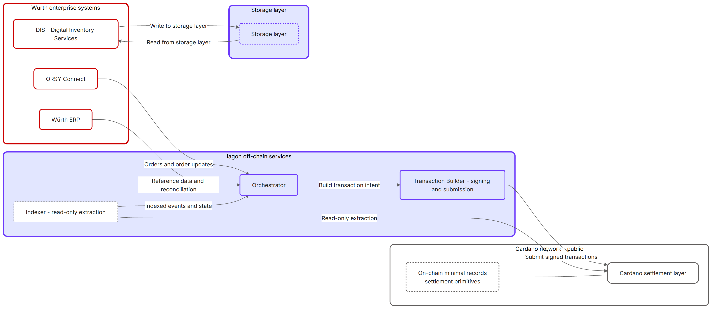
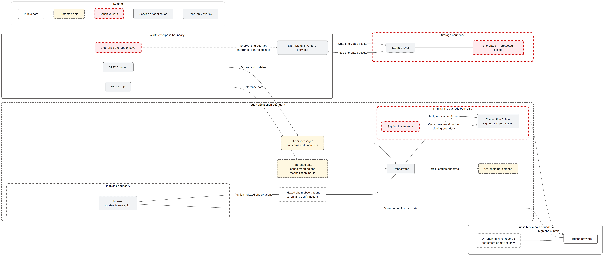
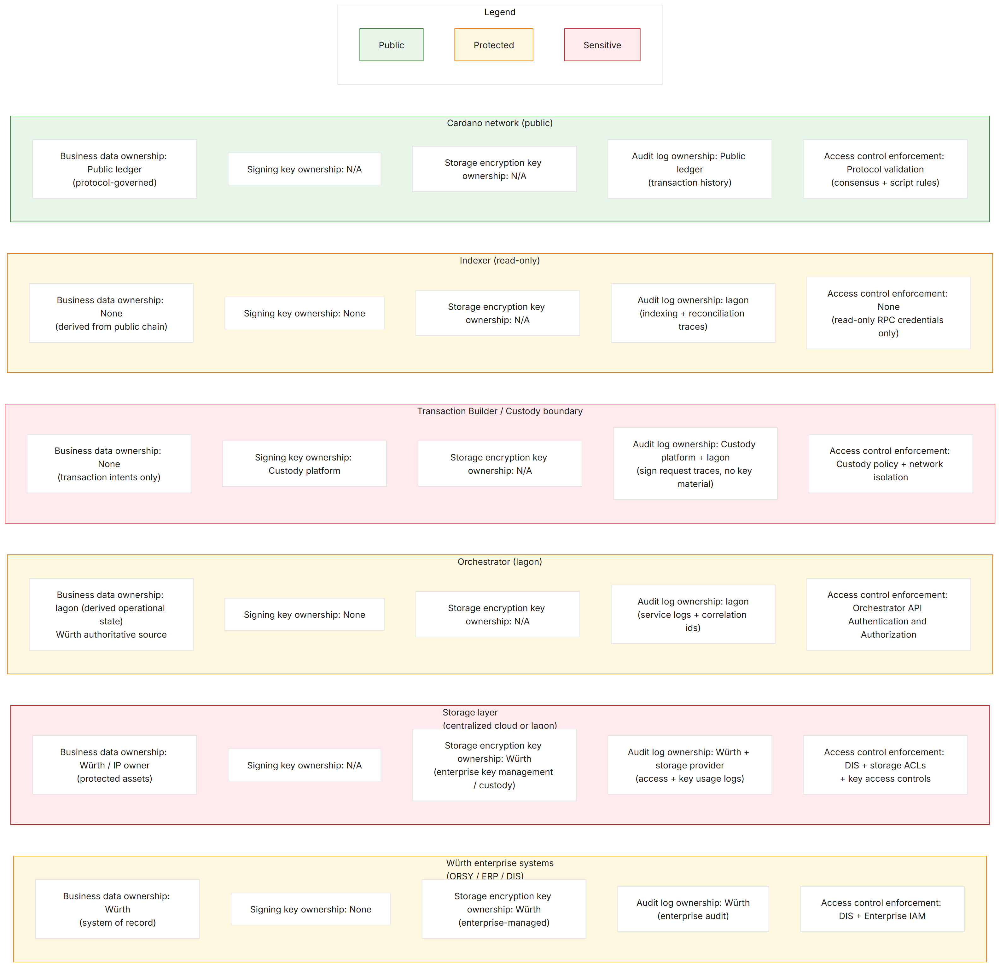

# Milestone 1 – Part 1: Technical Overview

## 1 Purpose and Scope

### 1.1 Purpose of this technical overview

This document defines the proposed end-to-end technical architecture for the Würth–Iagon licensing and royalty settlement system, focusing on:

* **Royalty settlement**: component responsibilities and integration boundaries for processing print license orders, recording royalty entitlements on Cardano, and reconciling settlement outcomes
* **IP asset storage** (separate domain): how IP-protected files are stored and accessed, including evaluation of Iagon as an alternative to centralized storage
* the minimum set of data flows needed to support license purchase, settlement (including royalty issuance and fund distribution), and reconciliation
* the trust and security model (especially where secrets, signing keys, and confidential business/IP data live)

These two domains—settlement and storage—are intentionally decoupled. Storage components do not participate in settlement flows, and settlement does not depend on the choice of storage backend.

It is intentionally an architecture and flow baseline, not an implementation spec. Implementation details (APIs, contract interfaces, storage connector specifics) are deferred to later milestones unless required to clarify a responsibility boundary. 

### 1.2 Scope boundaries

In scope for this document:

* license-based economic trigger: royalties are incurred on issuance of a print license, not on printing events
* off-chain orchestration as the system of record for orders/licenses, coordinating on-chain actions through a dedicated transaction component
* minimal on-chain footprint (non-identifying references only), with readable business metadata staying off-chain
* settlement delay window and cancellation handling prior to on-chain issuance/locking
* backend signing model (custodial key management isolated to a dedicated component; see Section 6.2)

Out of scope for this document:

* DIS and IoT print enforcement integrations as part of royalty triggering (explicitly removed from the initial scope)
* smart contract implementation details and testnet mechanics (Milestone 2+)

## 2 System Overview

### 2.1 High-Level Architecture

At a high level, the solution uses a hybrid enterprise + blockchain design:

* ORSY Connect remains the customer-facing ordering and operational system of record for orders and their line items.
* The Orchestrator receives the order signal, validates that referenced parts map to registered print licenses, and manages lifecycle state (including the settlement delay window).
* When an order becomes eligible for settlement (after the configured delay), the Orchestrator instructs the Transaction Builder to construct, sign, and submit the corresponding Cardano transaction(s).
* An Indexer observes chain state and provides read-only confirmation and reconciliation signals back to the Orchestrator.

This architecture preserves existing Würth workflows while selectively introducing on-chain proof and settlement, without exposing sensitive IP or commercial metadata publicly.

Milestone 1 Technical Overview Map: four system groups—Würth enterprise systems, Iagon off-chain services (Orchestrator, Transaction Builder, Indexer), Cardano network, and Storage layer.

### 2.2 On-Chain vs Off-Chain Responsibilities

Core split:

Off-chain (enterprise-controlled / orchestrated)

* orders, customers, vendors, part metadata, and business reporting remain off-chain
* license registration and mapping from part numbers to license identifiers
* order state management (including cancellation handling during the settlement delay)
* aggregation/batching decisions for cost-efficient settlement processing

On-chain (minimal, non-identifying, verifiable)

* cryptographic references to licenses (identifiers) and their fixed royalty economics
* on-chain settlement mechanisms for royalty issuance, entitlement reservation, and distribution availability after the delay window (see [02-royalty-transaction-tracking.md](02-royalty-transaction-tracking.md) for details)
* immutable record suitable for audit and reconciliation without revealing readable business metadata

### 2.3 Design Principles

The architecture is guided by the following validated principles:

* License-first economics: royalties are triggered by print license issuance, not printing events (see Scope boundaries in Section 1).
* Minimal on-chain data: store only what is necessary to prove entitlement and settlement parameters; keep all readable/commercial/IP metadata off-chain.
* Enterprise-aligned custody and signing: use backend signing for early phases; isolate signing keys to a dedicated service and support enterprise custody integration (see Section 6.2).
* Cost-aware settlement: prefer designs that support batching/aggregation and avoid unnecessary on-chain writes (especially for orders that may be canceled during the delay window).
* Non-disruptive integration: connect to ORSY Connect rather than re-architecting Würth’s existing operational stack; DIS/IoT remains optional and out-of-scope for the royalty trigger in the initial phase.

## 3 Key Actors and Systems

This section names the major systems in the proposed Milestone 1 architecture and clarifies their place in the overall solution. It defines the “nouns” and primary boundaries; detailed responsibilities and interface behavior are specified in Section 4.

### 3.1 ORSY Connect

ORSY Connect is Würth’s ordering and operations platform and is the upstream source of truth for customer orders that include print licenses as purchasable line items. In this solution, ORSY Connect provides the commercial context and lifecycle signals (e.g., created, canceled) that drive off-chain settlement eligibility. ORSY Connect remains authoritative for order context; it does not perform royalty settlement or blockchain interaction.

### 3.2 Digital Inventory Services (DIS)

Digital Inventory Services (DIS) is Würth Additive Group's platform for governed distribution and control of digital inventory assets (e.g., IP-protected 3D-printable parts and recipes). DIS integrates with an enterprise IoT hub and IoT-connected 3D printers to deliver g-code or machine instructions and manage the entire print lifecycle—from entitlement verification through print execution.

For this project, DIS is relevant to scoping and prototyping how a storage layer (including an Iagon-backed option) would fit into existing enterprise expectations for controlled asset handling. DIS is not part of royalty settlement (see Scope boundaries in Section 1).

### 3.3 Orchestrator

The Orchestrator is the central off-chain application coordinating business logic, lifecycle state, and enterprise integrations. It translates order events into settlement intent while keeping readable and sensitive metadata off-chain. It is the authoritative off-chain system for orders, print licenses, and vendor relationships, and it coordinates blockchain actions indirectly via the Transaction Builder (it does not hold signing keys).

### 3.4 Transaction Builder

The Transaction Builder is the dedicated chain-facing service that converts settlement intent into valid Cardano transactions. It encapsulates transaction construction, backend signing, and submission to Cardano nodes, returning transaction references and outcomes to the Orchestrator. This separation isolates blockchain-specific logic and key custody from enterprise business logic.

### 3.5 Blockchain Network

The Cardano network is used as a verifiable settlement and record layer with a minimal on-chain footprint. On-chain records are designed to avoid readable business metadata and IP exposure; only non-identifying references tied to print licenses and their economic parameters are stored. Orders are not modeled as stateful on-chain objects.

### 3.6 Storage Layer

The Storage Layer represents the controlled repository/network for IP-protected assets (manufacturing recipes and supporting artifacts) and the enforcement of confidentiality requirements (encryption, access control, auditing). It is explicitly off-chain: protected file contents are never written to Cardano. DIS is a key enterprise context for storage integration and prototyping, especially where distribution governance must be preserved.

### 3.7 Indexer

The Indexer is a read-only component that observes Cardano and extracts relevant events/state for reconciliation. It provides confirmations and chain references back to the Orchestrator for accurate settlement tracking and audit trails. Indexer feedback does not need to be real-time; accuracy at payout/reconciliation time is the requirement. The Indexer is operated by Iagon.

### 3.8 Vendors (IP Owners)

Vendors are the parties that supply IP-protected 3D-printable machine instructions and are entitled to royalties when print licenses are issued. In this architecture, vendors do not interact directly with the blockchain or manage wallet keys during the initial phase—backend signing and settlement are handled by the platform on their behalf.

Vendor onboarding involves registering the vendor's identity and associating it with a public key hash for on-chain attribution. The royalty claiming process and vendor-facing visibility are defined in Part 2 (Royalty and transaction tracking).

See system overview diagram in Section 1: system context showing ORSY Connect → Orchestrator → Transaction Builder → Cardano, with Indexer feeding confirmations back; DIS ↔ Storage Layer on the asset/distribution side.

## 4 Core Components

Section 4 specifies what each component must do (responsibilities, boundaries, and interfaces). It avoids redefining the systems and instead focuses on required behavior.

### 4.1 Orchestrator Responsibilities

The Orchestrator owns the off-chain lifecycle and the business rules that make settlement deterministic and auditable:

* Order ingestion and normalization

  * ingest orders (and cancellations) from ORSY Connect
  * normalize identifiers needed to resolve line items to print licenses
  * ensure idempotency for repeated events / retries

* Print license resolution

  * map each order line item to a print license identifier
  * enforce the fixed-cost royalty model per license/part
  * enforce single-vendor association per blueprint/license (with future extensibility left open)

* Lifecycle state and settlement delay

  * maintain an internal state model for “eligible vs not eligible for settlement”
  * apply the configurable settlement delay window
  * support cancellation prior to on-chain acknowledgment

* Settlement preparation

  * group/aggregate eligible items for cost-efficient on-chain settlement (batching)
  * create and persist transaction intents for the Transaction Builder

Transaction intent structure, lifecycle semantics, and reconciliation behavior are defined in Part 2 (Royalty and transaction tracking).

* Reconciliation and reporting inputs

  * consume Indexer confirmations and reconcile against transaction intents
  * resolve reference data from the Würth ERP system for validation and exception handling where required
  * expose reconciliation outputs for finance/reporting (off-chain)

Orchestrator state machine: Received → Pending (delay) → Eligible → Submitted → Confirmed, with cancellation transitions before Eligible/Submitted.

### 4.2 Transaction Construction and Signing

The Transaction Builder is responsible for translating transaction intents into valid Cardano transactions, submitting them, and operating the backend signing boundary.

* The Orchestrator never has access to private signing keys and never signs transactions.
* Blockchain constraint handling (size limits, fees, UTxO selection) is contained within the Transaction Builder boundary.

Signing boundary details, audit expectations, and operational semantics are defined in Part 2 (see Section 6, Backend Signing Model).

### 4.3 Blockchain Interaction Model

This subsection defines the on-chain model and its implications, following the minimal on-chain data principle established in Section 2.3.

* On-chain data constraints

  * only non-identifying license references and economic parameters (fixed royalty cost)
  * no readable vendor identity, customer identity, part metadata, DINs, or recipes on chain

* No on-chain order objects

  * orders do not exist as stateful on-chain entities
  * on-chain actions represent settlement outcomes (e.g., issuance/entitlement records), potentially aggregated across multiple orders

* Settlement finality invariant

  * on-chain records are created only once royalties are payable
  * the existence of an on-chain record implies settlement finality and eligibility for redemption
  * all settlement timing, delays, and aggregation occur off-chain

* Audit and linkage

  * define how off-chain records link to on-chain references without exposing business metadata publicly
  * ensure linkage supports reconciliation without requiring the chain to “know” enterprise context

For signing boundary details, see Part 2 (Section 6, Backend Signing Model).

### 4.4 Storage and Access Control Model

IP-protected asset storage is a separate domain from settlement.

* Protected file contents are never written to Cardano.
* Entitlement decisions remain under enterprise governance; the storage layer enforces access and auditability.

Storage backend options, connector design, encryption, and access control workflows are defined in Part 4 (Data management plan).

## 5 Data Flow Summary

This section summarizes the end-to-end flows at an architectural level. The detailed tracking, on-chain modeling, exception policy, and reconciliation semantics (including the detailed diagrams) are defined in Part 2 (Royalty and transaction tracking).

At a high level:

* ORSY Connect emits order and cancellation events.
* The Orchestrator resolves line items to print licenses, applies the settlement delay window, and persists transaction intents.
* The Transaction Builder constructs, signs, and submits settlement transactions.
* The Indexer provides confirmations for reconciliation; Orchestrator also sweeps for missed confirmations.

## 6 Security and Trust Model

This section captures the security considerations and trust assumptions for the Milestone 1 architecture. It focuses on ownership of data and secrets, boundary placement, and the best-practice controls applied. It intentionally does not restate functional data flows.

### 6.1 Trust Boundaries

The architecture is designed around explicit trust boundaries that align with enterprise security expectations:

* Würth enterprise boundary: ORSY Connect, ERP/master data systems, and DIS (where applicable) remain authoritative for enterprise business context and governance decisions.
* Off-chain application boundary: the Orchestrator processes business logic and maintains settlement state and reconciliation records. It is the primary off-chain system coordinating settlement and reporting.
* Signing and custody boundary: the Transaction Builder (and any delegated signer/custody provider) is the only boundary that can access private signing keys and produce signed blockchain transactions.
* Public blockchain boundary: Cardano is treated as an untrusted public environment; no readable or confidential enterprise data is stored on-chain.
* Storage boundary: IP-protected digital assets live off-chain behind encryption and access control; storage is treated as a confidential data domain distinct from settlement processing.
* Indexing boundary: the Indexer is read-only and consumes public chain data; it must not require privileged access to enterprise systems.

Trust boundary diagram: Würth systems, Orchestrator, Transaction Builder/Signer, Cardano, Storage, Indexer; explicit "secret-bearing" boundaries for signing keys and encryption keys.

### 6.2 Backend Signing Model

Backend signing is a model in which blockchain transactions are signed automatically by managed keys held within backend infrastructure, rather than by end users through browser wallets or hardware devices. In this approach, the signing keys are controlled by the system operator and transactions are authorized programmatically based on validated business logic.

This solution uses backend signing for settlement transactions because the primary users—Würth operations staff and vendors—are not expected to manage blockchain wallets or interact directly with blockchain tooling. Backend signing removes user friction, simplifies integration with existing enterprise workflows, and allows the system to operate without requiring blockchain expertise from business users. The architecture preserves the option to introduce user-managed or vendor-managed keys in the future if requirements evolve.

The backend signing model enforces the following constraints:

* The Orchestrator never has access to private signing keys and never signs transactions.
* Signing authority is isolated within the Transaction Builder, which acts as the sole signing boundary.
* Key custody and signing audit requirements are defined in Part 2 (see Section 6, Backend Signing Model).

### 6.3 Data Minimization and Confidentiality

The solution applies data minimization across trust boundaries to reduce exposure and compliance burden. Settlement processing and IP-protected asset storage are treated as separate domains and are intentionally not coupled.

#### 6.3.1 Settlement domain (ORSY Connect, Orchestrator, Transaction Builder, Indexer, Cardano)

See Part 2 (Section 7) for detailed data minimization rules.

#### 6.3.2 IP asset storage domain (DIS and Storage Layer, centralized cloud or Iagon)

See Part 4 (Section 11, Data Minimization and Confidentiality) for storage-domain minimization principles, DIS governance alignment, and the storage trust boundary. IP-protected assets remain off-chain and are never written to Cardano.

### 6.4 Enterprise Security Considerations

This section summarizes the security posture expectations and operational controls assumed for an enterprise pilot.

Identity, access, and service hardening

* authentication and authorization: service-to-service communication uses strong authentication; admin/operational access is restricted and audited
* least privilege access: Orchestrator and Indexer do not have access to signing keys; Indexer does not gain privileged enterprise access by virtue of indexing
* segregation of duties: operational roles that manage orders and reporting are separate from roles that manage signing/custody

Secrets management

* keys and secrets are stored in a secrets manager or custody platform appropriate for enterprise use
* secrets are not embedded in code, container images, or configuration repositories
* key rotation strategy is supported and documented, especially for signing keys and storage encryption keys

Logging and auditability

* audit logs capture:

  * settlement intent creation and submission outcomes
  * signing requests (without exposing key material)
  * access to protected assets in the Storage Layer
* logs are correlated across systems using consistent identifiers (order id, intent id, tx hash) without exposing confidential payloads on-chain

Resilience and failure posture

* failure of the Indexer or delayed indexing does not compromise security; it impacts timeliness only
* transaction submission failures are handled without leaking secrets; errors are categorized and recorded for operator response
* storage access failures do not leak protected data; unauthorized access attempts are logged and rejected

Security ownership matrix: component vs responsibility for business data, signing keys, storage encryption keys, audit logs, and access control enforcement.

## 7 Architectural Constraints and Decisions

This section summarizes the key constraints surfaced during discovery and the concrete decisions made in response. Where relevant, items refer back to earlier global principles such as data minimization and boundary placement (Section 6).

### 7.1 Enterprise and Compliance Constraints

* Constraint: Preserve existing Würth workflows and avoid invasive changes across ORSY, ERP, and DIS.

  * Decision: Integrate via ORSY Connect as the primary ordering interface and keep orchestration off-chain.
  * Rationale: Earlier EDI/ERP-centric approaches would have required deep coupling across multiple systems, including DIS and operational processes. Connecting directly to ORSY Connect reduced disruption.

* Constraint: Royalty data is not reliably available where orders originate.

  * Decision: Introduce a dedicated registration flow for licenses (and vendors as needed) so required royalty parameters exist before orders are processed.
  * Rationale: The Orchestrator must be able to resolve an order line item to a registered print license and its fixed royalty cost deterministically at processing time.

* Constraint: Protect sensitive business metadata and reduce IP/commercial exposure risk on a public blockchain.

  * Decision: Store only minimal, non-identifying license references and economic parameters on-chain. Keep readable identifiers (vendor identity, part numbers, DINs, recipes) off-chain.
  * Rationale: This aligns with the data minimization and confidentiality posture described in Section 6.3.

* Constraint: Vendor and customer operational friction must be minimized, especially around blockchain interaction.

  * Decision: Use backend signing for transactions, with enterprise custody integration supported (see Section 6.2).
  * Rationale: Avoids requiring vendors to manage wallets/keys for core settlement operations while keeping custody choices evolvable.

* Constraint: Royalty triggering must not depend on IoT printing success/timing (see Scope boundaries in Section 1).

  * Decision: Royalties are triggered by print license issuance, not printing events.
  * Rationale: Supports the subscription-based commercial direction and removes dependency on device/print telemetry for settlement correctness.

* Constraint: DIS is relevant to storage governance and enterprise expectations, but not required for settlement logic (see Scope boundaries in Section 1).

  * Decision: Include DIS only as a storage/distribution governance context for the Storage Layer and prototype integration work.
  * Rationale: Enables parallel progress on storage feasibility without coupling it to settlement.

### 7.2 Financial Visibility and Reporting

Visibility into royalty activity is an important element of the system for both vendors and Würth.

* **Vendor visibility**: Vendors require visibility into their current royalty balances and, due to the settlement delay, upcoming royalties that are pending but not yet finalized. The system will provide this, but the access mechanism is still under discussion. Today, vendor engagement is purely business-side—no technical systems exist for vendors to log into. The question is not *whether* to provide vendor visibility, but *how* to do so, and will be addressed in later milestones.

* **Würth financial reporting**: The Orchestrator produces reconciliation records that correlate off-chain order intents with on-chain settlement confirmations (see Section 4.1). These records support Würth finance and audit requirements, enabling reporting on settlement status, timing, and any discrepancies.

### 7.3 Scalability and Cost Considerations

* Constraint: On-chain operations must remain cost-efficient at enterprise order volumes.

  * Decision: Do not represent orders as stateful on-chain objects; allow batching/aggregation of settlement actions.
  * Rationale: Avoids state-heavy designs and supports throughput without linear or sub-linear on-chain cost growth per order.

* Constraint: Need a practical way to handle cancellations without paying unnecessary on-chain fees.

  * Decision: Apply a settlement delay window and perform on-chain acknowledgment at the end of the delay (or immediately if delay is zero).
  * Rationale: Reduces on-chain churn for orders that change shortly after creation while still providing timely settlement visibility.

* Constraint: Indexing latency should not be a blocker for correctness.

  * Decision: Treat the Indexer as read-only, and do not require real-time Indexer-to-Orchestrator communication.
  * Rationale: Correctness is enforced by on-chain state plus off-chain intent correlation; indexing cadence can be periodic as long as reconciliation is repeatable.

* Constraint: The settlement approach should avoid exposure to volatile assets.

  * Decision: Design the settlement approach to support stablecoin-based funding and payout on Cardano (exact mechanism finalized in blockchain option selection).
  * Rationale: Keeps the financial model aligned with treasury expectations while still leveraging Cardano as the settlement layer.

* Constraint: Blueprint/version complexity should not be introduced without a clear business need.

  * Decision: Keep blueprint metadata minimal and non-versioned in the initial model; rely on ORSY/DIS as the authoritative product catalog and metadata access tool.
  * Rationale: Avoids unnecessary state management and reduces coordination burden during the pilot.

### 7.4 Closed-Source Pilot Considerations

* Constraint: Pilot is closed-source with restricted external access and enterprise security expectations.

  * Decision: Keep validation, sign-off, and evidence handling internal between Würth and Iagon; produce a redacted public-facing deliverable set where needed.
  * Rationale: Aligns with partner agreements and security posture while still meeting Catalyst reporting requirements.

* Constraint: Existing centralized blueprint storage is trusted and production-proven; immediate replacement is not acceptable for many stakeholders.

  * Decision: Treat Iagon storage as an optional/parallel integration path via a connector-style approach rather than a near-term replacement.
  * Rationale: Enables diversification and risk-management exploration without disrupting the existing centralized storage solution used in Würth’s current 3D printing workflow.

* Constraint: Strong separation of duties for secrets and privileged operations.

  * Decision: Isolate signing keys to the Transaction Builder/custody boundary, keep the Transaction Builder hardened and network-restricted, and manage secrets via an enterprise secrets manager.
  * Rationale: Reinforces the trust boundary model described in Section 6 and limits blast radius if an off-chain component is compromised.

* Constraint: Need to validate UX and integration logic before final smart contracts are complete.

  * Decision: Build an off-chain prototype to simulate contract-like behaviors to validate orchestration, APIs, and UI early.
  * Rationale: Allows parallel delivery and reduces critical path risk without locking in premature on-chain implementation details.
