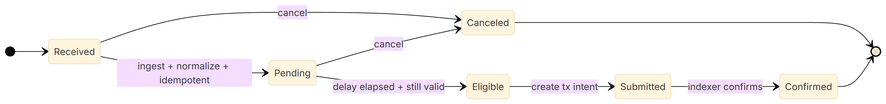
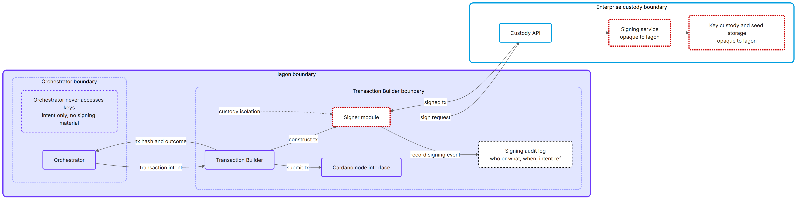
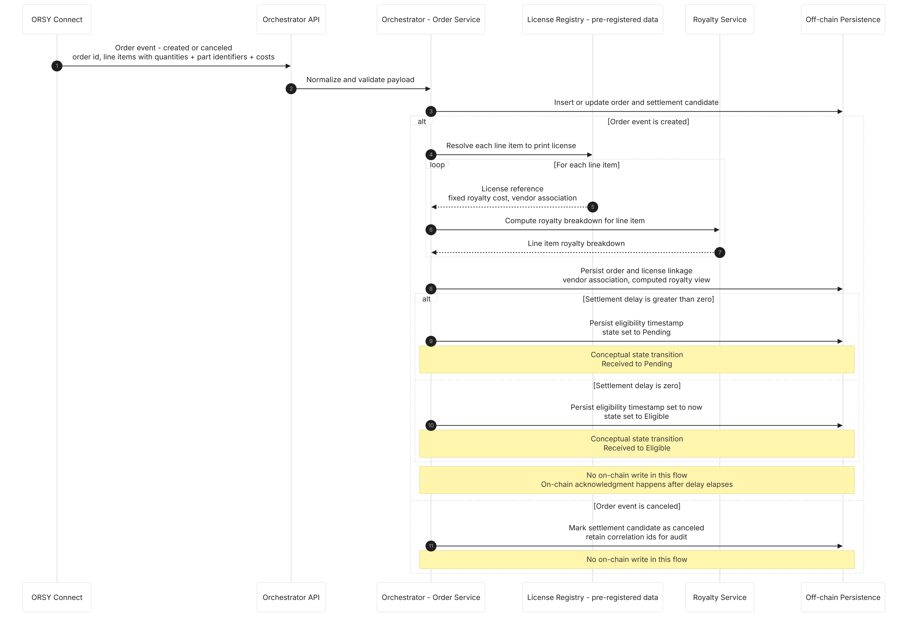
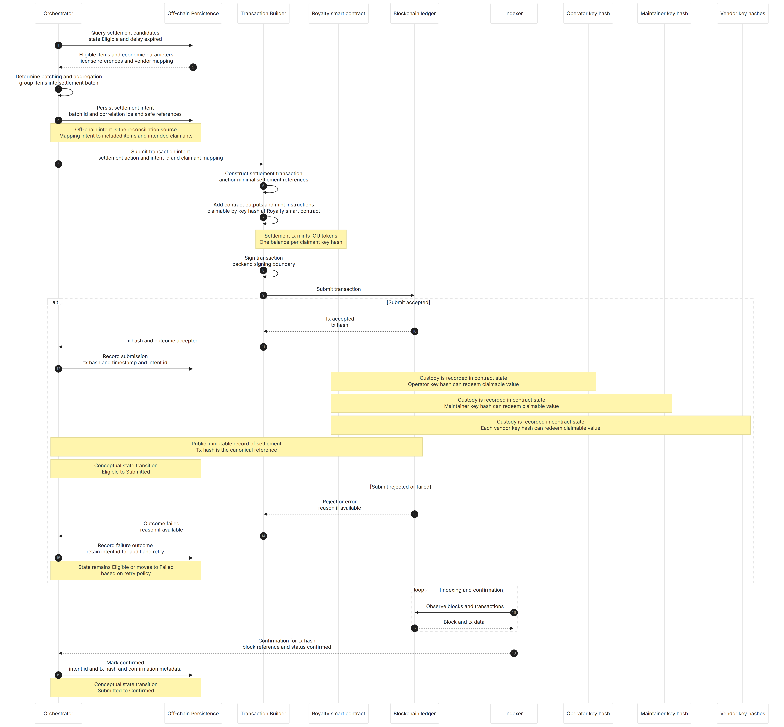
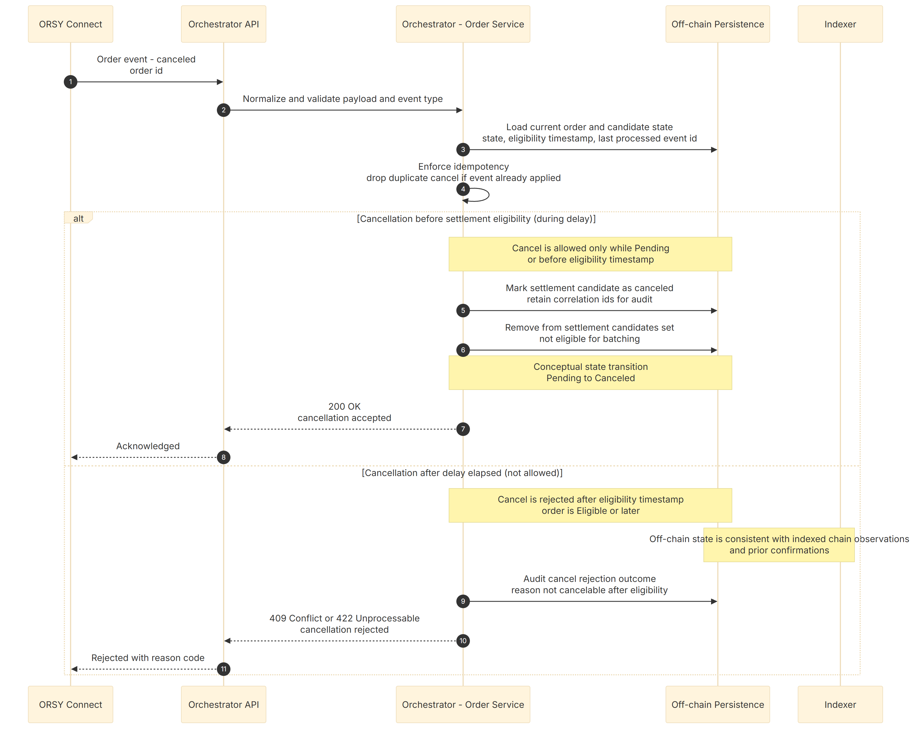
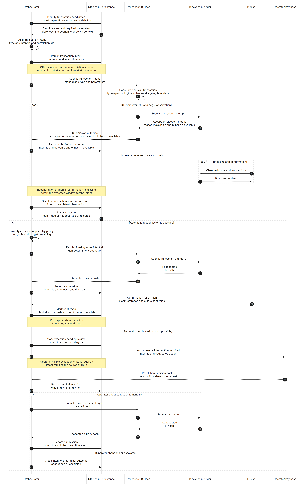
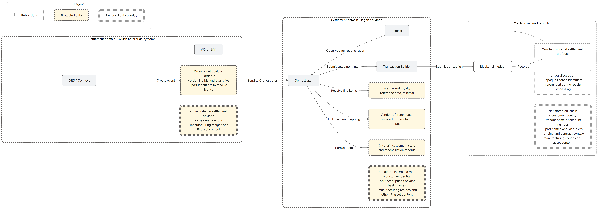

# Milestone 1 – Part 2: Royalty and Transaction Tracking

## 1 Purpose and Scope

### 1.1 Purpose of this document

This document defines the royalty and settlement tracking model the architecture in Part 1 is meant to support. It focuses on the “accounting spine” of the system:

* the lifecycle rules for royalties triggered by print license issuance (not printing)
* the off-chain intent records used as the system of record for settlement activity
* how settlement delay, batching/aggregation, submission outcomes, and confirmations are tracked
* what “reconciliation complete” means, and what evidence is retained for auditability

It is intended to be implementation-guiding for Milestone 2 contract and service work, while still remaining at the “rules and records” level (not a full smart contract spec).

### 1.2 Scope boundaries

In scope:

* license-first economics and what is considered the royalty-triggering event
* settlement delay semantics (what can change during the delay, what cannot after)
* tracking objects and required fields (intent ids, batch ids, correlation to order/line/license references)
* intent state model and idempotency/deduplication expectations across retries and replays
* reconciliation loops (Indexer push and Orchestrator sweep) and expected exception handling posture
* sub-cent accuracy expectations and rounding rules as they affect settlement amounts and reporting

Out of scope (either handled elsewhere or deferred):

* storage, encryption, access control, and DIS storage governance (Part 4)
* IoT print enforcement and print telemetry integration (explicitly out of initial settlement scope)
* final smart contract implementation details (data layout, redeemers, exact UTxO strategy) beyond what is needed to define tracking invariants
* on/off-ramp mechanics, custody provider selection details, and vendor UX for claims (tracked as later-milestone decisions)
* commercial split specifics beyond fixed royalty amounts per license (operator/platform fees are acknowledged but not finalized here)

## 2 Royalty and Settlement Concepts

### 2.1 License, royalty obligation, and settlement intent

A print license is the economic trigger for royalties. When an order results in one or more print licenses being issued, a royalty obligation is created per license (based on fixed royalty cost and quantity). See Glossary: Print License, Royalty (Fixed Royalty Cost), Order.

This section uses the following terms:

* Print license
  The unit being purchased (the right to produce a defined quantity of a part). Royalties are incurred when the license is issued, not when printing happens.

* Royalty obligation
  The amount owed as a result of issuing a print license. This is computed deterministically from the fixed royalty cost and quantity.

* Settlement intent
  An off-chain record created by the Orchestrator describing a planned on-chain settlement action for one or more royalty obligations. It is the source of truth for:

  * which obligations are intended to be settled
  * batching/aggregation decisions
  * retry behavior and outcomes
  * reconciliation against what is confirmed on chain

* Settlement batch
  A grouping of settlement intents used to optimize throughput and fees. Batches can change over time until submission, but the underlying intents and their correlations must remain stable.

Stablecoins are used for royalty payouts and for the funding pool(s) used to execute those payouts. This document intentionally does not prescribe how payout eligibility is represented on chain; it only requires that confirmations can be correlated back to off-chain intents.

### 2.2 Sub-cent accuracy and rounding rules

Royalties are represented internally using an integer sub-unit with sufficient precision to support sub-cent settlement; rounding rules are defined to guarantee lossless aggregation.

### 2.3 Settlement delay window

A settlement delay is a configurable waiting period between when an order is ingested and when its royalty obligation becomes eligible for settlement. See Glossary: Settlement Delay.

Within this model:

* Orders are not updated during the delay period.
* Once an order is in the system, the only transitions are:

  * cancellation (before eligibility), or
  * progressing to Eligible when the delay elapses and the order remains valid.

This avoids the need for mutable order handling or settlement snapshots during the delay window.

### 2.4 Invariants and reconciliation expectations

The tracking model relies on the following invariants:

* Deterministic obligations
* Exactly-once economic effect
* Stable correlation
* Eventual reconciliation

## 3 Tracking Model and Records

This section describes the tracking model at a conceptual level. It defines what is tracked, why it is tracked, and what must be true for reconciliation and auditability. It intentionally does not prescribe specific database schemas, message formats, or smart contract implementation details.

### 3.1 What is tracked and why

The solution tracks royalty settlement using a small set of durable records, each with a clear purpose:

* Order-derived royalty record
  Captures the normalized royalty obligation derived from an ingested order and its print license details. This record exists so the system can:

  * perform deterministic fee-safe aggregation using integer arithmetic
  * enforce idempotency when the same order/cancellation is observed more than once
  * produce an audit trail for how royalties were calculated from enterprise inputs

* Settlement intent
  Represents the decision to settle one or more eligible royalty obligations on-chain. This record exists so the system can:

  * prevent duplicates across retries and replays
  * correlate submission attempts to the eventual on-chain confirmation
  * provide an authoritative record of intended actions independent of indexing timing

* Settlement outcome
  Captures the result of a submission attempt and its eventual confirmation (or terminal failure). This record exists so the system can:

  * reconcile late confirmations safely
  * support operational reporting and exception handling
  * demonstrate exactly-once economic effect for obligations

A single implementation may model these as separate records or as a single record with phases; what matters is that the above information is retained with stable identifiers and correlations.

### 3.2 State model

Royalty settlement is tracked as a simple lifecycle. Orders are ingested once; the only allowed transitions are cancellation or progression toward settlement and confirmation.

State intent:

* Received
  A new order event has been observed. It has not yet been fully normalized into the internal royalty representation.

* Pending
  The order has been ingested and normalized into the internal royalty representation. It is waiting for the settlement delay to elapse.

* Eligible
  The delay has elapsed and the royalty obligation is still valid. At this point, it becomes eligible to be included in a settlement submission.

* Submitted
  A settlement intent has been created and submitted for on-chain processing.

* Confirmed
  The Indexer has confirmed the settlement outcome on chain and the Orchestrator has correlated it to the submitted intent.

* Canceled
  The order was canceled before becoming eligible (and therefore never becomes a settlement obligation).

This lifecycle is designed to avoid needing order snapshots during the delay window.

### 3.3 Idempotency and reconciliation

To ensure correctness under retries, duplicate messages, and delayed indexing:

* Idempotent ingestion
  The Orchestrator must handle receiving the same order/cancellation more than once without creating duplicate royalty obligations or duplicate settlement intents.

* Exactly-once settlement
  For any royalty obligation that reaches Eligible, there must be at most one confirmed settlement outcome. Retries must not create duplicates; they must converge on a single confirmed outcome.

* Eventual reconciliation
  Indexer confirmations can be delayed, duplicated, or arrive out of order. The Orchestrator reconciles by correlating observed confirmations back to submitted settlement intents using stable references recorded at submission time.

Operationally, this means a delayed confirmation is treated as success once it is observed, even if it arrives after the “expected” window. Manual intervention is reserved for true terminal cases (for example, an intent that never confirms and is considered expired or otherwise non-retriable under policy).

## 4 Transaction Construction and Signing

### 4.1 Transaction intent contract

The Transaction Builder accepts transaction intents from the Orchestrator and treats them as a contract with strict input expectations. The builder validates intent completeness and rejects invalid or inconsistent instructions early.

Transaction intents are expected to include:
- License identifiers
- Amounts
- Recipients and policy references
- Settlement batch identifiers

### 4.2 Construction and blockchain constraints

The Transaction Builder builds Cardano transactions that implement the intended settlement action. Blockchain constraints are handled within the builder boundary.

Responsibilities include:
- Building transactions that match the requested settlement action
- Handling constraints such as size limits, fees, and input selection within the builder boundary

### 4.3 Backend signing and key custody isolation

The Transaction Builder signs transactions using backend-managed keys. Key material is kept behind a dedicated boundary. The design supports enterprise custody integration without changing core orchestration logic.

Signing operations are auditable and should capture:
- Who initiated the signing request
- What intent was signed
- When the signing occurred

This section is aligned with the Backend Signing Model in Section 6, including the signing interface and audit logging expectations.

Signing boundary (external custody): Transaction Builder with external custody provider; Orchestrator never accesses keys. An internal-custody variant of this signing boundary also exists.

### 4.4 Submission and outcomes

The Transaction Builder submits transactions to Cardano nodes and returns the transaction hash and submission outcome to the Orchestrator.

Responsibilities include:
- Submitting transactions to Cardano nodes
- Returning transaction hash and submission outcome to the Orchestrator
- Defining retry and failure behavior, including distinguishing transient submission errors from hard validation failures

### 4.5 Batching and aggregation strategy

The Orchestrator determines batching and aggregation strategies for settlement transactions. The Transaction Builder constructs transactions based on the provided batch instructions. 

See Section 8.5 for open design decisions regarding batching options and decision factors, which will be actively refined in later milestones.

## 5 Detailed Data Flows

This section describes the expected end-to-end data flows across the integration boundaries.

### 5.1 License Purchase Flow

License purchase sequence (ORSY → Orchestrator): order created/updated/canceled; Orchestrator validates and resolves line items to print licenses; enters Pending state (or Eligible if delay is zero).

Data and state (summary)

* Input: order id, order line items, quantities, part identifiers sufficient to resolve print license references.
* Orchestrator: performs order ingestion, license resolution, and lifecycle state management per Section 4.1. Computes and persists a royalty breakdown (off-chain) so Würth and vendors have visibility prior to any on-chain action.
* State (conceptual): Received → Pending (or Eligible if delay is zero).
* Off-chain persistence: order/license linkage, vendor association, computed royalty view, settlement eligibility timestamp.
* On-chain: no write occurs in this flow (on-chain acknowledgment happens only after the settlement delay elapses).

### 5.2 Settlement Flow (Royalty Issuance and Reservation)

Settlement after delay (Orchestrator → Transaction Builder → Blockchain): Orchestrator detects expired delay items; prepares settlement batch; Transaction Builder constructs + signs + submits; Indexer confirms. This flow creates on-chain royalty entitlement records and reserves them for later distribution.

Data and state (summary)

* Trigger: settlement delay expires for one or more eligible order/license items.
* Orchestrator:

  * select eligible items and determine batching/aggregation
  * create transaction intent with safe references and correlation ids
  * persist the transaction intent as the off-chain record for reconciliation
* Transaction Builder:

  * construct transaction for the intended settlement action
  * sign under backend signing boundary
  * submit and return tx hash / outcome
* State (conceptual): Eligible → Submitted → Confirmed (once indexed).
* On-chain: anchor minimal settlement references tied to print licenses and their economic parameters.
* Off-chain persistence: tx hash, submission timestamp, batch identifiers, mapping between intent and included items.

### 5.3 Cancellation and Exception Handling

This section defines two behaviors covered by the diagrams:

Diagram 5.3-A: Cancellation flow (pre-eligibility only)

Diagram 5.3-B: Reconciliation flow (missing confirmation after submission)

Cancellation handling

Cancellations are only allowed while an order is still in the settlement delay window. Once the delay has elapsed and the order becomes Eligible, cancellations are rejected based on the off-chain state (which is aligned with indexed chain observations).

Cancellation during settlement delay (allowed)

* Input: cancel event from ORSY Connect
* Orchestrator API validates and forwards to the Order Service
* Order Service enforces idempotency and loads current state
* If state is Pending (or eligibility timestamp not reached):

  * Mark the settlement candidate as Canceled in Off-chain Persistence
  * Remove it from settlement candidate processing
  * Retain correlation ids and audit metadata
* Conceptual state: Pending → Canceled
* On-chain: no write

Cancellation after delay elapsed (rejected)

* Input: cancel event from ORSY Connect
* Order Service loads state and eligibility timestamp
* If the order is Eligible (or later):

  * Reject the cancellation and record the rejection outcome for audit
  * No state rollback occurs
* Conceptual state: unchanged (Eligible or later)
* On-chain: unaffected

Exception handling when a transaction is not confirmed on-chain

The Orchestrator reconciles submissions via an idempotent retry policy, with a defined terminal state for non-recoverable exceptions that requires operator review.

### 5.4 Read-Only Indexing and Reconciliation

The Orchestrator reconciles off-chain intents against on-chain state to mark settlements confirmed and surface exceptions for review. Reconciliation is designed to be repeatable and tolerant of indexing latency.

## 6 Backend Signing Model

### 6.1 Signing boundary and key custody assumptions

Transactions are signed using backend-managed keys rather than end-user wallets. This is a deliberate enterprise-oriented design that centralizes control and reduces operational friction, while requiring strong key management controls.

Private signing keys are owned and controlled within the signing boundary, implemented by the Transaction Builder and optionally a custody provider. The Orchestrator never has access to private keys and never signs transactions.

The custody provider may be a third-party enterprise custody platform, or an internally managed signing service if requirements dictate.

### 6.2 Signing interface, authorization, and audit logging

Signing operations are restricted to a minimal, hardened interface. Only the signing component can perform signing operations, and only authorized callers can request signing actions.

Signing operations should be auditable, including who initiated the request, what intent was signed, and when it occurred. Signing requests and results are logged with correlation identifiers to support traceability across off-chain intents, transaction construction, and on-chain confirmations.

### 6.3 Operational safeguards and failure handling

Signing keys reside in a dedicated service boundary, separated from business logic and general application workloads. The design supports delegating signing to an enterprise-grade custody provider without changing core orchestration logic.

Operational safeguards and failure handling for signing requests are treated as an implementation concern to be refined in later milestones. This includes the expected behavior for transient failures, timeouts, and custody provider unavailability, as well as any manual intervention procedures.

## 7 Data Minimization and Confidentiality

The solution applies data minimization across trust boundaries to reduce exposure and compliance burden. Settlement processing and IP-protected asset storage are treated as separate domains and are intentionally not coupled.

### 7.1 On-chain (public by default)

* Only minimal, non-identifying settlement artifacts required for royalty attribution and later reconciliation are recorded.
* On-chain data is limited to:

  * vendor public key hashes as claimants
  * royalty entitlement tokens and aggregated settlement entries
  * transaction hash and block reference
  * (open design decision) whether license-level identifiers appear on-chain, or only aggregate royalty/settlement data without license reference—both options remain viable; either way, any on-chain reference will be opaque (non-identifying) and linkable to real part numbers and names only through off-chain mapping
* No readable business metadata is stored on-chain (no customer identity, no vendor name or account number, no part names or identifiers, no DINs, and no pricing/contract details beyond minimal settlement parameters).
* Any linkage between off-chain records and on-chain references is performed off-chain.

### 7.2 Off-chain (enterprise-controlled)

* ORSY Connect and ERP remain the source of truth for commercial context and business reporting.
* ORSY Connect sends only the order and line context required for settlement initiation (order id, line ids, quantities, and part identifiers sufficient to resolve license references).
* The Orchestrator stores only the minimum data needed to determine settlement eligibility, resolve line items to license references, maintain vendor attribution for on-chain settlement, and correlate off-chain intents to on-chain confirmations.
* IP-protected asset content is not stored in the settlement domain (no manufacturing recipes or other confidential print data).

### 7.3 Classification diagram

Data classification view: "Settlement domain"; public/on-chain vs off-chain data;

## 8 Open Design Decisions

The following design decisions remain open and will be finalized in subsequent milestones based on prototyping outcomes, cost analysis, and stakeholder input.

### 8.1 Royalty representation and redemption mechanism

How royalty entitlements are represented and made redeemable on-chain remains an open question, with trade-offs in complexity, liquidity requirements, and on-chain footprint. The final mechanism will be selected based on prototyping in Milestone 2.

### 8.2 Token model and bucket granularity options

Locking and unlocking mechanisms require a way to identify authorized claimants. The identity binding mechanism may vary depending on whether self-custodial or custodial access models are adopted, and will be finalized in subsequent milestones.

### 8.3 Stable asset and funding approach

The on-ramp and off-ramp flows for funds remain to be defined:

* **On-ramp**: How do paid subscription fees or license payments from customers enter the funding pool or treasury that backs royalty settlements?
* **Off-ramp**: How are claimed royalties distributed to participants in the settlement model?

These flows involve fiat-to-crypto conversion, treasury management, and potentially multi-party disbursement rules. The specific mechanisms and responsible parties will be discussed and finalized in coordination with Würth's finance and operations teams.

### 8.4 Indexing coverage and missed-event handling

The timeliness and reliability of blockchain indexing affects how quickly settlement confirmations propagate to the Orchestrator and downstream systems. Key open questions include:

* What latency is acceptable between on-chain confirmation and Orchestrator state updates?
* How are transient indexing failures (e.g., temporary network issues) handled versus persistent gaps?
* What remediation strategies exist for non-recoverable scenarios (e.g., missed events due to extended outages)?

Specific remediation strategies for non-recoverable scenarios are out of scope for Milestone 1 but are flagged as requiring discussion before production deployment.

### 8.5 Batching and aggregation strategy

Settlement transactions can be structured at different granularities, with cost and complexity trade-offs against Cardano transaction fees and size limits. The final batching and aggregation strategy will be determined based on volume projections and cost modeling in later Milestones, and may evolve as the project moves from prototype to final product.
