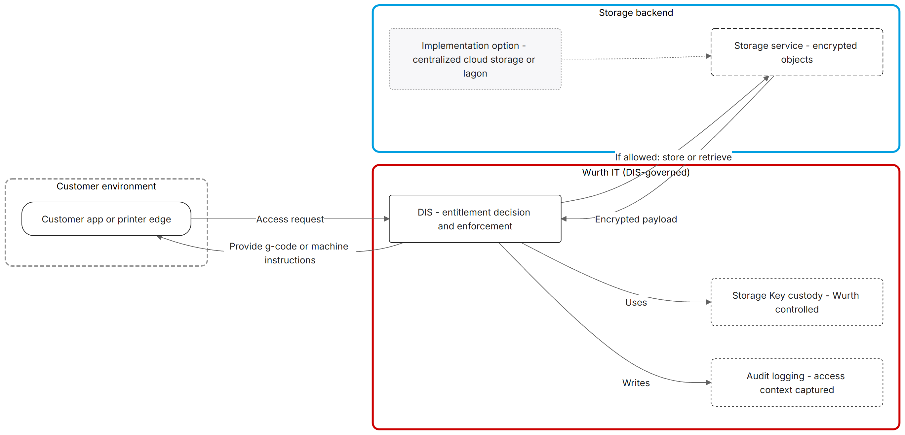
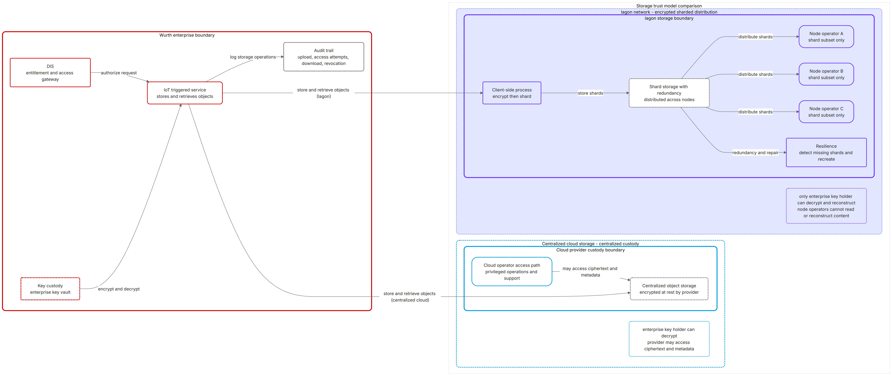

# Milestone 1 – Part 4: Data Management Plan

## 1 Purpose and Scope

### 1.1 Purpose of this document

This document defines how IP-protected files and related metadata are stored, encrypted, and accessed for the pilot architecture described in Part 1. It evaluates the current centralized storage model, identifies associated business risks, and presents Iagon decentralized storage as an alternative that addresses those risks while preserving existing enterprise controls.

Specifically, it defines storage-domain data handling for IP-protected assets (machine instruction files, recipes, and supporting artifacts), including:

* current state assessment of centralized cloud storage within the DIS-governed workflow
* business risks associated with centralized cloud storage
* how Iagon decentralized storage addresses those risks
* integration approaches that minimize disruption to existing systems

### 1.2 Scope boundaries

In scope:

* storage of IP-protected artifacts off-chain
* encryption, key custody boundaries, and access enforcement expectations
* evaluation of centralized storage risks vs Iagon storage benefits
* connector-style integration approaches for storage backend substitution

Out of scope (Milestone 1):

* complete connector API specifications and production hardening details
* full DIS/IoT execution integrations
* detailed legal/compliance policies beyond pilot-level posture

## 2 Current State: DIS and Centralized Cloud Storage

### 2.1 Digital Inventory Services as the entitlement gateway

Digital Inventory Services (DIS) is Würth Additive Group's platform for governed distribution and control of digital inventory assets. DIS integrates with an enterprise IoT hub and IoT-connected 3D printers to deliver g-code or machine instructions and manage the print lifecycle—from entitlement verification through print execution.

Within this workflow, DIS acts as the entitlement decision point and enforcement gateway. It determines whether a requester (customer, printer, or internal system) is authorized to access a given asset, and only then facilitates retrieval from the storage backend.

### 2.2 Centralized cloud storage as the current backend

Centralized cloud object storage serves as the current repository for IP-protected g-code or machine instructions. The integration between DIS and the storage backend is well-bounded: print asset storage requires only object/blob-style operations—upload, retrieve, and delete. There is no dependency on queues, tables, file shares, or advanced storage policies for the core print asset workflow.

This limited surface area makes the storage backend a candidate for substitution without disrupting the broader DIS architecture or enterprise workflows.

DIS-governed storage access flow: entitlement decision → storage gateway/enforcement point → storage backend, with audit logging and key ownership under Würth control.

### 2.3 Current encryption model

With centralized cloud storage, files are transmitted over TLS and encrypted at rest by the provider using keys managed via an enterprise key management service. This is the standard enterprise model for cloud storage:

* data arrives at the provider and is encrypted at rest using platform-managed or customer-managed keys
* both the ciphertext and the encryption keys reside within the provider's trust boundary
* the provider has technical access paths to both encrypted data and key material

This model is widely adopted but introduces specific risks discussed in Section 3.

## 3 Business Problem: Centralized Storage Risks

### 3.1 Provider access, legal compulsion, and malicious actors

With centralized cloud storage, the provider operates both the storage infrastructure and (typically) the key management service. Even when encryption keys are customer-managed via an enterprise key management service, the provider has technical access paths to both ciphertext and key material within their infrastructure.

This creates multiple exposure vectors:

* **Legal compulsion**: Under subpoena, court order, or government request, the provider may be required to access stored data and provide it to authorities. Cloud providers regularly receive and comply with such requests. For IP-protected manufacturing assets, this represents a business risk where sensitive print machine instructions could be exposed through legal processes directed at the storage provider rather than at Würth.

* **Malicious actors**: An attacker who gains access to the cloud provider's infrastructure can download encrypted data in bulk. Once exfiltrated, this data can be subjected to offline brute-force or cryptanalytic attacks without detection or rate limiting. Because both ciphertext and key material reside within the same trust boundary, a sufficiently privileged breach could yield both.

In contrast, with Iagon's distributed model, an attacker would need to compromise multiple independent node operators to obtain enough shards to attempt reconstruction—and would still lack the encryption keys, which remain in Würth's enterprise key management service outside the storage network entirely.

### 3.2 Single point of failure and availability

Centralized storage concentrates availability risk. A regional outage, infrastructure failure, or service disruption at the cloud provider can render IP-protected assets unavailable, potentially halting print operations across affected facilities.

While cloud providers offer high availability within their SLAs, outages do occur and recovery timelines are outside enterprise control.

### 3.3 Resilience complexity and attack surface

Adding resilience to centralized storage (cross-region replication, multi-provider redundancy) increases operational complexity and expands the attack surface. Each additional replication target introduces:

* new access paths that must be secured
* additional key management and synchronization requirements
* more infrastructure under the provider's control that could be subject to legal compulsion

The effort to mitigate availability risk can inadvertently increase confidentiality risk.

## 4 Iagon Decentralized Storage: Value Proposition

Iagon provides a decentralized storage network that addresses the risks identified in Section 3 while maintaining compatibility with enterprise workflows. The following subsections focus on business outcomes; technical implementation details may be refined in subsequent milestones.

### 4.1 Encryption key custody remains with Würth

With Iagon, encryption keys remain under Würth control in the enterprise key management service already in use. Keys are never transmitted to or stored by the Iagon network. Node operators receive only encrypted, sharded fragments and have no access to key material.

This eliminates the provider access path: even under legal compulsion, the storage network cannot produce decrypted content because it does not possess the keys required for decryption.

### 4.2 Shard distribution and no single-operator access

After client-side encryption, Iagon shards the encrypted data and distributes fragments across multiple independent storage nodes. The distribution model ensures:

* no single node operator holds enough shards to reconstruct the original content
* node operators do not have knowledge of shard placement beyond their own allocation
* even if an individual node is compromised, the attacker obtains only an encrypted fragment—meaningless without the other shards and the decryption key

This architectural property means there is no single point of attack. Compromising the storage network would require simultaneously breaching multiple independent operators and obtaining keys held entirely outside the storage boundary.

### 4.3 Built-in redundancy without expanding trust boundaries

Iagon's redundancy model uses error-correcting codes (Reed-Solomon encoding) such that only a subset of shards (approximately 70%) is required to reconstruct the original file. Redundant shards are distributed automatically, and the network continuously monitors node availability:

* if a node goes offline, shards are automatically recovered and redistributed to other nodes
* redundancy is maintained without requiring Würth to configure or manage replication
* the trust boundary does not expand—additional redundancy does not create additional access paths or key exposure

This contrasts with centralized storage, where adding resilience requires explicit configuration and introduces new attack vectors.

### 4.4 Reduced vendor concentration risk

Relying on a single cloud provider for storage creates concentration risk—operational, commercial, and regulatory. Iagon's decentralized model distributes storage across a network of independent providers, reducing dependence on any single vendor's infrastructure, pricing, or policy changes.

Storage trust model comparison: centralized storage (provider holds ciphertext and has access path to keys) vs Iagon storage (client-side encryption, sharded distribution, no single operator can reconstruct content).

## 5 Integration Approaches

The limited surface area of DIS's interaction with storage (object-level operations only) makes the storage backend a natural substitution point. Two integration approaches are outlined below. No final selection is made at this stage; the appropriate path depends on implementation priorities, DIS codebase constraints, and operational preferences.

### 5.1 Iagon SDK integration

In this approach, the Iagon SDK replaces existing storage SDK calls at the points where DIS interacts with storage.

**Characteristics:**

* direct integration using Iagon's purpose-built client libraries and REST API
* DIS code is modified to call Iagon endpoints for upload, retrieve, and delete operations
* storage-specific logic (encryption, sharding) is handled transparently by the SDK
* requires code changes in DIS but results in a clean, native integration

**Trade-offs:**

* more direct control over Iagon-specific features and configuration
* requires development effort to replace existing storage SDK calls
* DIS becomes explicitly aware of the storage backend implementation

### 5.2 Compatibility-layer approach

A compatibility-layer approach is also under consideration to minimize changes to existing systems.

### 5.3 Common considerations

Regardless of approach:

* the connector boundary must support the object-level operations required by DIS (upload, retrieve, delete, list)
* authentication and authorization remain under DIS control; the storage connector enforces access based on verified entitlements
* audit logging must capture storage operations with sufficient context for compliance and troubleshooting

## 6 Access Control Model

### 6.1 Entitlement decision sources

Entitlement decisions remain under enterprise governance. ORSY rules, DIS policies, and related enterprise systems determine who or what is authorized to access a given asset. The storage layer does not independently make access decisions.

### 6.2 Enforcement points

DIS acts as the enforcement gateway. Storage operations are initiated only after DIS has verified entitlements. The storage backend (centralized cloud or Iagon) enforces access at the storage layer based on credentials and policies controlled by Würth, but does not evaluate business-level entitlements.

### 6.3 Auditability and traceability

Minimum expected audit events include:

* upload/ingestion events (who/what/when, asset identifier)
* access attempts (allowed/denied, requester context)
* download/retrieval events (successful delivery confirmation)
* deletion and revocation actions

Audit logs must be correlatable to entitlement context without exposing confidential payload content in log entries.

## 7 Encryption and Key Management

### 7.1 Encryption posture across backends

Würth's security posture regarding pre-encryption does not change between storage backends:

* with the centralized cloud backend, Würth can pre-encrypt files before upload or rely on provider-side encryption at rest
* with Iagon, the same choice exists—Würth can pre-encrypt for defense-in-depth, or rely on Iagon's client-side encryption

The key difference is where encryption occurs by default: the centralized cloud backend encrypts at rest after receiving plaintext, while Iagon encrypts client-side before data enters the storage network.

### 7.2 Key custody and enterprise key management

Encryption keys remain under Würth control in the enterprise key management service regardless of storage backend. This preserves:

* existing key management workflows and policies
* segregation of duties between storage operations and key custody
* enterprise-grade audit logging for key access and usage

With Iagon, keys stored in the enterprise key management service are used for client-side encryption before data is transmitted. The storage network never receives or has access to these keys.

### 7.3 Key rotation and lifecycle

Key rotation, access policies, and lifecycle management continue through existing enterprise key management mechanisms. Rotating keys for Iagon-stored assets follows the same operational process as for assets in centralized cloud storage:

* generate new key version in the key management service
* re-encrypt affected assets (or encrypt new assets with the new key)
* retire old key versions per retention policy

The storage backend is transparent to key lifecycle operations.

## 8 Data Lifecycle Management

### 8.1 Upload and ingestion

Ingestion workflows remain DIS-governed. Assets are validated, classified, and associated with appropriate metadata before storage. Metadata required for entitlement and audit purposes is maintained off-chain in enterprise systems—not in the storage layer.

### 8.2 Integrity verification

Content integrity should be verified using cryptographic hashes:

* hash computed at ingestion and stored as part of asset metadata
* hash verified on retrieval to confirm content has not been altered
* hashes can serve as safe pointers (opaque, non-identifying references) for audit and reconciliation purposes

### 8.3 Retention and deletion

Retention and deletion policies are enforced by DIS based on enterprise requirements. When an asset is deleted:

* DIS initiates deletion through the storage connector
* the storage backend (centralized cloud or Iagon) removes the asset per its deletion semantics
* audit log captures deletion event with appropriate context

For Iagon, deletion results in shard removal across the distributed network; the redundancy model ensures deleted content cannot be reconstructed once deletion propagates.

## 9 Availability and Resilience

### 9.1 Centralized storage baseline

With centralized cloud storage, availability depends on the selected redundancy tier. Higher redundancy increases cost and, as noted in Section 3.3, can expand attack surface.

### 9.2 Iagon resilience model

Iagon's architecture provides built-in resilience:

* Reed-Solomon encoding allows reconstruction from approximately 70% of shards
* node failures trigger automatic shard recovery and redistribution
* no manual configuration required to maintain redundancy levels

This model achieves resilience without the trade-offs associated with centralized cross-region replication.

### 9.3 Recovery expectations

For pilot usage, recovery expectations should be defined based on:

* acceptable downtime for print operations if storage is temporarily unavailable
* data durability requirements (probability of permanent data loss)
* recovery point objectives if disaster recovery scenarios arise

Both centralized cloud storage and Iagon can meet enterprise-grade durability requirements; the choice affects how resilience is achieved and managed.

## 10 Operational Controls and Compliance

### 10.1 Logging and monitoring

Audit logs should capture storage operations and be correlatable to entitlement context without exposing confidential payloads. Logs should include:

* operation type, timestamp, and outcome
* requester identity (service account, user, or system)
* asset identifier (opaque reference, not content)

### 10.2 Compliance considerations

For an enterprise pilot, relevant compliance considerations include:

* data residency: ability to constrain storage to specific geographic regions (Iagon supports regional node selection)
* access restrictions: ensuring only authorized systems and personnel can initiate storage operations
* evidence handling: maintaining audit trails sufficient for regulatory or legal inquiries

Detailed compliance analysis is out of scope for Milestone 1 but should be addressed before production deployment.

## 11 Data Minimization and Confidentiality

This section states the data minimization principles for the IP asset storage domain. It is the storage counterpart to Part 2’s settlement-domain minimization section; the two domains are intentionally decoupled.

### 11.1 Storage domain (confidential IP domain)

* IP-protected asset content remains off-chain and is never written to Cardano.
* Storage backends (centralized cloud or Iagon) must only ever receive encrypted payloads according to the chosen encryption posture (see Section 7).
* Encryption keys remain under Würth control (enterprise key management service); storage operators and storage providers do not receive key material.

### 11.2 Metadata minimization and safe identifiers

* Readable business metadata (part numbers, names, recipes, customer/vendor context) remains in enterprise systems (DIS and related systems) and is not stored as storage object names or tags.
* Storage-layer identifiers should be opaque references suitable for audit and reconciliation without revealing readable IP or commercial context.
* Integrity hashes may be stored and used as safe pointers (see Section 8.2) without exposing payload content.

### 11.3 DIS governance alignment (storage enforcement surface)

* DIS remains the enforcement gateway and entitlement decision point for governed distribution.
* Storage connectors must preserve DIS expectations for access enforcement, traceability, and auditability (see Section 6).

## 12 Open Design Decisions

* **Integration approach**: Iagon SDK integration vs. compatibility-layer approach—to be evaluated based on DIS codebase constraints and operational preferences.
* **Connector boundary details**: Specific API mappings, error handling, and feature coverage to be defined in subsequent milestones.
* **Pilot scope**: Which assets and workflows to include in initial storage backend substitution testing.

