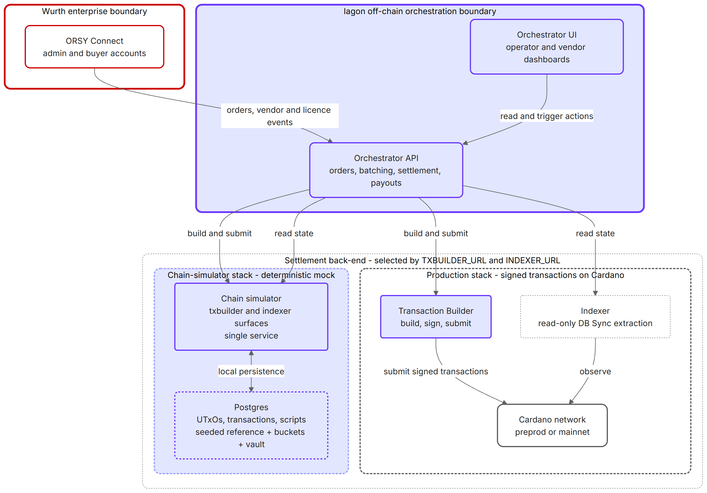
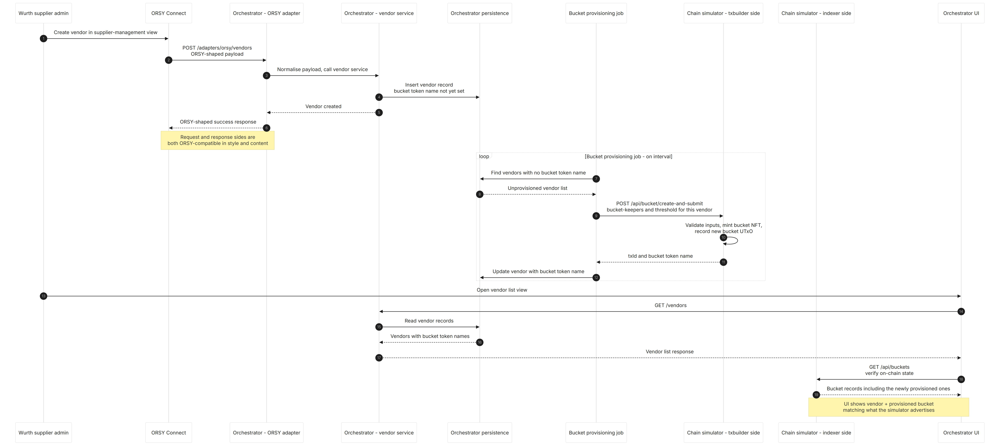
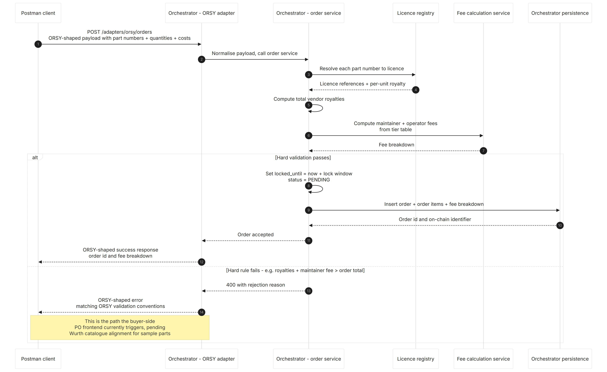
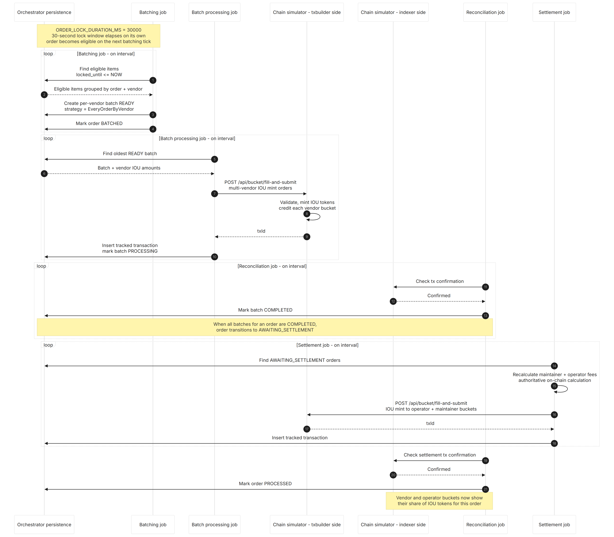
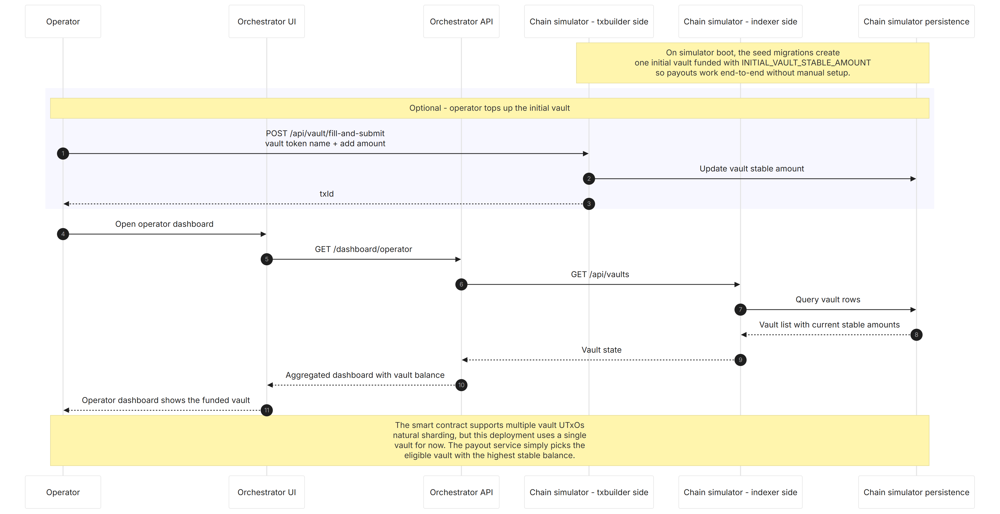
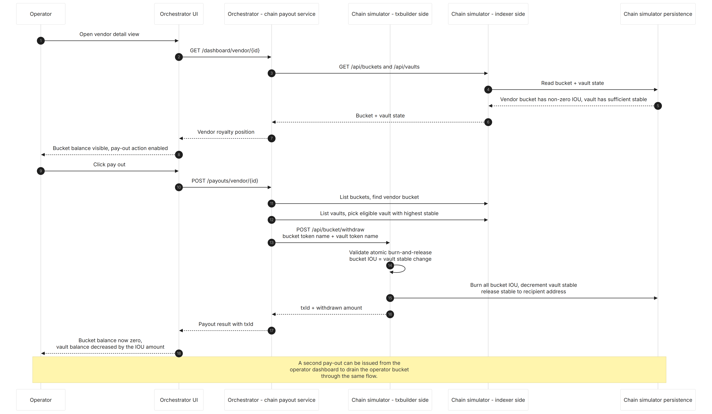

# Milestone 2 – Part 3: Off-chain API Prototype Report

## 1 Purpose and Scope

### 1.1 Purpose of this report

This document is one of the four output reports for Milestone 2 of the Iagon & Würth Catalyst Fund 13 project. It describes the off-chain side of the prototype delivered for this milestone — the services, the user interface, the enterprise integration with Würth's ORSY platform, and the deterministic mock back-end used in place of Cardano for demonstration and testing.

It addresses the Milestone 2 *Off-chain API prototype* output and its associated acceptance criteria, which call for:

- a working API prototype that **simulates real integration scenarios** with Würth's enterprise systems,
- mock API calls **documented and reviewed** by Iagon and Würth,
- a **walkthrough video** demonstrating the prototype end-to-end,
- the corresponding **interaction logs** that capture the exchanged payloads.

The report is intentionally written at the same level of abstraction as the Milestone 1 deliverables — sufficient to validate scope, behaviour, and intent without disclosing internal implementation details that fall under the closed-source enterprise pilot agreement.

### 1.2 Scope boundaries

In scope for this document:

- the **services** that make up the off-chain stack: the orchestrator API, the orchestrator user interface, and the chain-simulator service that replaces the production transaction builder and indexer for demonstration purposes;
- the **ORSY enterprise integration** surface: how Würth's product- and order-management system drives vendor, licence, and order events into the orchestrator;
- the **end-to-end flow** demonstrated in the accompanying walkthrough video, step by step, with sequence diagrams.

Out of scope for this document:

- the on-chain primitives, datums, and validators (covered in Part 1);
- the royalty calculation rules, fund-lock semantics, and batching strategies (covered in Part 2);
- the full enumeration of orchestrator HTTP endpoints (covered in Part 4);
- closed-source implementation specifics such as table schemas, service-class internals, and deployment configuration.

### 1.3 Relationship to other Milestone 2 deliverables

- **Part 1 — Smart Contract Prototype Report** describes the on-chain primitives that the off-chain services ultimately drive.
- **Part 2 — Royalty Mechanism Test Report** describes the royalty calculation, fund locks, batching, and payout semantics that the orchestrator implements.
- **Part 4 — API Endpoint Specification Document** documents every orchestrator endpoint exercised below and includes a pointer to the rendered specification site.

## 2 System Overview

### 2.1 Off-chain stack

The off-chain side of the prototype is a small set of cooperating services and one browser-based application:

- **Orchestrator API.** The central off-chain service. Owns the order lifecycle, fee calculation, fund-lock handling, batching, settlement scheduling, payout execution, and the ORSY enterprise integration. All persistence is in a dedicated PostgreSQL database. Exposed via HTTP with an OpenAPI specification that is the source of truth for the platform's auto-generated SDK clients.
- **Orchestrator user interface.** A React single-page application that operators and vendors use to observe orders, settlement state, vendor royalty positions, and to trigger payouts. The UI is the only HTTP client that operators and vendors interact with directly during a walkthrough.
- **Chain-simulator service.** A deterministic, PostgreSQL-backed mock of the on-chain side of the system. Exposes the union of the production transaction builder and indexer HTTP surfaces, and seeds itself on first boot with a configured reference contract, system buckets for the operator and maintainer, and an initial vault funded with a documented stablecoin balance. The orchestrator switches between the real Cardano back-end and this mock by changing two environment variables and nothing else.

### 2.2 The chain-simulator stand-in

The chain-simulator exists for two reasons that matter for Milestone 2:

- Catalyst Milestone 2 explicitly asks for a **mock smart contract simulating token issuance, access control logic, and royalty distribution**. The chain-simulator is that mock — and because it is a service rather than an in-process simulation, the orchestrator's own code paths and SDK clients are unchanged between the simulated demonstration and the live Cardano preprod walkthrough.
- Live preprod transactions have settlement delay and are not trivially resettable. The chain-simulator is **synchronous and resettable** by design, which lets reviewers replay every step of the demonstration from a clean state and makes deterministic verification straightforward in a CI pipeline.

A discipline of **endpoint parity** is enforced operationally: any endpoint added to the production transaction builder or indexer must land in the chain-simulator's OpenAPI specification and be implemented in the same change. This guarantees that the demonstration stack and the production stack diverge only in *where* the on-chain effects happen, not in *which* operations are available.

### 2.3 Architecture comparison

The relationship between the orchestrator, the production stack, and the chain-simulator is shown below. Both back-ends present the same HTTP surfaces; only the URLs differ.

The Milestone 2 walkthrough video uses the chain-simulator back-end for the main demonstration to keep the recording reproducible. A short appendix segment exercises the same orchestrator against Cardano preprod to confirm that the production back-end behaves equivalently for the same flow.

## 3 End-to-end Demonstration Flow

This section walks through the demonstration captured in the accompanying walkthrough video. Each subsection corresponds to a contiguous portion of the recording and is accompanied by a sequence diagram that describes the participants and the messages exchanged. The video itself is filed alongside this report in the milestone evidence bundle.

The demonstration runs against the chain-simulator back-end with the orchestrator user interface and ORSY Connect open side by side. The orchestrator is configured with `TXBUILDER_URL` and `INDEXER_URL` pointing at the chain-simulator service, and the chain-simulator's seeded state — a reference contract, the operator and maintainer system buckets, and a pre-funded initial vault — is in place before the recording begins.

### 3.1 Vendor registration and automatic bucket provisioning

The demonstration opens in the Würth supplier-management view of ORSY Connect. A new vendor is created there. ORSY immediately posts the vendor payload to the orchestrator's ORSY adapter, which translates it into a clean vendor record on the orchestrator side. Because the ORSY adapter and the direct vendor management endpoints share their underlying business service (see Part 4 §3.2.1), this is the same code path that a direct administrator-driven vendor creation would take, with the request and response formats translated to ORSY's conventions on the wire.

The vendor lands in the orchestrator's database without an on-chain bucket yet — bucket provisioning runs as a separate, asynchronous background job. On its next cycle the job finds the unprovisioned vendor, requests a bucket creation against the chain-simulator's transaction builder surface, and records the resulting bucket token name against the vendor. The orchestrator user interface refreshes a moment later showing the vendor with their provisioned bucket and a zero royalty balance.

### 3.2 Licence registration

The same supplier-management flow is then exercised for **licences**: a new licence is created in ORSY Connect, the ORSY adapter receives it, and the licence appears in the orchestrator's catalogue tied to its vendor. The flow is structurally identical to vendor registration (different payload shape, same adapter pattern) and is not given a separate sequence diagram in this report; the licence catalogue in the orchestrator user interface reflects the new licence immediately.

### 3.3 Purchase-order frontend - current state and limitation

Before the order submission step, the video briefly shows the **buyer-side purchase-order frontend** in ORSY Connect from the buyer account. The frontend renders correctly and accepts user input, but **submitting an order through it currently fails** at the orchestrator's hard validation step. The reason is unrelated to the orchestrator: the ORSY-side mock catalogue does not yet expose part numbers whose per-unit royalty values and total prices satisfy the *total royalties plus maintainer fee must not exceed the order total* hard rule from Part 2 §2.5. The orchestrator rejects the order with the configured rejection reason, in an ORSY-shaped error response, which is the correct behaviour.

The unblock is a **catalogue alignment on the Würth side** — the project team is awaiting sample data that mirrors actual 3D licence pricing — and it does not require any change in the orchestrator or in the on-chain side. Once that data lands, the buyer-side path will succeed without further code changes. In the meantime, the demonstration uses the same endpoint via Postman to drive a known-valid order, as described in §3.4.

### 3.4 Order submission via the ORSY adapter

The video switches to Postman and sends a single `POST /adapters/orsy/orders` request containing a payload that is structurally identical to what ORSY Connect itself would send, but populated with values that satisfy the hard validation rules. The orchestrator's order service receives the payload through the same ORSY adapter that ORSY Connect uses in production, computes the vendor royalty total, asks the fee calculation service for the maintainer and operator fees (Part 2 §2.2), runs the hard validation, and on success persists the order with a `locked_until` timestamp and a status of `PENDING`. The response is an ORSY-shaped success payload that includes the order identifier and the full fee breakdown.

The orchestrator user interface immediately shows the new order in the operator dashboard with its locked status, fee breakdown, and lock-expiry timestamp.

### 3.5 Fund-lock expiry and IOU minting

For the purposes of the demonstration the orchestrator is configured with `ORDER_LOCK_DURATION_MS=30000`, giving each order a **30-second lock window** before it becomes eligible for batching. In production this window will be calibrated to throughput (see Part 2 §3.4); 30 seconds is short enough to keep the recording moving, but long enough that reviewers can see the order sit in the PENDING state and verify the lock-expiry behaviour live, rather than via a database edit.

Once the 30 seconds elapse, the orchestrator drives the rest of the flow with no further human involvement. The batching job picks up the now-eligible order and groups its line items by vendor under the *every-order-by-vendor* strategy (Part 2 §4.2). The batch-processing job picks up the resulting batch, asks the chain-simulator's transaction builder surface to mint IOU tokens to the receiving vendor's bucket in a single multi-vendor transaction, and inserts a tracked transaction for the reconciliation job to confirm. Once the reconciliation job marks the batch as completed, the order moves to *awaiting settlement*. The settlement job then computes the authoritative on-chain maintainer and operator fees, mints the corresponding IOU tokens to the operator and maintainer system buckets, and lets reconciliation finish the order.

The orchestrator user interface reflects each stage in turn: the order moves through `BATCHED`, `AWAITING_SETTLEMENT`, and finally `PROCESSED`. The vendor's dashboard view shows their bucket gaining the vendor royalty IOUs; the operator dashboard shows the operator bucket gaining its share shortly thereafter.

The maintainer bucket also receives its share on the same settlement transaction. The orchestrator user interface does not surface a maintainer view — the maintainer position is observable directly through the chain-simulator's read endpoint, which the video shows briefly. The demonstration does not dwell on it.

### 3.6 Vault state

Throughout the demonstration the operator dashboard renders the current state of the **vault** that backs vendor payouts. The vault was funded on chain-simulator startup with a documented initial stablecoin balance large enough to cover every demonstration scenario; the same orchestrator user interface that shows it is configured to read its balance through the chain-simulator's indexer surface.

The smart contract supports **natural sharding** across multiple vault UTxOs (Part 1 §3.3), but the Milestone 2 deployment operates with a single vault. The payout service simply picks the eligible vault with the highest stablecoin balance, which in this configuration is always the seeded vault. Supporting multiple vaults at the orchestrator and user interface levels is a configuration-and-UI change rather than a contract change and is parked for a later milestone if Würth's projected throughput motivates it or other opportunities surface the need.

### 3.7 Payout flow

Finally the demonstration shows the **payout** step. From the vendor detail view in the orchestrator user interface, the operator clicks the *pay out* action. The orchestrator's chain payout service looks up the vendor's bucket and the eligible vault through the chain-simulator's indexer surface, builds a bucket-withdraw transaction against the chain-simulator's transaction builder surface, and submits it. The chain-simulator validates the transaction against the same atomic-binding rules described in Part 1 §4.3 — the bucket's full IOU balance is burned in the same transaction that releases the matching amount of stablecoin from the vault — and persists the result. The orchestrator's response includes the transaction identifier and the withdrawn IOU amount.

A second payout is then issued from the operator dashboard against the operator bucket using the same flow, closing the end-to-end demonstration.

## 4 ORSY Enterprise Integration

The orchestrator exposes a small set of ORSY-shaped HTTP endpoints (`/adapters/orsy/vendors`, `/adapters/orsy/licenses`, `/adapters/orsy/orders`) that accept payloads in the formats produced by Würth's ORSY system and return responses in formats ORSY consumes without translation. Field naming, identifier formats, and payload structure follow ORSY's conventions on both the request and response sides.

Each ORSY-adapter endpoint internally **delegates to the same business service** that backs the corresponding direct endpoint exposed for non-ORSY callers — the adapter is a translation layer over the orchestrator's vendor, licence, and order services, not a separate implementation. This guarantees that ORSY-originated events and direct calls (administrator-driven, scripted, or otherwise) produce identical downstream state and apply identical business rules.

The full enumeration of the ORSY adapter and its direct-API counterparts is documented in Part 4 §3.2, including the specific endpoint paths and the M2 themes each one serves.
