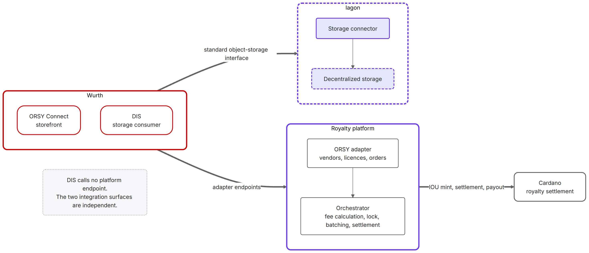

# Milestone 3 – Part 1: Integration API Documentation

## 1 Purpose and scope

### 1.1 Purpose of this document

This document is one of the four output reports for Milestone 3 of the Iagon & Würth Catalyst
Fund 13 project. It documents the API surface that integrates the tokenization platform with
Würth's **ORSY** storefront and, at the design level, with the **DIS** storage consumer. It
addresses the Milestone 3 *API Documentation* output, which calls for API specifications
detailing endpoint structures, input/output parameters, and integration logic, complete and
reviewed by both teams.

It is written at the same level of abstraction as the Milestone 1 and Milestone 2 deliverables:
enough to validate scope, responsibilities and integration logic without disclosing internal
implementation details that fall under the closed-source enterprise pilot agreement.

### 1.2 Scope boundaries

**In scope**: the ORSY storefront integration surface (adapter endpoints plus supporting
vendor/license/order operations), the design-stage storage-connector API surface, and sample
request/response payloads.

**Out of scope**: internal service-to-service APIs (txbuilder, chain-simulator) except where
they clarify integration behaviour; smart-contract internals (covered in M2 Part 1). The indexer
is not part of the storefront integration either, but its specification is published alongside
the orchestrator's and is described in §2.4.

### 1.3 Two integration surfaces, and what became of DIS

The Milestone 3 objective and its API Documentation output are both worded around **DIS**
(Digital Inventory Services). A reviewer reading this document will find it is mostly about
**ORSY Connect**. The scope resolved during the work.

At proposal time it was not yet established which Würth system would drive the royalty and
orchestration logic: DIS, ORSY Connect, or both. The proposal and the Milestone 1 documents
were written under that uncertainty and named DIS as the integration counterpart. As the
integration was actually built out with Würth, the question resolved. ORSY Connect is the
storefront, and it is the only Würth system that exchanges order, licence or vendor data with
the orchestrator. The Milestone 2 documents recorded this correction; this document works from
the resolved position.

The project therefore has two integration surfaces, and they do not touch each other:

| | ORSY Connect | DIS |
|---|---|---|
| Relationship to the platform | Storefront. Sends vendors, licences and orders. | Storage consumer. Retrieves IP-protected build files at print time. |
| In the royalty / orchestration path? | Yes. It originates every order. | No. |
| Calls any orchestrator endpoint? | Yes, the three adapter endpoints in §3. | No. |
| API surface shared with the orchestration logic | The surface documented in §3. | None. |
| Documented where | This document, §3. | The storage connector, Output 4, summarised in §4. |

DIS shares no API surface with the royalty and orchestration solution. It is not a caller of any
orchestrator endpoint, it does not receive orchestrator callbacks, and no such interface is
planned. Its only point of contact with anything Iagon builds is the storage connector
(Output 4), where DIS is a client of the connector's object-storage interface. Everything
relevant to DIS integration is therefore in [Part 4](04-storage-connector-design.md), and §4
below summarises that contract from the API perspective.

This is a design outcome rather than a reduction in scope. Because the connector presents a
standard object-storage interface, DIS needs no bespoke API from Iagon: it uses the storage
client tooling it already has, and there is no additional interface to design and then maintain.

---

## 2 Integration architecture overview

### 2.1 Where the integration sits

The orchestrator is the system of record for licences, orders and royalty settlement. ORSY
Connect pushes three kinds of fact into it over HTTP. Everything downstream (fee calculation,
the cancellation window, batching, on-chain settlement and payouts) happens without further
involvement from the storefront.



*Diagram **022**: the two integration surfaces. ORSY Connect drives the royalty platform through
the adapter endpoints; DIS reaches Iagon storage through the connector and touches no platform
endpoint.*

The integration is one-directional at the API level. ORSY calls the orchestrator; the
orchestrator does not call ORSY. Settlement state is available to be read back through the order
endpoints (§3.4) but is not pushed.

### 2.2 Transport, authentication and conventions

| Aspect | Contract |
|---|---|
| Specification | OpenAPI 3.1.0, `Orchestrator API` v1.0.0. The rendered specification (§6) is the authoritative definition. |
| Transport | HTTPS, JSON request and response bodies. |
| Authentication | `X-API-Key` header (`ApiKeyAuth`). Keys are provisioned per consumer through service configuration. |
| Monetary units | Micro-units throughout: 1,000,000 micro-units = 1 unit of base currency. A `Cost` of `28.80` on an ORSY payload becomes `28800000`. |
| Identifiers | The platform exposes both a numeric `id` (database primary key) and a stable `onChainId` / `uuid`. Integrations should key on the on-chain identifier or on their own `AccountNumber`, not on the numeric id. |
| Error shape | All 4xx/5xx responses return `ApiErrorResponse`: `{ "message": "…" }`. |
| Status codes | `201` on resource creation, `200` on read, `204` on cancellation, `400` validation, `404` not found, `409` duplicate. |

The identifier row is the one that shapes integration work. ORSY's `AccountNumber` is stored by
the platform as `customVendorIdentifier` and is the key by which licences and orders resolve
back to a vendor. ORSY never needs to learn the platform's internal vendor id, so the
integration stays stateless on the storefront's side: ORSY sends the identifiers it already owns.

### 2.3 Complete API surface at a glance

The published specification covers 21 operations across 8 tags. Only a subset is part of the
storefront integration; the table marks which.

| Tag | Ops | Integration relevance |
|---|---:|---|
| ORSY Adapter | 3 | The integration surface. ORSY-shaped payloads. §3.1–§3.3. |
| Orders | 4 | Read-back and cancellation for orders created via the adapter. §3.4, §3.5. |
| Vendors | 3 | Native equivalents of the adapter's vendor operation; used by the operator UI. |
| Licenses | 3 | Native equivalents of the adapter's licence operation; used by the operator UI. |
| Payouts | 2 | Vendor and operator bucket drains. Not called by ORSY. |
| Dashboard | 2 | Read-only operator and vendor views joining database and on-chain state. |
| Health | 3 | Detailed health, liveness, readiness. Useful to ORSY for monitoring. |
| Authentication | 1 | Auth-mode discovery for the UI. |

### 2.4 The indexer specification

The indexer is published as a second, separate specification: `Indexer API` v1.0.0, 8 operations
across 6 tags. It is a read-only observer of Cardano chain state, queried by the orchestrator to
confirm transactions and to read contract, vault and bucket state. ORSY does not call it, and it
holds no order, licence or vendor data.

| Tag | Ops | Paths |
|---|---:|---|
| Health | 3 | `GET /health` · `GET /health/live` · `GET /health/ready` |
| Contracts | 1 | `GET /api/contracts`. Reference contract versions. |
| Vaults | 1 | `GET /api/vaults`. Vault UTxO state and balances. |
| Buckets | 1 | `GET /api/buckets`. Bucket UTxO state and IOU token balances. |
| Transactions | 1 | `GET /api/transactions/{txHash}`. Confirmation lookup. |
| UTxOs | 1 | `GET /api/utxos/{address}`. Raw UTxO lookup by address. |

It is documented here because it is the component that substantiates the on-chain half of the
settlement pipeline: the confirmation thresholds and stage timings in
[Part 2](02-integration-test-report.md) §6.3 are measured against what this service observes.
The two specifications are never merged, and each is rendered as its own page (§6).

---

## 3 ORSY storefront integration endpoints

Three endpoints carry the entire storefront integration. Each accepts an ORSY-shaped payload,
maps it onto the platform's internal model, and delegates to the same service the platform's own
endpoints use, so the adapter is a translation layer and not a second implementation.

The surface is this small because the model behind it assumes immutability. A vendor that has
accrued royalties is not deleted, and neither is a licence that has already been quoted on an
order; both are referenced by settled on-chain state. Changing a vendor's keys is supported by
the smart contract but is not currently exposed through the orchestrator, and may be added
later. Cancellation is the one mutation the platform does support, and ORSY does not yet drive
it: it exists as the native `DELETE /orders/{id}` (§3.5) with no adapter equivalent. As Würth
settles how it wants to use ORSY Connect and extends these capabilities, further adapter
endpoints may follow.

Every adapter payload tolerates extra fields. ORSY may send address, contact and catalogue data
that the platform has no use for; those fields are ignored, not rejected. The payload ORSY sends
the orchestrator is the same one it already sends to other systems in Würth's ecosystem, so the
storefront reuses a message it maintains anyway instead of building a projection of it specific
to this platform.

### 3.1 `POST /adapters/orsy/vendors`: create a supplier

Registers an ORSY supplier as a platform vendor, provisioning a wallet for it.

**Field mapping**

| ORSY field | Platform field | Notes |
|---|---|---|
| `Vendor.Name` | `displayName` | Required. |
| `Vendor.AccountNumber` | `customVendorIdentifier` | Required. The key for all later lookups. |
| `Vendor.Address1`, `City`, `State`, `Zipcode`, `Country` | n/a | Accepted and ignored; reserved for future use. |

**Side effect**: the platform creates a Cardano wallet for the vendor and returns its
`publicKeyHash`. An on-chain royalty bucket is provisioned for the vendor asynchronously by a
background job.

**Responses**: `201` with the `Vendor` object · `400` validation error · `409` a vendor with
that `AccountNumber` already exists.

### 3.2 `POST /adapters/orsy/licenses`: register a 3D-print licence

Binds a part number to a vendor and a per-unit royalty. The vendor must already exist.

**Field mapping**

| ORSY field | Platform field | Notes |
|---|---|---|
| `License.PartNumber` | `partNumber` | Required. Unique across all licences. This is the value an order must quote. |
| `License.VendorPartNumber` | `vendorPartNumber` | Required. The vendor's own reference; not required to be unique. |
| `License.Name` | `name` | Required. Human-readable. |
| `License.RoyaltyAmountMicro` | `royaltyAmountMicro` | Required, integer micro-units. `750000` = $0.75 per unit. |
| `License.AccountNumber` | → vendor lookup → `vendorId` | Required. Resolved against `customVendorIdentifier`. |

The two part numbers are deliberate. `PartNumber` is the system-level identifier that orders
quote and that must be unique; `VendorPartNumber` is the supplier's own reference for the same
item. Keeping them separate means a supplier's internal numbering never has to be reconciled
with the Würth catalogue.

The two values coincide for licences created through the ORSY interface, whose create
form captures vendor, product and royalty (see [Part 3](03-ux-design-report.md) §3.2, step 12).
Callers of this endpoint supply the two separately and can carry a distinct vendor reference.

**Responses**: `201` with the `License` object · `400` validation error or duplicate part
number · `404` no vendor with that `AccountNumber`.

### 3.3 `POST /adapters/orsy/orders`: submit an order

This endpoint carries the actual transaction volume. It resolves each line item to a licence,
computes the royalty and fee split, and returns the breakdown synchronously.

**Field mapping**

| ORSY field | Platform field | Notes |
|---|---|---|
| `Order.Parts.Part[].Part` | `items[].partNumber` | Required. Must match a licence's `partNumber`. |
| `Order.Parts.Part[].OrderQty` | `items[].quantity` | Required, ≥ 1. |
| `Order.Parts.Part[].Cost` | summed → `totalOrderAmountMicro` | Required. Total line cost, not per-unit. Dollars, converted ×1,000,000. |
| `Order.Number` | n/a | Logged for traceability, not stored on the order. |
| `Order.Vendor.AccountNumber` | n/a | Logged for future vendor linking. |
| `Order.Date`, `Order.Supplier.*`, `Parts.Part[].Description` | n/a | Accepted and ignored. |

One validation rule will reject an order: the total must cover total royalties plus the
maintainer fee. If the `Cost` values sum to less than that, the order is rejected with `400` and
a message naming the shortfall. This is the check most likely to surprise an integrator, because
it couples the storefront's pricing to the licence royalties configured on the platform.

A `201` carries back the created order, its items, and a `feeBreakdown`:

| Field | Meaning |
|---|---|
| `totalRoyaltiesMicro` | Sum of licence royalties across all line items. |
| `maintainerFeeMicro` | Maintainer fee, derived from the tier table (see M2 Part 2). |
| `operatorFeeMicro` | Operator proceeds: the remainder after royalties and the maintainer fee. |

**Responses**: `201` with `OrderWithItems` · `400` validation error, inactive licence, or
insufficient order total · `404` no licence for a quoted part number.

### 3.4 Supporting operations

The adapter endpoints create state; these read it back. ORSY does not have to call them, but
they are the contract available to it.

| Method & path | Purpose |
|---|---|
| `GET /orders/by-on-chain-id/{onChainId}` | The recommended read-back. Retrieves an order and its items by stable on-chain UUID. |
| `GET /orders/{id}` | Same, by internal numeric id. |
| `DELETE /orders/{id}` | Cancels an order. Read §3.5 before use. |
| `GET /health` | Detailed component health, for integration monitoring. |
| `GET /health/live` · `GET /health/ready` | Probe endpoints. |

Vendor, licence, payout and dashboard operations exist as native (non-ORSY) endpoints and are
documented in the rendered specification (§6). They back the operator and vendor interfaces
described in [Part 3](03-ux-design-report.md) rather than the storefront integration.

### 3.5 Order cancellation: scope and current contract

`DELETE /orders/{id}` sets the order's status to `CANCELLED` and returns `204`.

Cancellation covers exactly one situation: an order still inside its lock window, before that
window elapses and the order becomes eligible for batching. Nothing is ever rolled back on
chain, and no rollback path is designed for. An order inside its lock window has caused no
on-chain write at all, so cancelling it is a database state change and the lock expires
unobserved. This is the settlement delay window defined in
[M1 Part 2](../milestone-1/02-royalty-transaction-tracking.md) §2.3, with its cancellation
rules in that document's §5.3, which exists so that an
order that may still be withdrawn never incurs on-chain cost in the first place. Once the window
closes, royalties are minted as IOUs and that state stands; a cancellation at that point has
nothing to undo.

The current implementation does not yet enforce that boundary. It updates the order's status
without checking the lock, so a late call marks an order `CANCELLED` in the database while its
on-chain record stands, leaving the two out of step.

Closing this is scheduled for Milestone 4, against a specified contract: cancellation succeeds
while the order is PENDING and inside its window, and is refused with `409` once the window has
elapsed or the order has been batched, is awaiting settlement, or has been processed. A
companion change will expose cancellation on the ORSY adapter keyed by ORSY order number,
inheriting the same semantics.

[Part 2](02-integration-test-report.md) §1.3 also records that the cancellation path carries no
load-test evidence, because both runs submitted only orders that were allowed to settle. The
endpoint exists and is documented here; its behaviour under load is scheduled for Milestone 4.

---

## 4 Storage-connector API surface (design stage)

Per §1.3, this is the whole of the DIS-facing story, and it is deliberately not a
platform-specific API.

The storage connector presents a standard enterprise object-storage interface on its front side
and translates each operation into Iagon storage calls behind it. A consumer such as DIS
connects to it with ordinary object-storage client tooling, using the same connection-string
shape, shared-key request signing and operations it would use against a conventional cloud
object store. Nothing Iagon-specific appears on the wire.

The operation surface:

| Group | Operation | Purpose |
|---|---|---|
| Service | List containers | Enumerate top-level namespaces. |
| Container | Create · Delete · Exists · List objects | Container lifecycle and listing, with prefix and delimiter handling so virtual folders behave as clients expect. |
| Object | Upload | Write an IP-protected build file. Stored private by default. |
| Object | Download | Retrieval at print time. Streamed, so large 3D models are never buffered whole. |
| Object | Properties | Metadata without transferring content. |
| Object | Delete | Removes the object and invalidates its path mapping. |
| Service | Health · liveness | Operational probes. |

Two aspects of the contract are worth spelling out. The first is addressing.
Consumers work entirely in stable, human-readable container-and-path terms
(`parts/8842/model.3mf`), while the connector maintains the bidirectional mapping to Iagon's
opaque file identifiers and provisions intermediate directories on demand. DIS never handles an
Iagon identifier. The second is credentials. The consumer authenticates to the connector with a
shared key scoped to the connector, and the connector authenticates to Iagon with entirely
separate credentials that the consumer never sees. The two domains meet only inside the gateway.

A working implementation of this interface already exists as an internal Iagon service, and
[Part 4](04-storage-connector-design.md) carries the design plan Milestone 3 calls for. What
remains to settle at integration time is key provisioning and rotation, container layout, and
where the connector sits relative to the partner's network.

---

## 5 Sample payloads

A complete worked sequence: register a supplier, licence two parts, submit an order against
them. Values are illustrative test data.

### 5.1 Create a supplier

```http
POST /adapters/orsy/vendors
X-API-Key: <key>
Content-Type: application/json
```
```json
{
  "Vendor": {
    "Name": "Precision Parts GmbH",
    "AccountNumber": "SUP-90210",
    "City": "Künzelsau",
    "Country": "Germany"
  }
}
```
```http
201 Created
```
```json
{
  "id": 1,
  "uuid": "550e8400-e29b-41d4-a716-446655440000",
  "displayName": "Precision Parts GmbH",
  "publicKeyHash": "892fb7ea9f4484ca6deb9568cc200fcb761c0b8d591235f365fbeb84",
  "customVendorIdentifier": "SUP-90210",
  "createdAt": "2026-08-14T10:30:00Z"
}
```

`City` and `Country` were accepted and ignored. `SUP-90210` is the only value the caller needs
to retain.

### 5.2 Register two licences

```http
POST /adapters/orsy/licenses
```
```json
{
  "License": {
    "PartNumber": "ORSY-HCB-4410",
    "VendorPartNumber": "PP-HCB-001",
    "Name": "Hydraulic Connector Bracket",
    "RoyaltyAmountMicro": 750000,
    "AccountNumber": "SUP-90210"
  }
}
```
```http
201 Created
```
```json
{
  "id": 1,
  "onChainId": "7c9e6679-7425-40de-944b-e07fc1f90ae7",
  "partNumber": "ORSY-HCB-4410",
  "vendorPartNumber": "PP-HCB-001",
  "name": "Hydraulic Connector Bracket",
  "royaltyAmountMicro": 750000,
  "vendorId": 1,
  "isActive": true,
  "createdAt": "2026-08-14T10:31:00Z"
}
```

Repeat for the second part, `ORSY-CRC-4411` (Cable Routing Clip) at `1500000` micro-units
per unit.

### 5.3 Submit an order

Three brackets at $0.75 royalty each and two clips at $1.50 each: $2.25 + $3.00 = $5.25 in
royalties. The two line costs sum to $28.80, which comfortably covers royalties plus the
maintainer fee.

```http
POST /adapters/orsy/orders
```
```json
{
  "Order": {
    "Number": "ORD-2026-00158",
    "Date": "14/08/2026 09:55:02",
    "Vendor": { "AccountNumber": "SUP-90210" },
    "Parts": {
      "Part": [
        {
          "Part": "ORSY-HCB-4410",
          "Description": "Hydraulic Connector Bracket",
          "OrderQty": 3,
          "Cost": 14.40
        },
        {
          "Part": "ORSY-CRC-4411",
          "Description": "Cable Routing Clip",
          "OrderQty": 2,
          "Cost": 14.40
        }
      ]
    }
  }
}
```
```http
201 Created
```
```json
{
  "order": {
    "id": 1,
    "onChainId": "9f1b2c3d-4e5f-6789-abcd-ef0123456789",
    "totalOrderValueMicro": 28800000,
    "status": 0,
    "createdAt": "2026-08-14T09:55:04Z",
    "lockedUntil": "2026-08-15T09:55:04Z"
  },
  "items": [
    { "orderId": 1, "licenseId": 1, "quantity": 3 },
    { "orderId": 1, "licenseId": 2, "quantity": 2 }
  ],
  "feeBreakdown": {
    "totalRoyaltiesMicro": 5250000,
    "maintainerFeeMicro": 1440000,
    "operatorFeeMicro": 22110000
  }
}
```

Three things an integrator should note about this response:

- `status` is a numeric enum, not a string: `0` PENDING, `1` PROCESSED, `2` CANCELLED,
  `3` BATCHED, `4` AWAITING_SETTLEMENT.
- Items reference licences by `licenseId`, not by part number. The part number was the lookup
  key on the way in; it is not echoed on the way out.
- `lockedUntil` is the end of the cancellation window and the point from which settlement timing
  is measured (see [Part 2](02-integration-test-report.md) §6.1). `onChainId` is the handle to
  use for read-back.

### 5.4 Error responses

| Condition | Status | Body |
|---|---|---|
| Missing or invalid API key | `401` | `{ "message": "Unauthorized" }` |
| `AccountNumber` does not resolve to a vendor | `404` | `{ "message": "Vendor with AccountNumber SUP-90210 not found" }` |
| Duplicate `AccountNumber` on vendor creation | `409` | `{ "message": "Vendor already exists" }` |
| Quoted part number has no licence | `404` | `{ "message": "License not found for part number ORSY-XXX-0000" }` |
| Order total below royalties + maintainer fee | `400` | `{ "message": "Total royalties (…) plus maintainer fee (…) exceed the order total" }` |

Error messages are illustrative in wording; the shape (`{ "message": … }`) is the contract.

---

## 6 Reviewer access

The authoritative, field-level specifications are the rendered OpenAPI definitions, one for the
orchestrator and one for the indexer. This document is the navigation map and the integration
narrative; the renders are the specification.

| | |
|---|---|
| **Rendered specification** | Orchestrator: <https://orchestrator-beta.iagon.com/api-docs> · Indexer: <https://orchestrator-beta.iagon.com/api-docs/indexer/> |
| **Access** | HTTP Basic Auth, independent of any application session. Credentials are shared out-of-band with the milestone evidence package and should be treated as sensitive. |
| **Scope of access** | Documentation only. Reviewers read the rendered specification; no API keys are issued and no deployment is made available to call. |
| **Source of truth** | The two OpenAPI definitions maintained in the prototype repository, from which the renders are generated. |

Each render is produced from its OpenAPI definition during the deployment build, themed to the
project palette, and served as static content behind a Basic Auth layer separate from the
application's own sign-in. Because the build regenerates them every time, the renders cannot
drift from the definitions.

This is the same mechanism used for the Milestone 2 Part 4 API Endpoint Specification, extended
to a second specification. The Milestone 3 orchestrator render covers the same deployment with
the surface as it now stands, re-framed around the storefront integration.
