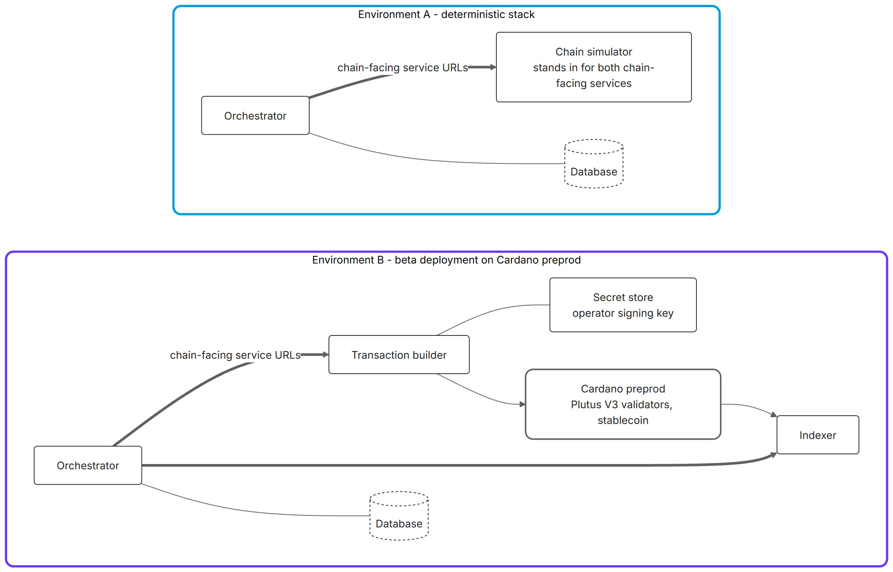

# Milestone 3 – Part 2: Integration Test Report

## 1 Purpose and scope

### 1.1 Purpose of this document

This document is one of the four output reports for Milestone 3 of the Iagon & Würth Catalyst Fund 13 project. It reports the integration testing performed on the storefront-integration path, validating data exchange, performance characteristics, and system-response behaviour between the platform and the ORSY storefront (and, where applicable, the storage/DIS design). It addresses the Milestone 3 *Integration Test Results* output.

The report demonstrates exhaustive testing and compensates for the project's closed-source nature by providing procedures, logs, results, and replication instructions.

### 1.2 Scope boundaries

**In scope**: the order/license/vendor integration path (ORSY adapter → orchestrator → settlement → payout), exercised against the deterministic chain-simulator and, where relevant, preprod; performance metrics; replication procedures.

**Out of scope**: on-chain smart-contract unit testing (covered in M2 Parts 1 & 2) except where reused as integration evidence.

### 1.3 What is absent

Two things a reader might expect to find here are out of scope by decision:

- **Order cancellation and rollback.** The order-lock window exists precisely so that an
  order can still be withdrawn before anything irreversible happens on chain (§6.1). Both
  load runs submitted only orders that were allowed to settle, so the rollback path has no
  test evidence in this report. Exercising it is scoped to Milestone 4 and tracked
  internally.
- **Payout analytics.** The load-test harness runs a payout phase to drain vendor buckets
  between profiles. That is an operational step, not a performance characteristic of
  interest at this milestone, so payout timings are excluded from §6 and `payouts.jsonl`
  is excluded from the evidence package. Payout transactions still appear in the on-chain
  transaction inventory, as `transaction_type = 4`.

---

## 2 Test environment & topology

Testing was carried out against two distinct environments, because they answer different
questions. The deterministic environment answers *"is the logic correct and reproducible?"*;
the live environment answers *"does it behave under real chain conditions?"*. Neither alone
would satisfy the Milestone 3 acceptance criterion, which asks for data exchange,
performance, and system response.

| | Environment A: deterministic stack | Environment B: beta deployment |
|---|---|---|
| Purpose | Correctness, reproducibility, CI | Performance, system response under real conditions |
| Chain | `chain-simulator` (in-memory, deterministic) | Cardano **preprod** |
| Transaction building | simulated | real txbuilder, MeshSDK, Plutus V3 validators |
| Chain observation | SQL queries | real indexer over Cardano DB Sync |
| Value transferred | SQL queries | real preprod stablecoin and tADA |
| Reproducible bit-for-bit | yes | no (chain timing varies) |
| Used for | §4 test suites, §3.2 functional scenarios | §5 results, §6 performance |

*Diagram **025**: the two test environments. Only the two chain-facing service URLs differ
between them; the orchestrator logic under test is identical.*

### 2.1 Services under test

The system comprises four deployable services plus an operator/vendor web interface:

| Service | Role |
|---|---|
| **Orchestrator** | Business logic: vendors, licenses, orders, fee calculation, batching, settlement, payouts, reconciliation. Owns the relational schema and the ORSY adapter endpoints. |
| **Transaction builder** | Builds, signs and submits Cardano transactions. Holds the operator signing key in the secret store. |
| **Indexer** | Observes chain state (buckets, vaults, reference contract) and answers confirmation queries. |
| **Chain simulator** | Deterministic mock of the union of the transaction-builder and indexer APIs. Substituting it for both replaces the entire on-chain side with a reproducible one. |
| **Operator/vendor dashboards** | The web interface described in [Part 3](03-ux-design-report.md). Not on the integration path; orders arrive machine-to-machine. |

Supporting infrastructure: a relational database (separate schemas for the orchestrator and
the chain simulator) and a secret store holding the operator signing key and service
credentials.

### 2.2 Environment A: deterministic stack

The chain simulator makes the integration path testable without a testnet. Because it
implements the union of the transaction-builder and indexer APIs behind a single endpoint, the
orchestrator is switched between simulated and real chain by configuration alone: the two
chain-facing service URLs point at the simulator instead of at the real services. The
orchestrator has no simulation mode of its own, and the same build runs in both environments.

On boot the simulator initialises its own state, creating a reference contract (carrying the
operator and keeper key hashes, the bucket contract and script hashes, the stablecoin policy,
and the operator/maintainer bucket token names) and the two system buckets. Initialisation is
idempotent, so a rerun is safe.

A container composition file brings up the secret store and the application services for local
use. It is a convenience wrapper rather than a complete environment: the database and the
chain simulator are run alongside it. §7.2 gives the full bring-up sequence.

### 2.3 Environment B: beta deployment on Cardano preprod

The performance results in §5 and §6 were produced against the deployed beta environment.
Every component of the on-chain path was real:

- real txbuilder building and signing with the operator key from the secret store;
- real Plutus V3 validators (`genesis`, `reference`, `vault`, `bucket`) on preprod;
- real indexer reading confirmations from chain data;
- real preprod stablecoin transfers and real tADA fees.

**Nothing about the chain was mocked.**

### 2.4 Configuration deviations from production

The beta deployment was tuned so that a soak run completes in hours rather than weeks, mostly
by removing waits that would otherwise dominate the elapsed time. What the runs produce is a
general system-response profile on preprod, not a simulation of mainnet: preprod has its own
block timing, and is if anything slower.

One deviation has to travel with the figures in §5 and §6, the 30-second order lock against a
24-hour production default. That is why the headline metric is anchored at unlock rather than
intake (§6.1). The rest are minor adjustments to keep a run moving.

| Setting | Beta value | Production default | Why, and what it affects |
|---|---|---|---|
| `ORDER_LOCK_DURATION_MS` | 30 000 (30 s) | 24 h | **The most consequential deviation.** This is the ORSY cancellation window. At the production default, batching would be blocked for the entire duration of any test. It shifts *when* the pipeline starts, not how long the pipeline takes, which is why the headline metric is anchored at unlock rather than intake (§6.1). Confirmed by measurement at 30.0 s p50 and p95 across all 384 orders in both runs. |
| `TX_CONFIRMATION_THRESHOLD` | 2 | 4 | Keeps the reconciliation loop responsive under preprod block times. Halves the number of confirmations waited for, and with it the observed confirmation latency. |
| `TX_EXPIRATION_TIMEOUT_MINUTES` | 30 | 10 | The default invites expiry storms under preprod congestion. |
| `ORDER_BATCHING_INTERVAL_MS`, `BATCH_PROCESSING_INTERVAL_MS`, `SETTLEMENT_INTERVAL_MS`, `TX_RECONCILIATION_INTERVAL_MS` | 15 000 | longer | Compressed job intervals. Directly sets the floor on the `IOU confirmed → settle submitted` stage. |
| `BUCKET_PROVISIONING_INTERVAL_MS` | 10 000 | longer | Compressed only to keep a run snappy. A vendor's bucket is provisioned before any of its orders can settle, and at the production 24-hour lock that leaves a full day of headroom, so an interval anywhere in the minutes range is sufficient. |
| `ORDER_BATCHING_WINDOW_SECONDS` | 300 | (to be set) | The batching window. Governs `unlock → IOU submitted` when a batch does not fill early. |
| `MAX_ITEMS_PER_BATCH` | 20 | (to be set) | Batch capacity. A burst that fills a batch short-circuits the 300 s window. |

The last two are policy settings rather than deviations from a known default. Their mainnet
values will be chosen once a mainnet-like load run has been carried out and analysed, which
follows the work on the findings in §8.

---

## 3 Test procedures

Testing proceeded in three layers, each covering what the layer below cannot.

### 3.1 Layer 1: automated suite execution

Every service carries an automated unit-test suite, run for all services by a single command
from the repository root. Suites run against in-memory implementations of their dependencies,
so business logic is verified in isolation from the database, the chain, and the network. A
small number of database-backed suites connect to a local database instance and skip
gracefully when one is not configured, so the run succeeds on a clean checkout. Results are
in §5.1; composition and coverage in §4.

### 3.2 Layer 2: functional integration scenarios

Each scenario below is driven through the public HTTP surface against Environment A. They
are ordered by dependency: each step's output is the next step's input, which is itself part
of what is being validated.

**Scenario 1: vendor (supplier) registration.**
`POST /adapters/orsy/vendors` with the ORSY-shaped payload
`{ "Vendor": { "Name": …, "AccountNumber": … } }`. The adapter maps ORSY's supplier
vocabulary onto the platform's vendor model (`AccountNumber` → `customVendorIdentifier`),
requests a real wallet backed by the secret store, and returns HTTP 201 with the
vendor's `publicKeyHash`. *Validates*: payload translation, wallet provisioning, and the
duplicate-account rejection path (HTTP 409).

**Scenario 2: license creation.**
`POST /adapters/orsy/licenses`, linking a 3D-printable part number to the vendor by
`AccountNumber` and carrying the per-unit royalty. *Validates*: vendor resolution by external
identifier, and the not-found path (HTTP 404) when the account number does not resolve.

**Scenario 3: on-chain bucket provisioning.**
Not an API call. The bucket-provisioning job detects vendors without an on-chain royalty
bucket and builds a bucket-creation transaction. *Validates*: the asynchronous job path, and
the tracked-transaction lifecycle that owns it.

**Scenario 4: order submission and fee calculation.**
`POST /adapters/orsy/orders` with the ORSY order envelope
(`Order.Number`, `Order.Vendor.AccountNumber`, `Order.Parts.Part[]` with `Part`, `OrderQty`,
`Cost`). The orchestrator resolves each part number to a license, sums royalties across line
items, applies the tiered maintainer fee, and derives operator proceeds as the remainder.
HTTP 201 returns the full `feeBreakdown`. *Validates*: the storefront data exchange proper
(line-item mapping, dollar-to-micro-unit conversion, royalty summation, fee tiering), plus
rejection when the order total cannot cover royalties plus fee, and when a part number has no
license (HTTP 400).

**Scenario 5: fund lock.**
The accepted order is written with a future `locked_until` and is invisible to batching until
that moment passes. *Validates*: that no irreversible action is taken during the cancellation
window. See §1.3 on cancellation itself.

**Scenario 6: batching and IOU minting.**
After unlock, the batching job groups eligible order items into a time window (300 s window,
20-item cap), and batch processing builds a single IOU-distribution transaction crediting each
vendor's bucket with its own royalty share. *Validates*: multi-vendor batch composition,
per-vendor royalty separation, and the batch → transaction hand-off.

**Scenario 7: settlement.**
Once the IOU distribution confirms, the settlement job builds one settlement-distribution
transaction per order and marks the order `PROCESSED` on confirmation. *Validates*: the
reconciliation loop, confirmation thresholding, and terminal order state.

**Scenario 8: payout.**
Vendor and operator buckets are drained through the vault via `POST /payouts/*`. *Validates*:
the value actually arrives. Timings excluded per §1.3.

### 3.3 Layer 3: load and soak procedure

Layers 1 and 2 establish correctness. Layer 3 establishes behaviour at volume, over time,
against the real chain. It is driven by the in-repo load-test harness
purpose-built for this exercise. Its stages run in sequence:

| Stage | What it does | Artifacts produced |
|---|---|---|
| **Setup** | Verifies the system buckets, creates run-scoped vendors with real wallets, creates licenses, and waits until every vendor has an on-chain royalty bucket. Idempotent per run identifier. | `setup.json` |
| **Generate** | Submits orders through the ORSY adapter on the chosen arrival profile (constant, burst or ramp, with configurable rate and duration). Interrupt-safe and resumable from a given sequence number. | `orders.jsonl`, `run-meta.json` |
| **Observe** | Runs concurrently, sampling health, order and batch status histograms, and the transaction census every 60 seconds. Raises alerts on stuck batches, rising expiry counts, and stalled settlement. | `monitor.jsonl` |
| **Drain** | Operational step between profiles (§1.3). | *(excluded from this package)* |
| **Extract** | Database extracts scoped to the run window. | `timeline.jsonl`, `batches.csv`, `transactions.csv`, `tx-census.csv`, `settlement-hourly.csv` |
| **Aggregate** | Computes the metrics and renders the run summary. | `metrics.json`, `metrics.csv`, `summary.md` |

Two profiles were exercised:

- **Constant soak**: target 38 orders/h for 470 minutes, chosen so injection stays below the
  computed settlement drain rate (≈48 orders/h at confirmation threshold 2 on ~20 s preprod
  blocks) and the settlement queue stays bounded.
- **Burst**: 10 orders arriving simultaneously every 30 minutes over 4 hours, to separate
  arrival-rate effects from concurrency effects and to exercise the batch-capacity path.

---

## 4 Test suites & coverage

### 4.1 Composition

57 test suites across the four services, 425 test cases in total:

| Service | Suites | Test cases |
|---|---:|---:|
| Orchestrator | 20 | 162 |
| Transaction builder | 23 | 177 |
| Indexer | 8 | 53 |
| Chain simulator | 6 | 33 |
| **Total** | **57** | **425** |

### 4.2 Integration-relevant suites

The suites that matter most for the storefront-integration path, with their measured
statement coverage:

| Area covered | What it verifies | Stmt coverage |
|---|---|---:|
| **ORSY payload mapping** | Translation between the ORSY payload vocabulary and the platform's vendor/license/order model, the storefront data-exchange contract itself. | **100%** |
| Order intake | Royalty summation across line items, including duplicate items for the same license; order acceptance and rejection rules. | 67.1% |
| Fee calculation | Tiered maintainer fee, operator-fee-as-remainder, boundary conditions. | 84.6% |
| Order batching | Eligibility selection and batch formation after unlock. | **100%** |
| Batch processing | Multi-vendor batch → IOU distribution, preserving each vendor's royalty separately. | **100%** |
| Settlement | Settlement transaction construction and terminal order state. | 98.1% |
| Transaction reconciliation | Confirmation, expiry, and the automatic reset of expired IOU batches to a re-processable state. | 94.6% |
| Bucket provisioning | On-chain bucket creation for new vendors. | 94.1% |
| Payout | Bucket drain through the vault. | 85.7% |
| Batching strategies | Both shipped strategies and the registry that selects between them. | 97.7% |

Beneath these, the transaction builder's 177 tests cover transaction construction, input
selection, collateral handling, the secret store, and payload validation; the indexer's 53
cover contract datum decoding for the bucket, vault and reference validators; the chain
simulator's 33 cover its transaction handling, key-hash validation, and reconciliation flow.

### 4.3 Coverage figures

Coverage was measured on the orchestrator using the standard V8 coverage provider:

| Scope | Statements | Branches |
|---|---:|---:|
| **Business-logic layer** | **70.9%** | 59.9% |
| ORSY payload mapping | 100% | 100% |
| Batching strategies | 97.7% | 92.9% |

Within the business-logic layer, the uncovered remainder sits in two places, neither of them
on the settlement path. The largest single block is the dashboard read model, which exists
only to serve the operator and vendor screens described in
[Part 3](03-ux-design-report.md) and is never called by the storefront integration. The rest
is vendor and licence CRUD: thin wrappers over the repository layer that the ORSY adapter
delegates to, carrying no unit tests of their own but exercised by every vendor, licence and
order created in the runs in §5.2.

---

## 5 Results & logs

### 5.1 Automated suite results

Full suite execution across all services on 2026-08-10:

| Service | Suites | Tests | Result |
|---|---:|---:|---|
| Orchestrator | 20 | 162 | **all passed** |
| Transaction builder | 23 | 177 | **all passed** |
| Indexer | 8 | 53 | **all passed** |
| Chain simulator | 6 | 33 | **all passed** |
| **Total** | **57** | **425** | **425 passed, 0 failed** |

The orchestrator's two database-backed suites ran against a live local database under an
isolated test schema, exercising real schema migration and real eligibility-query behaviour,
including the lock-expiry filtering that the fund lock depends on.

### 5.2 Live-run results

Two runs against Environment B. Raw and derived artifacts for both are in
[`loadtest-evidence/`](loadtest-evidence/INVENTORY.md): 12 files per run, each extract
scoped to its own run window.

| | Constant soak | Burst |
|---|---|---|
| Run ID | `soak-constant-20260802` | `soak-burst-20260802` |
| Window (UTC) | 2026-08-03 04:42 → 13:25 | 2026-08-09 04:24 → 08:24 |
| Duration | 8.7 h | 4.0 h |
| Profile | constant, target 38 orders/h | bursts of 10 every 30 min |
| Orders submitted | 304 | 80 |
| **Orders accepted (HTTP 201)** | **304 (100%)** | **80 (100%)** |
| Intake errors | 0 | 0 |
| Mean royalty per order | 406,630 micro-stable | 418,847 micro-stable |
| Total royalty generated | 123,615,500 micro-stable | 33,507,740 micro-stable |
| Batches formed | 77 | 15 |
| Batches completed | 68 (88.3%) | 13 (86.7%) |
| Mean batch fill | 9.4 items (47% of cap) | 13.2 items (66% of cap) |
| **Orders fully settled end to end** | **268 / 304 (88.2%)** | **76 / 80 (95.0%)** |
| Confirmed IOU-distribution txs | 68 | 13 |
| Confirmed settlement-distribution txs | 268 | 76 |
| Monitor samples (60 s interval) | 589 | 569 |

Every order submitted through the ORSY adapter was accepted, at both a sustained arrival
rate over nearly nine hours and in ten-at-once bursts: 384 real ORSY-shaped payloads, mapped,
fee-calculated and persisted, with zero rejections and zero mapping errors.

### 5.3 Settlement completion: the shortfall and its single cause

The gap between 100% acceptance and settlement at 88% to 95% has one cause.

Nine of 77 batches in the soak (11.7%) and two of 15 in the burst (13.3%) failed to build or
submit their IOU-distribution transaction. Orders in a failed batch remain at `BATCHED` and
never reach settlement. Every order in a batch that *did* complete settled successfully. The
failure rate is essentially identical across a constant arrival profile and a bursty one
(11 of 92 batches, 12.0% combined), which establishes that it is not a load-related or
burst-specific effect. Unminted royalty from the soak's nine failures was approximately
12,486,618 micro-stable, about 10% of that run's total.

The cause is diagnosed in §5.4 under *Operator wallet UTxO contention*, and its consequence
under *Terminal batch failure*.

### 5.4 Incidents and system response

Each incident below surfaced explicitly during the runs and was diagnosed from the structured
logs.

**Operator wallet UTxO contention (open defect).**
Settlement, batch fill, bucket provisioning and payout transactions are all built from the
same operator wallet, by independent jobs on 15-second timers, with no reservation of
inputs belonging to submitted-but-unconfirmed transactions. Two builders can therefore
select the same UTxO; the second is rejected with `BadInputsUTxO` at submission or
`CannotCreateEvaluationContext` at evaluation. This was captured directly in the burst run:
batch 100's rejected input was an output that the settlement transaction submitted 89 seconds
earlier had already consumed. **This is the cause of the batch failures in §5.3.**

**Terminal batch failure (deferred by design).**
A batch whose transaction fails stays failed; its orders remain at `BATCHED`. Retry is
deliberately unimplemented. The persisted transaction body is kept for post-hoc inspection of
failed or malformed transactions, but it cannot simply be resubmitted, because its UTxOs may
since have been spent. Recovery requires rebuilding from current chain state.

**Concurrent bucket provisioning, recovered automatically.**
During the soak's setup phase, provisioning built several bucket-creation transactions in one
cycle from the same operator UTxO set, the same contention described above. The losing
transactions were rejected ("all inputs are spent") and two of five buckets hung. The
tracked-transaction lifecycle recovered them without intervention: expiry, then
re-provisioning. The contention is self-healing wherever an expiry path exists; the planned
fix extends that property to batches.

**Monitor alerts raised during the runs.**

| Run | Timestamp (UTC) | Alert |
|---|---|---|
| Constant soak | 2026-08-03 05:35:42 | EXPIRED tracked transactions increased: 0 → 2 |
| Burst | 2026-08-09 04:24:31 | EXPIRED tracked transactions increased: 0 → 5 |
| Burst | 2026-08-09 06:26:44 | No settlement confirmed for 20+ min while 8 orders await settlement |
| Burst | 2026-08-09 06:27:46 | No settlement confirmed for 20+ min while 8 orders await settlement |

Both settlement-stall alerts in the burst run trace to a single failed batch: the operator
wallet contention described above cost that batch its transaction, and the eight orders behind
it stayed at `BATCHED`. The monitor raised the condition within 20 minutes of the last
confirmed settlement, from its own sampling, without any database inspection.

*Evidence note*: a reviewer comparing this table against the raw files will find the burst
run's 04:24 expiry alert listed in the constant run's `metrics.json` as well. Unlike the
`loadtest:collect` extracts, `monitor.jsonl` is not scoped to a run window. It is written by
a long-lived monitor session, and one left running across both runs carried its earlier
entries forward. Of the two expiry alerts, only the 05:35 one belongs to the constant soak.
The table above assigns each alert to the run that produced it.

### 5.5 Logging and log-derived counters

All services emit structured JSON logs with correlation identifiers, at info level. The runs
captured full orchestrator and transaction-builder logs, 37 MB for the burst run alone.
They are excluded from the evidence package on size grounds; the findings drawn from them
are what §5.4 reports.

That exclusion has one consequence a reader could misread. The per-run `summary.md` files
contain a line reading `Resubmissions: 0, expiries: 0, job errors: 0`, and `metrics.json`
carries a `logEvents` block of zeros. Those zeros are missing input rather than measurement:
the aggregation stage derives the counters by parsing the captured server logs, and those logs
are not present in the published package. The monitor independently observed transaction
expiries in both runs (§5.4), which directly contradicts a literal reading of `expiries: 0`.
Reviewers should treat the `logEvents` block as unpopulated.

Because container replacement can rotate logs away mid-run, §7.3 requires capturing them from
before the first order.

---

## 6 Performance characteristics

### 6.1 How to read these numbers

Four things govern what the figures below measure.

**These are pipeline latencies, not customer-visible settlement times.** In production an
order is locked for 24 hours before it becomes eligible for batching. On the beta deployment
that lock was 30 seconds (§2.4), so the measured pipeline begins almost immediately after
intake. Production settlement time is approximately 24 h plus the measured pipeline latency,
and the pipeline figure is what characterises system performance.

**The lock is the ORSY cancellation window, not processing delay.** It is the period in which
an order can still be rolled back. Nothing irreversible happens during it: no IOU tokens are
minted, and no royalty is locked to a vendor. Once the window closes the order becomes
batch-eligible and settlement proceeds to an on-chain state that cannot be unwound. The system
defers every irrevocable action until cancellation is no longer possible. The sequence is
"24 hours of reversibility, then roughly seven minutes to irreversible on-chain settlement".

**Most of the measured time is configured policy, not computation.** Actual compute is the
~200 ms order intake and sub-second transaction builds. Everything else is a deliberate
wait: the 300-second batching window, the 15-second job intervals, and on-chain confirmation
at the configured threshold. The stage table in §6.3 labels each stage with what governs it.

**The headline metric is therefore `unlock → settled`.** It starts at the moment the order
becomes batch-eligible, excludes the lock entirely, and is consequently comparable between
the beta deployment's 30-second lock and production's 24 hours. The intake-anchored figure is
reported alongside it for continuity; in production it would read "24 h 8 min", dominated
entirely by the lock. The unlock moment is read from `orders.locked_until` in the
database rather than derived from configuration, so it stays correct even if the setting
changes between runs.

### 6.2 The reported metric set

Five figures, agreed with the team as the metric set for this report.

**1. Order intake.**

| | Constant soak | Burst |
|---|---|---|
| Acceptance rate | 304 / 304 (100%) | 80 / 80 (100%) |
| HTTP latency p50 | 237 ms | 208 ms |
| HTTP latency p95 | 578 ms | 247 ms |
| HTTP latency max | 1,345 ms | 657 ms |

Submission latency stayed well inside a second even when ten orders arrived simultaneously.
The burst profile's p95 is *lower* than the soak's, because the soak's tail includes intake
occurring while heavier background job activity was in flight.

**2. Unlock → settled latency (headline).**

| | Constant soak | Burst |
|---|---|---|
| n (settled orders) | 268 | 76 |
| **p50** | **428.5 s (7.1 min)** | **468.7 s (7.8 min)** |
| **p95** | **570.9 s (9.5 min)** | **850.3 s (14.2 min)** |
| **max** | **704.2 s (11.7 min)** | **945.4 s (15.8 min)** |
| *Secondary:* intake → settled p50 / p95 | 458.5 s / 600.9 s | 498.7 s / 880.3 s |

Ten simultaneous orders moved the median by 40 seconds: 7.1 minutes under a steady
arrival rate against 7.8 minutes under bursts. The dominant terms are fixed waits rather than
contended computation, so concurrency barely shifts the median. The burst run's wider p95
spread comes from settlement-job scheduling, not from intake or build (§6.3).

**3. Settlement completion rate.**

| | Constant soak | Burst |
|---|---|---|
| Orders settled end to end | 268 / 304 (88.2%) | 76 / 80 (95.0%) |
| Batches completed | 68 / 77 (88.3%) | 13 / 15 (86.7%) |

Analysed in §5.3, with the cause and remediation status in §5.4.

**4. Sustained end-to-end throughput.**

| | Constant soak | Burst |
|---|---|---|
| Settled orders per hour | 30.4 | 20.6 |

These are arrival rates sustained without backlog, not a measured capacity ceiling. Both
profiles were chosen so that injection stayed below the computed settlement drain rate, and
in neither run did the settlement queue grow without bound. **Maximum capacity was not
measured.**

**5. Stage breakdown.** §6.3.

### 6.3 Stage breakdown

Each stage is labelled with what governs it. The system's own computation appears in only two
rows.

**Constant soak** (`soak-constant-20260802`):

| Stage | n | p50 | p95 | max | Governed by |
|---|---:|---|---|---|---|
| Order intake (HTTP) | 304 | 237 ms | 578 ms | 1.3 s | **system** |
| intake → unlock | 304 | 30.0 s | 30.0 s | 30.0 s | `ORDER_LOCK_DURATION_MS` (24 h in production) |
| unlock → IOU submitted | 268 | 209.2 s | 320.2 s | 333.1 s | 300 s batching window + build |
| IOU submitted → confirmed | 268 | 63.8 s | 170.8 s | 240.8 s | chain: block time × confirmation threshold |
| IOU confirmed → settle submitted | 268 | 116.1 s | 303.8 s | 466.7 s | settlement job interval |
| settle submitted → confirmed | 268 | 63.6 s | 124.0 s | 229.1 s | chain: block time × confirmation threshold |
| **unlock → settled** | **268** | **428.5 s** | **570.9 s** | **704.2 s** | sum of the above, lock excluded |
| intake → settled | 268 | 458.5 s | 600.9 s | 734.2 s | headline + the lock |

**Burst** (`soak-burst-20260802`):

| Stage | n | p50 | p95 | max | Governed by |
|---|---:|---|---|---|---|
| Order intake (HTTP) | 80 | 208 ms | 247 ms | 657 ms | **system** |
| intake → unlock | 80 | 30.0 s | 30.0 s | 30.0 s | `ORDER_LOCK_DURATION_MS` |
| unlock → IOU submitted | 77 | 31.3 s | 323.8 s | 325.3 s | batch capacity reached, or the 300 s window |
| IOU submitted → confirmed | 77 | 69.3 s | 110.8 s | 110.8 s | chain: block time × confirmation threshold |
| IOU confirmed → settle submitted | 76 | 245.3 s | 467.3 s | 556.2 s | settlement job interval |
| settle submitted → confirmed | 76 | 44.8 s | 111.2 s | 134.0 s | chain: block time × confirmation threshold |
| **unlock → settled** | **76** | **468.7 s** | **850.3 s** | **945.4 s** | sum of the above, lock excluded |
| intake → settled | 76 | 498.7 s | 880.3 s | 975.4 s | headline + the lock |

The tables make four things visible:

**Batching works as designed.** `unlock → IOU submitted` collapses from 209 s (soak) to 31 s
(burst) at the median. A burst of ten fills a batch toward capacity immediately, so the batch
closes on the capacity condition rather than waiting out the 300-second window. Mean batch
fill rises correspondingly, from 9.4 items (47% of cap) to 13.2 (66%). The p95 of that same
stage stays around 320 s in both runs. That is the tail of orders that arrived just after a
batch closed and waited a full window, the expected worst case for a time-window strategy.

**The lock holds to the second.** `intake → unlock` reads 30.0 s at p50, p95 and max
across all 384 orders in both runs, measured from `orders.locked_until` rather than from the
setting.

**The two on-chain stages batch differently.** IOU distribution is one transaction per batch:
a single fill credits every vendor bucket in the batch, so the number of orders in a batch
costs nothing at this stage. Settlement is one transaction per order: it credits the
operator and maintainer buckets with that order's fee split, and the settlement job submits
the next order's transaction only once the previous one has confirmed. Across all 344
settlements in the two runs, no two were ever in flight at once; consecutive submissions were
75 s apart at p50 in the soak and 60 s in the burst, which is one confirmation plus one job
interval.

The asymmetry follows from the UTxO model rather than from scheduling. A fill spends the
target bucket's UTxO and recreates it carrying the new total, so two fills against the *same*
bucket cannot overlap. Every settlement credits the same two system buckets, which forces
them into a strict sequence; vendor buckets are distinct per vendor, which is what lets one
IOU transaction serve a whole batch.

**Where the burst run's wider tail comes from.** The only stage materially worse under bursts
is `IOU confirmed → settle submitted` (245 s vs 116 s at p50). Ten orders confirming together
produce a queue of ten settlements drained one confirmation at a time. The first order in the
queue settles in about 11 s, the last after nine confirmations ahead of it. This is a
consequence of the per-order settlement transaction, not a capacity limit.

### 6.4 What was not measured

- **Maximum throughput.** Neither profile saturated the system (§6.2, metric 4).
- **Production-configuration latency.** Every run used the deviations in §2.4, on preprod
  rather than mainnet. The one figure that carries over is the lock: production settlement
  time is the 24-hour lock plus the measured pipeline latency (§6.1).
- **Cancellation and rollback timing.** Scoped to Milestone 4 (§1.3).
- **Payout latency.** Excluded by decision (§1.3).
- **UI performance.** The dashboards are not on the integration path.

---

## 7 Replication procedure

This section records the procedure that produced the results in §5 and the parameters the runs
were configured with, so that the figures can be read against the conditions that generated
them. It is a statement of method rather than a runbook for an outside party: the pilot is
closed-source, the deployment is not open to external callers, and the exact commands,
configuration templates and helper scripts live in the repository's own operator documentation.
What follows is what was done, why each step matters, and what a team with access to the stack
would need in order to repeat it. The configuration values themselves are in §2.4.

### 7.1 How the automated suite results were produced (§5.1)

Dependencies are installed and the full test suite is run across all services from the
repository root. The published execution reported 57 suites and 425 tests passing. Coverage as
reported in §4.3 comes from running the orchestrator's suite with coverage enabled.

Six database-backed cases self-skip unless a local database is reachable and its connection
settings are supplied; those suites create their own isolated test schemas.

### 7.2 How the functional scenarios were run against the deterministic stack (§3.2)

1. Start the database and, if exercising real key handling, the secret store.
2. Start the chain simulator. A shortened simulated block time makes the loop faster. It
   initialises the reference contract and system buckets automatically on boot.
3. Point the orchestrator's two chain-facing service URLs at the simulator, and enable
   the background jobs on short intervals. The settings that matter for comparability with
   the published runs are the order-lock duration and the confirmation threshold (§2.4).
4. Start the orchestrator.
5. Walk the scenarios in §3.2 against the HTTP API. The request and expected-response
   payloads for vendor creation, licence creation and order submission, plus the error-path
   table, are in [Part 1](01-integration-api-documentation.md) §5.

Only the two chain-facing URLs, the database target, and the operator/maintainer public-key-
hash settings differ between this dry run and the preprod configuration, by design.

### 7.3 How a load run was performed (§5.2, §6)

The steps below are the procedure both published runs followed, and the conditions that had to
hold for them to produce valid data.

**Preflight.**

1. The health endpoint returns OK; the transaction builder and indexer are reachable from
   the orchestrator; the secret store is unsealed; the chain-data-provider credential is set.
2. System buckets are registered and their public key hashes match the configured operator
   and maintainer hashes. If they do not, settlement silently skips every cycle and the
   run produces no settlements at all.
3. Vault stablecoin balance ≥ total expected royalties, with margin.
4. Operator wallet funded for roughly `orders × 1.2` transactions at ~0.5 tADA each. Fund
   days ahead, as the preprod faucet is rate-limited, and keep one pure-ADA output of
   ≥ 5 tADA as collateral.
5. Take a database backup and note the wall-clock start time.
6. **Start the server-log capture before the first order.** This is not optional; see §5.5.

**Configuration.** The harness reads its own dedicated environment file: the orchestrator
base URL and API key, the indexer URL, database connection settings (tunnelled when the
target is remote), and a fresh run identifier per profile. Reusing a run identifier
across profiles destroys the earlier profile's evidence, because `run-meta.json` is rewritten
on each run while `orders.jsonl` is appended.

**Sequence.**

1. Open a database tunnel to the target deployment, if remote.
2. Run **setup** once, provisioning the run's vendors and licences. Allow 30 to 45 minutes
   for on-chain bucket provisioning to complete.
3. Run a short **smoke generation** (a handful of orders at a low rate) and confirm they
   reach settlement end to end before committing to a long run.
4. Start the **monitor** in a session that survives disconnection, and leave it running for
   the whole exercise.
5. Start the **generation** stage with the chosen profile, rate and duration.
6. Wait until the monitor reports no orders awaiting settlement, then run **drain**,
   **extract** and **aggregate** in that order.

**Capture the server logs** for the whole run, from before the first order, in a session that
survives disconnection, and place them where the aggregation stage expects them before
running it: log-event counts are folded into the run summary only if the logs are present.
A helper script in the repository automates the collection and archiving.

**To run a second profile against the same vendors**, carry the previous run's `setup.json`
into the new run instead of re-running setup. That avoids re-provisioning and the contention
described in §5.4. This is what the burst run did.

**Incident playbook.**

| Situation | Action |
|---|---|
| The generator died mid-run | Restart from the next sequence number under the same run identifier, and record the gap in the run notes. |
| The orchestrator was restarted by the hosting platform | Pipeline state is database-persisted and resumes; note the gap. |
| A batch is stuck in processing (monitor alert) | Reconciliation resets expired IOU batches automatically. For any other cause, apply the remedial statement the monitor prints and record the incident. |
| Settlement never confirms | Check preflight item 2 first; mismatched system-bucket key hashes fail silently. |

Both published runs used the resume path at least once: the constant soak has a ~42-minute
gap in order arrivals (2026-08-03 04:53 → 05:35 UTC) where the generator was stopped for an
operator workstation restart. Server-side processing continued throughout. `run-meta.json`
records both windows, and that run is therefore two contiguous arrival windows rather than
one uninterrupted 8.7-hour stream.

### 7.4 Reading the published evidence

[`loadtest-evidence/INVENTORY.md`](loadtest-evidence/INVENTORY.md) describes all 12 files per
run, the numeric enum legends needed to read the CSV and JSONL extracts, and the scope
exclusions. Reviewers should read §6.1 of this report and the inventory's "Reading the
numbers" section before drawing conclusions from the raw files, and should note §5.5
regarding the unpopulated `logEvents` counters.

---

## 8 Findings carried forward

Each item below is tracked internally.

| Finding | Status | Where reported |
|---|---|---|
| Concurrent builders contend for operator wallet inputs | Open defect, the cause of the batch failures | §5.3, §5.4 |
| Failed batches are terminal; recovery requires rebuilding from current chain state | Deferred by design | §5.4 |
| Fee distribution is issued per order, so settlements run one confirmation at a time | Optimisation candidate: the operator and maintainer increases for a whole batch could be summed into a single fill, as vendor royalties already are | §6.3 |
