# Milestone 3 – Part 3: UX Design Report

## 1 Purpose and scope

### 1.1 Purpose of this document

This document is one of the four output reports for Milestone 3 of the Iagon & Würth Catalyst Fund 13 project. It presents the user-experience design for the end-to-end ordering and 3D-printing user flows and the platform's operator/vendor interfaces. It addresses the Milestone 3 *UX Designs* output, which calls for wireframes or clickable prototypes validated through feedback, delivered as a UX report regardless of deployment status. Per Catalyst's clause, *where UI is already present, screenshots may be provided instead*. A recorded walkthrough of those interfaces accompanies the report and is linked in §7.

### 1.2 Scope boundaries

**In scope**: the ordering / 3D-print storefront experience (ORSY Connect), the platform's operator and vendor dashboards, any conceptual file-access UX tied to the storage connector, and the rationale for flow decisions.

**Out of scope**: visual/brand design of ORSY Connect itself (owned by Würth); implementation details of the dashboards.

### 1.3 Design method

The original proposal anticipated a UX design phase producing wireframes or clickable
prototypes for the ordering and 3D-printing flows. That phase was not run, and this report
therefore contains no wireframes.

The ordering and 3D-printing storefront already existed. ORSY Connect is Würth's production
ordering system. It was not ours to design, and designing a parallel ordering experience would
have produced an artefact nobody intended to build. That matches the primary goal Würth and
Iagon set at the outset: the end-user experience stays as smooth as it is today and unchanged
wherever possible, with existing production workflows intact and new components integrating
with Würth's current systems rather than replacing them ([Milestone 1
introduction](../milestone-1/00-introduction.md) §2.1). What the project actually needed were
two narrower surfaces that ORSY Connect did not previously have: 3D-print **license
management** (binding a part number to a vendor and a per-unit royalty) and **vendor
management** (registering a supplier and tracking what it has earned).

Those two surfaces were iterated directly on working prototypes with Würth. Because the
backend was already running against a deterministic chain simulator, a screen could be built,
shown to Würth, and changed inside a review cycle. Reviewing a running interface backed by
real order and royalty data surfaced questions that a static wireframe would not have raised,
particularly around custody of payouts (§4.4) and what a vendor should be able to see about
its own orders. Iterating on wireframes first would have added a translation step without
adding information.

Sections 3 and 4 therefore present annotated screenshots of the real interfaces, and Section 6
records the review cycles and the decisions that came out of them.

That approach has a cost. Prototype-led iteration leaves no trail of rejected design
alternatives, because the alternatives were discussed against a running screen rather than
drawn. Section 6 consequently records *decisions and their reasons* rather than a sequence of
design revisions. Decisions that remain open are marked as open.

---

## 2 User flows overview

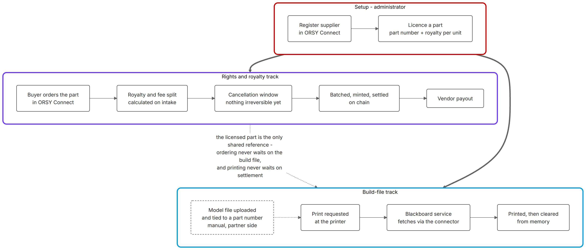

*Diagram **026**: the whole flow. Setup licenses a part; from there the royalty track and the
build-file track run independently, sharing only the licensed part as a reference.*

Four parties interact with the system, and only two of them are humans using an interface.

| Party | Interface | Role |
|---|---|---|
| **Buyer** | ORSY Connect (Würth) | Orders a 3D-printable part from the storefront. |
| **Operator** | Orchestrator UI, operator views | Registers vendors and licenses, monitors settlement, triggers payouts. |
| **Vendor (supplier)** | Orchestrator UI, vendor views | Sees its licenses, its orders and its royalty balance; takes payout. |
| **DIS** | none (machine-to-machine) | Retrieves the IP-protected build file at print time. See §5. |

The end-to-end flow:

1. **Setup.** The operator registers a supplier and its 3D-print licenses, each binding a part
   number to a per-unit royalty. The platform provisions a Vault-backed wallet and an on-chain
   royalty bucket for the vendor. *(Operator UI, §4.2.)*
2. **Order.** A buyer orders the part in ORSY Connect. ORSY posts the order to the platform's
   adapter endpoint. The platform resolves each part number to a license, calculates vendor
   royalties, the maintainer fee and operator proceeds, and returns the breakdown.
   *(ORSY Connect, §3.)*
3. **Cancellation window.** The order is held and is invisible to settlement until its lock
   expires, which in production is 24 hours. Nothing irreversible happens during this period,
   which is what makes cancellation in ORSY possible at all. This is a user-facing guarantee
   expressed as a system property rather than as a screen.
4. **Settlement.** After the window closes, orders are batched, royalties are minted as IOUs
   into each vendor's bucket, and settlement is confirmed on chain. No human involvement.
5. **Payout.** The vendor (or the operator) converts an IOU balance into stablecoin.
   *(Vendor and operator UI, §4.3, §4.4.)*
6. **Print.** DIS retrieves the IP-protected file through the storage connector at the point
   of printing. *(No user interface, §5.)*

The buyer never sees the platform. A buyer ordering a 3D-printed part sees an ordinary Würth
ordering experience; royalty settlement does not surface in the storefront at all.

---

## 3 Ordering & 3D-print experience (ORSY Connect)

The ordering and 3D-print experience is ORSY Connect, Würth's own storefront. The platform
integrates with it through three adapter endpoints (supplier creation, license creation, order
submission) documented in [Part 1](01-integration-api-documentation.md).

The screens below are captured from the ORSY Connect development environment and show the
complete flow, from registering a 3D supplier through to a body shop submitting a purchase
order that reaches the royalty platform.

The flow spans two different users. Steps 1 to 13 are performed by a Würth administrator under
the **3D Royalty** menu, which only that role sees. Steps 14 to 20 are performed by a
body-shop customer, using a separate account on the same storefront. Neither account can see
the other's screens, and the change of user between step 13 and step 14 is a real logout and
login rather than a view switch.

Three API calls happen across the whole flow, each triggered by an explicit user action rather
than in the background. They are marked in the walkthrough below.

### 3.1 Administrator: registering a supplier for 3D royalty

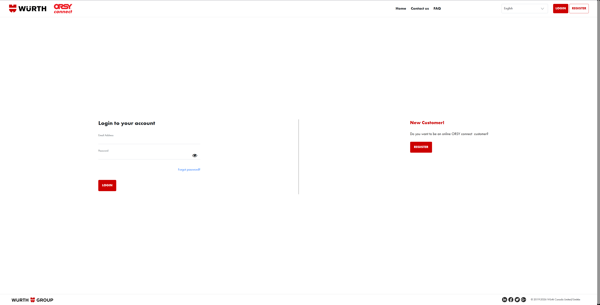

*Step 1. The storefront login. Both the administrator and the body shop sign in here; the
account determines what the navigation offers.*

*Step 2. The **3D Royalty** menu, visible to the administrator only, with its five areas:
Create 3D Vendor, Link 3D Vendor, 3D Vendor Articles, Licenses, and 3D Vendor Order. The list
shows suppliers held in ORSY.*

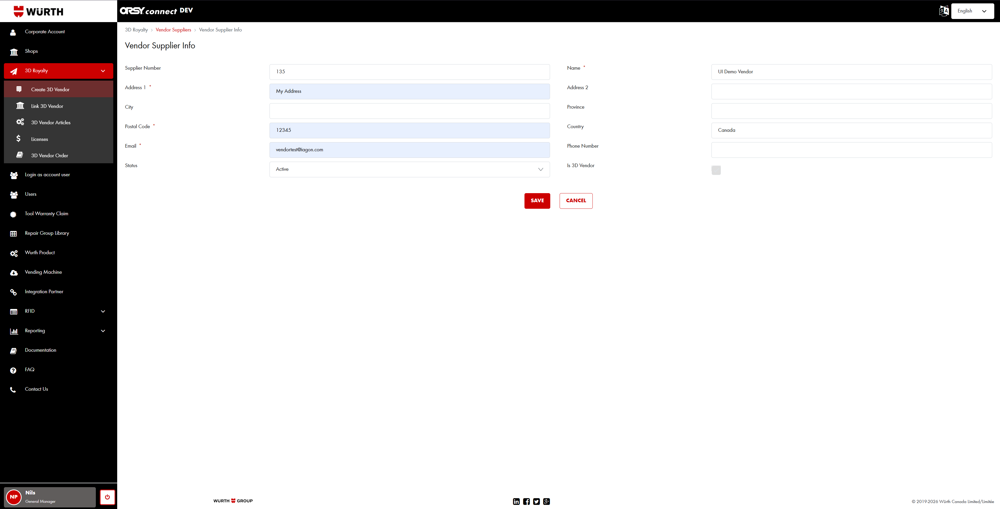

*Step 3. Supplier master data: number, name, address, contact details, and an **Is 3D Vendor**
flag. This record lives entirely in ORSY.*

*Step 4. The supplier now exists in the storefront. **No royalty-platform call has been made
yet.** Creating a supplier and enrolling it in royalty settlement are deliberately separate
steps, so not every ORSY supplier becomes a royalty participant.*

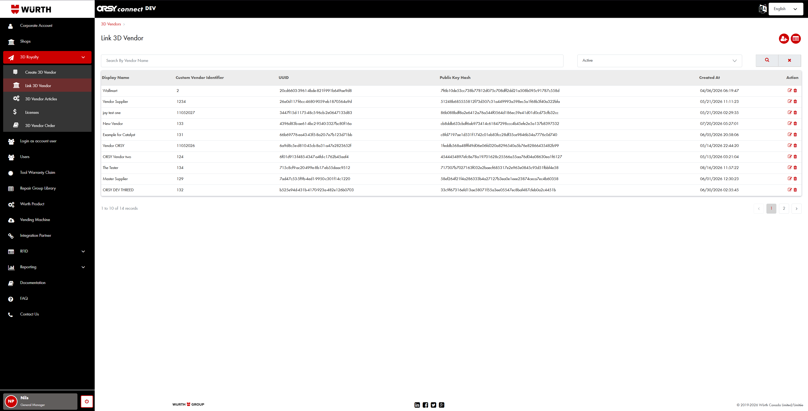

*Step 5. **Link 3D Vendor** lists suppliers already registered with the royalty platform. The
columns are the platform's own fields (display name, custom vendor identifier, UUID, public
key hash and creation time), read back from the platform rather than held in ORSY.*

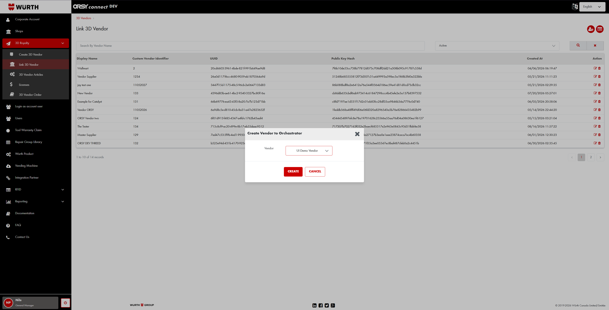

> **API call: `POST /adapters/orsy/vendors`.**

*Step 6. Selecting the supplier and confirming enrols it with the royalty platform. The
supplier's ORSY number travels as `AccountNumber` and becomes the key by which every later
licence and order resolves back to this vendor.*

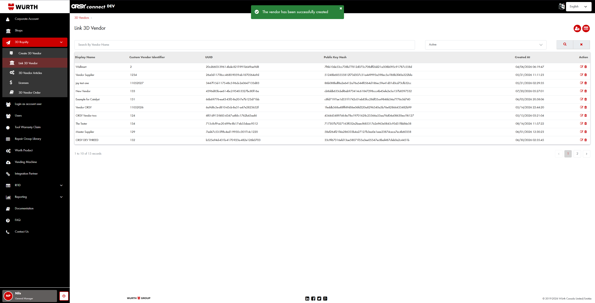

*Step 7. The new row carries a **UUID** and a **public key hash** that ORSY did not have a
moment ago: the platform created a wallet for the vendor and returned its identifiers. This
is the confirmation loop closing inside the storefront.*

### 3.2 Administrator: cataloguing the part and licensing it

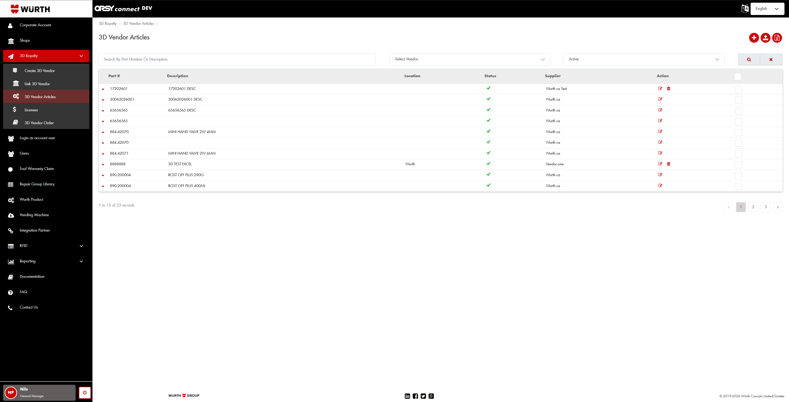

*Step 8. The 3D article catalogue.*

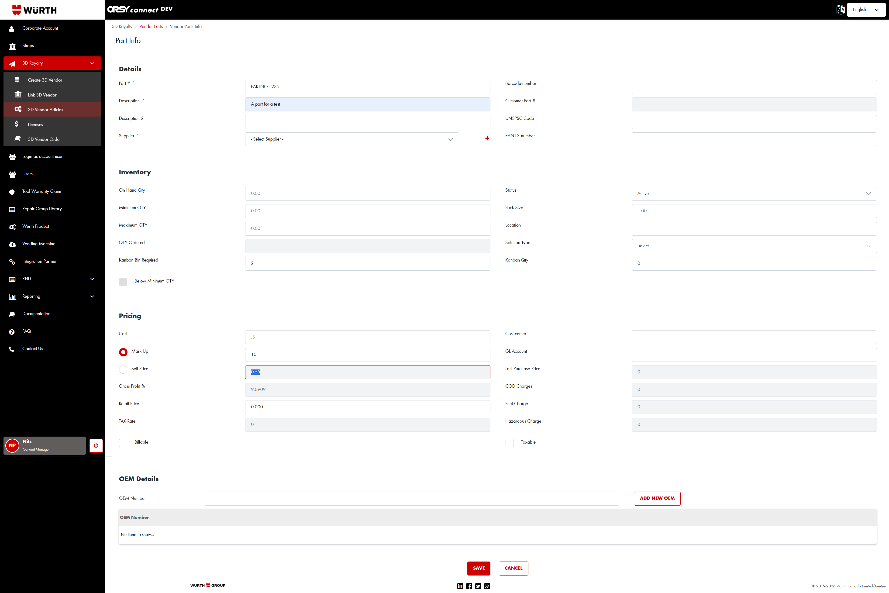

*Step 9. Part master data: part number, descriptions, supplier, inventory levels and pricing.
This is ordinary ORSY catalogue data and, like the supplier record, involves no platform
call.*

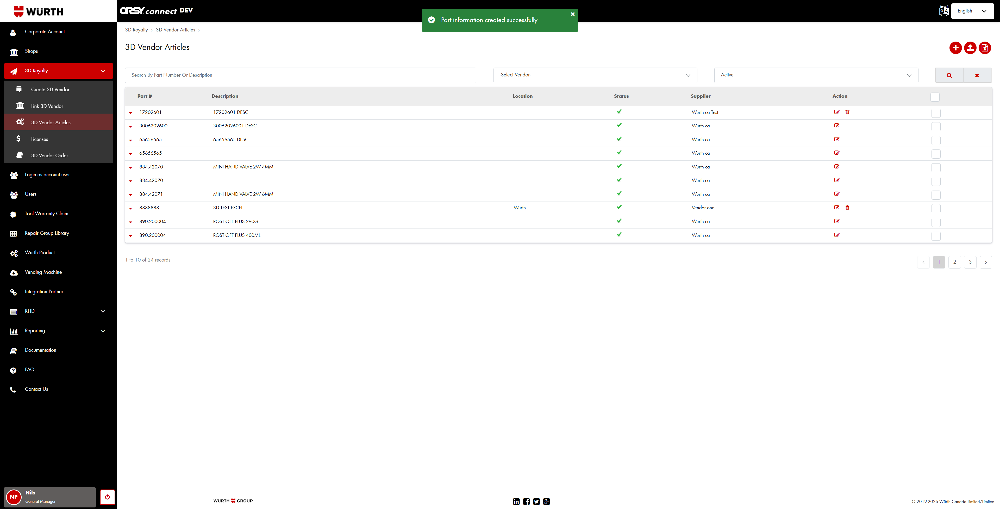

*Step 10. The part is now orderable in the storefront, but carries no royalty yet.*

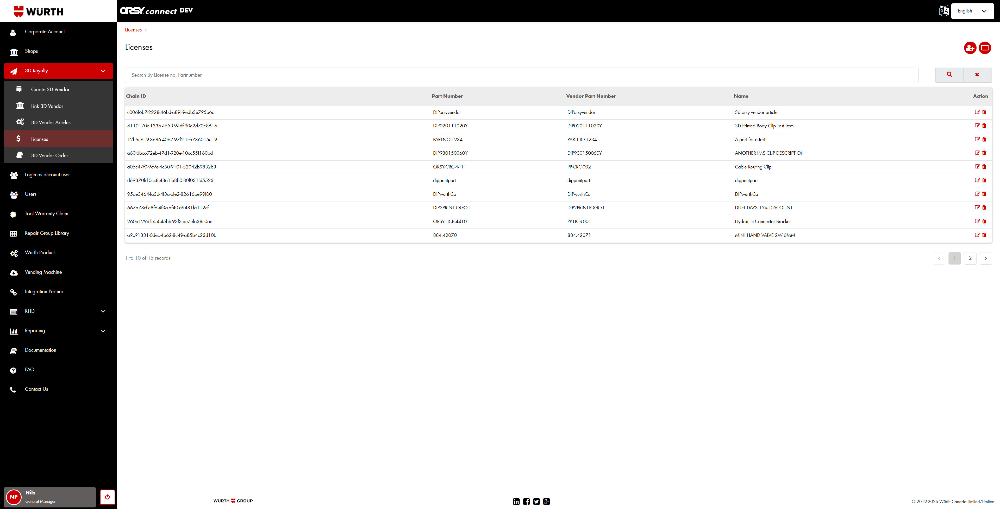

*Step 11. The **Licenses** list, showing **Chain ID**, part number, vendor part number and
name. Chain ID is the platform's on-chain licence identifier, again surfaced back into ORSY.*

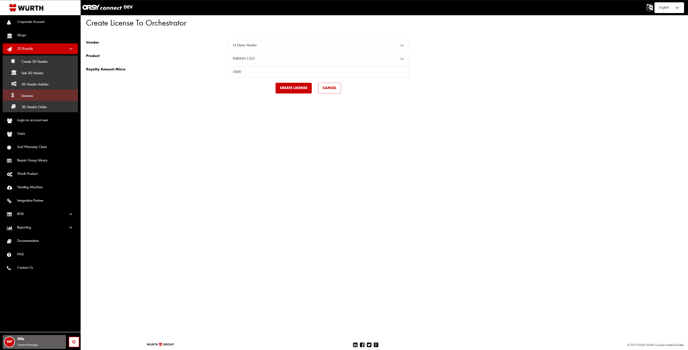

> **API call: `POST /adapters/orsy/licenses`.**

*Step 12. The licence binds three things: the vendor, the part, and the royalty per unit in
micro-units. This is the moment a catalogue part becomes a royalty-bearing part.*

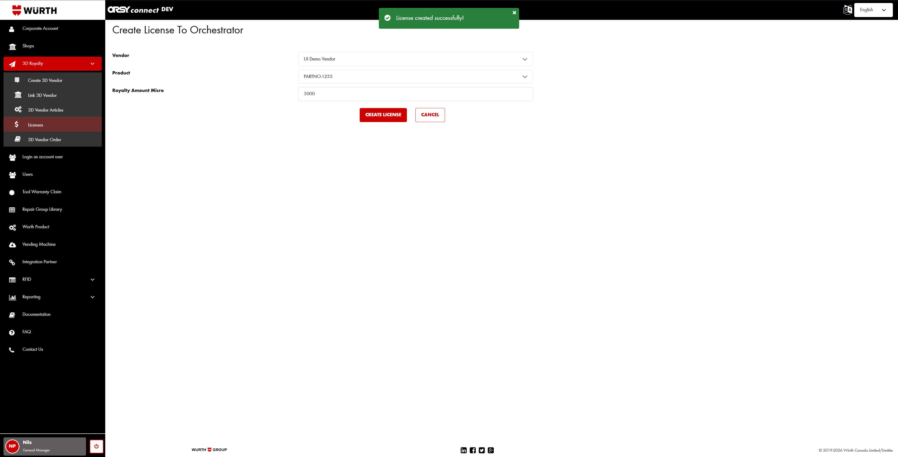

*Step 13. The licence appears with its Chain ID. Administrator setup is complete.*

### 3.3 Body shop: ordering the part

> **The administrator now logs out, and a body-shop customer logs in** at the same URL with a
> different account.

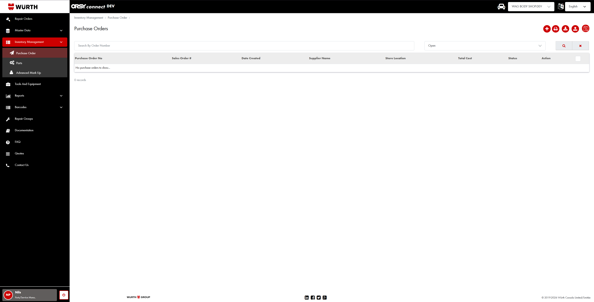

*Step 14. The body shop's navigation is entirely different: repair orders, inventory
management, tools, reports. **There is no 3D Royalty menu.** Nothing about royalties, vendors
or settlement is visible to the buying customer.*

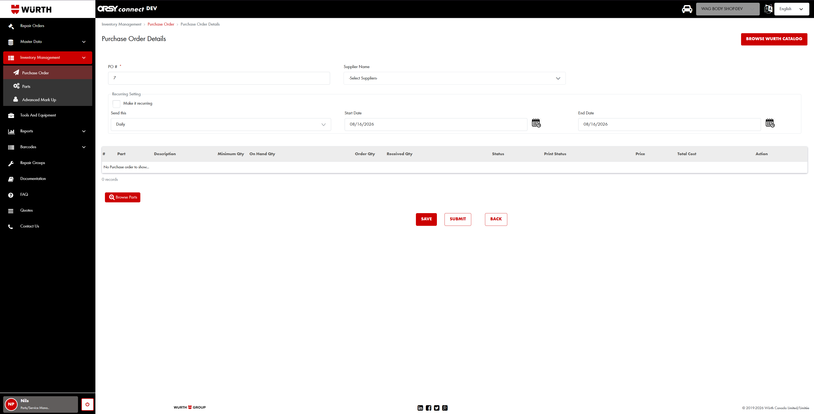

*Step 15. A new purchase order. At this point it is an ordinary procurement form: supplier,
dates, and an empty line-item table.*

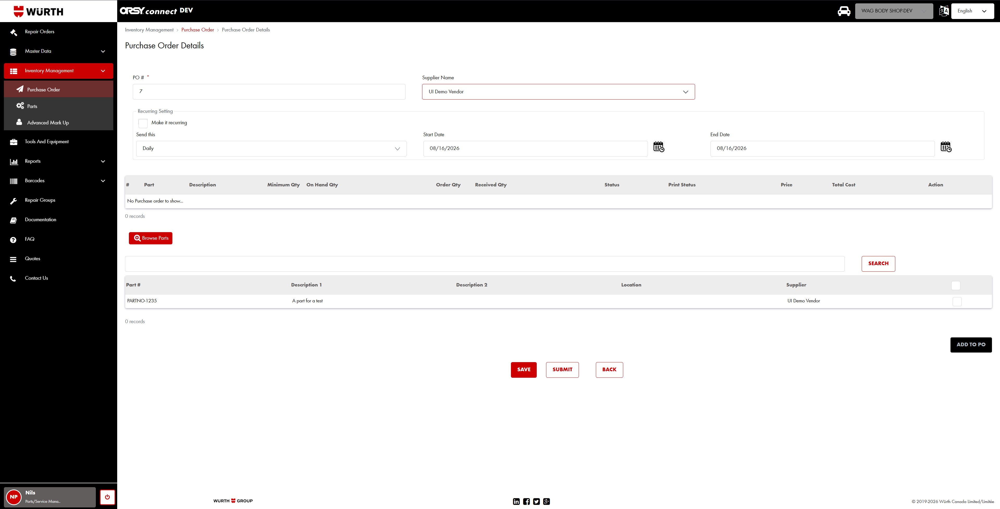

*Step 16. Choosing the supplier filters the catalogue to that supplier's parts.*

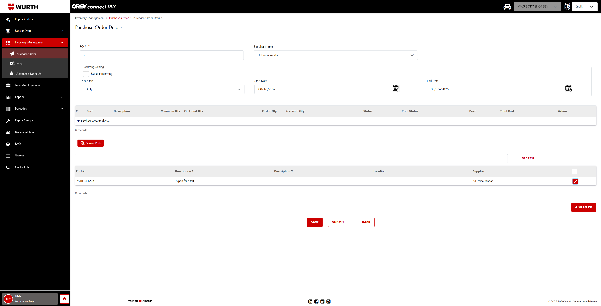

*Step 17. The part is added to the order.*

*Step 18. Quantity, unit price and line total. **The royalty is nowhere on this screen.** The
buyer sees price and cost, exactly as for any other part; the royalty is resolved by the
platform after submission, from the licence created in step 12.*

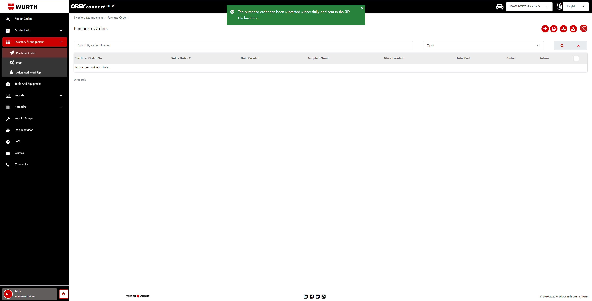

> **API call: `POST /adapters/orsy/orders`.**

*Step 19. Submission. The confirmation is the only point in the entire buyer-facing flow that
alludes to the royalty platform at all, and it does so in one line of a success message.*

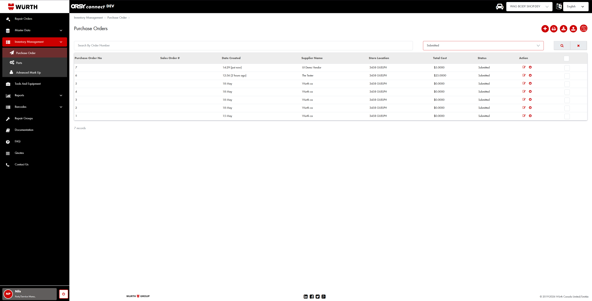

*Step 20. The order is now Submitted. From the body shop's perspective the transaction is
finished. Behind it, the platform has calculated the royalty split, locked the order for its
cancellation window, and will settle it on chain without any further storefront involvement.
That is the pipeline measured in [Part 2](02-integration-test-report.md) §6.*

### 3.4 What the flow demonstrates

Four design decisions in that flow:

1. **Enrolment is explicit and separate from master data.** Creating a supplier, and
   registering that supplier for royalty settlement, are two deliberate actions in two
   different screens. The same is true of parts and licences. A Würth administrator decides
   which suppliers and which parts participate; nothing is enrolled implicitly.
2. **Platform identifiers flow back into the storefront.** The vendor's UUID and public key
   hash, and the licence's Chain ID, are displayed in ORSY. The administrator can confirm
   that registration succeeded without leaving the storefront or consulting the platform's
   own interface.
3. **The buyer's experience is untouched.** The body-shop account orders a 3D-printed part
   through the same purchase-order screen it uses for anything else. It shows no royalty
   figure, no vendor wallet and no settlement status.
4. **Each API call is user-triggered at a natural decision point.** There is no background
   synchronisation, no polling and no scheduled export. The integration surface is three
   calls, each made when a person takes an action that means them.

How much platform state the ORSY admin UI shows is open. Point 2 is the minimum: enough for an
administrator to confirm that a registration succeeded. The same read path could carry more.
An order's royalty breakdown, a licence's settlement status or a vendor's outstanding balance
could appear under the **3D Royalty** menu rather than only in the platform's own dashboard, so
that a Würth administrator works in one system instead of two. The read-back endpoints for this
already exist ([Part 1](01-integration-api-documentation.md) §3.4) and this remains a possible
outcome; which figures are worth the screen space, and whether the administrator's work belongs
in ORSY Connect or in the operator dashboard of §4, is Würth's call.

---

## 4 Platform interfaces

The operator and vendor dashboard is a single web application providing three groups of
views: operator, vendor, and a feature-flagged chain-management area. Access is by API key or
by enterprise single sign-on, selected by deployment configuration.

These interfaces are **prototypes**; §4.4 explains why.

### 4.1 Operator dashboard

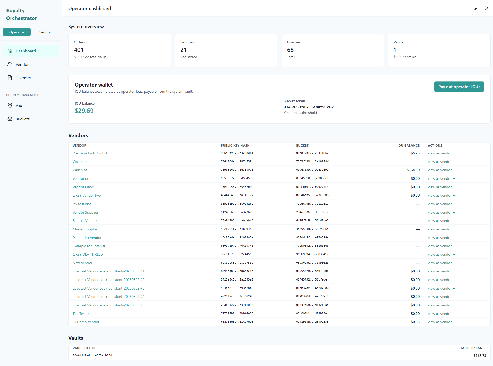

The operator's landing view answers two questions: what is in the operator's own wallet, and
what does each vendor currently hold. The operator wallet section shows vault token and stable
balance, with the operator's own payout action. The vendor table lists vendor name, public key
hash, bucket, IOU balance, and per-vendor actions.

The IOU balance is the design decision here. A vendor's earned-but-unpaid royalty
lives on chain as a token balance in that vendor's bucket, so the dashboard reports chain state
rather than a database figure that could drift from it. What the operator sees is what has
actually settled.

### 4.2 Vendors and licenses

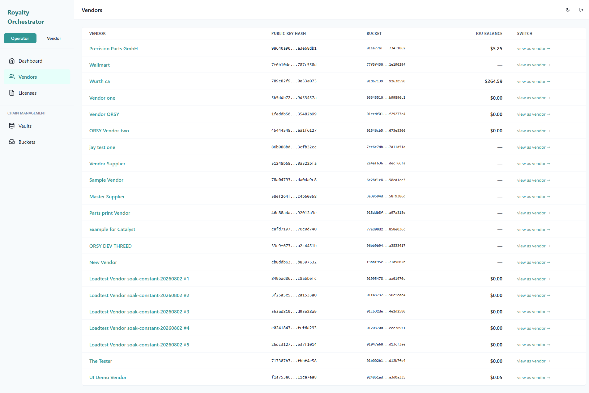

*Vendor list, with a switch into the vendor's own view, letting an operator see the system as
a given supplier sees it without separate credentials.*

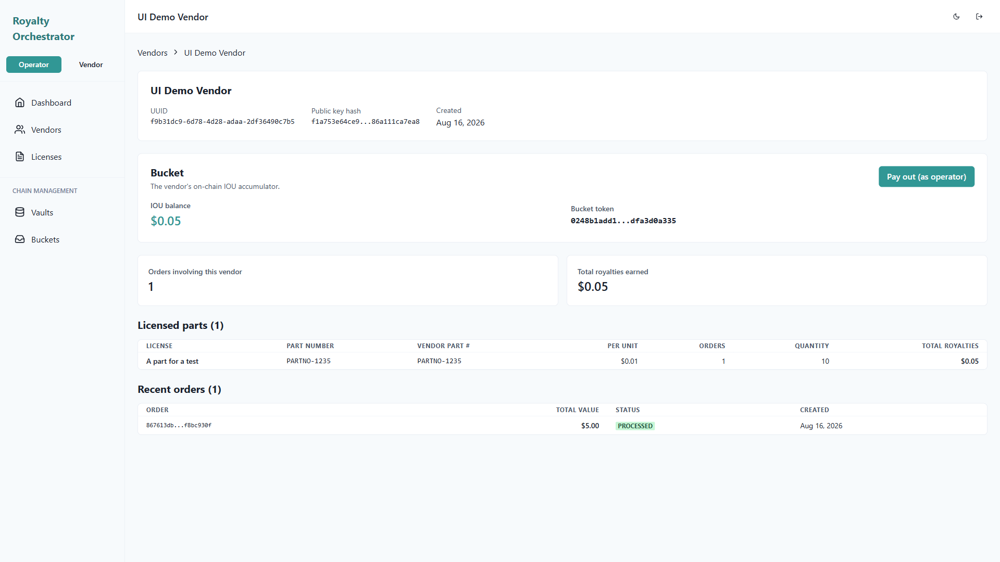

*Vendor detail: the vendor's bucket, its licenses (part number and per-unit royalty), and its
orders (quantity, total royalties, total value, status, created).*

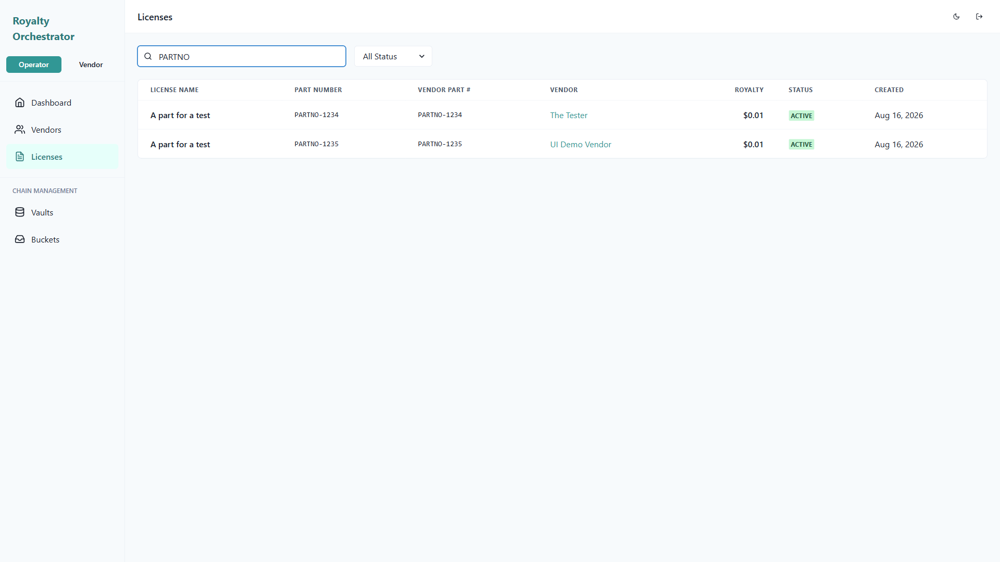

*License management, the 3D-print licensing surface that ORSY Connect did not previously
have. Columns: license name, part number, vendor part number, vendor, royalty, status,
created. Search covers name and part number.*

The **vendor part number** column exists because two identifiers are in play: the part number
as ORSY knows it, and the vendor's own reference for the same part. They are kept as separate
fields so that a supplier's internal reference never has to match the Würth catalogue value.

### 4.3 Vendor views

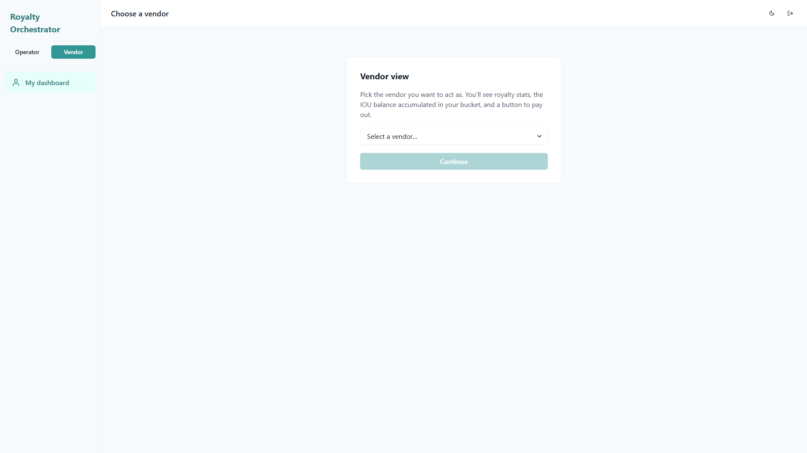

*The vendor picker, through which an operator enters a given supplier's view.*

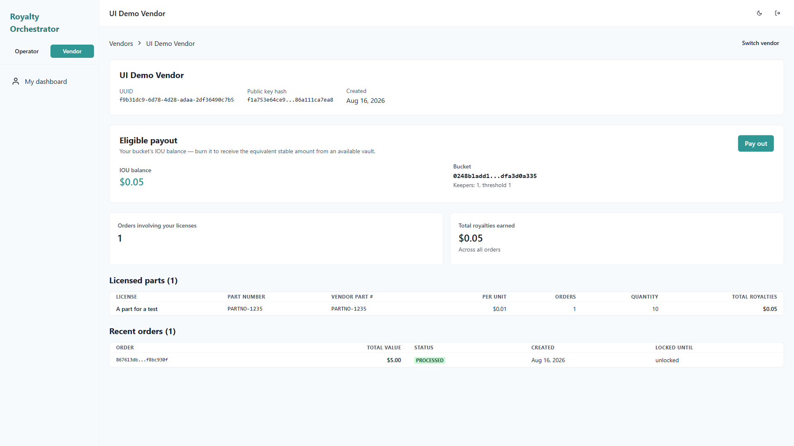

*The vendor dashboard for the supplier created in the §3 walkthrough. This is the same
transaction seen from the other side: licensed part `PARTNO-1235`, one order, quantity 10,
total royalties $0.05, against the $5.00 purchase order submitted in ORSY at step 19. A
reviewer can follow the single order across both systems using these two sections.*

The vendor dashboard leads with **eligible payout**, the amount the vendor can convert to
stablecoin right now, then its licenses and its orders. The orders table carries a **locked
until** column that the operator's equivalent view does not. In this capture the order has
already settled, so the column reads `unlocked`; on an order still inside its window it shows
the expiry timestamp. The column is there because an order that has arrived but is not yet
payable otherwise looks like a system error, and the expiry timestamp tells the vendor when it
becomes payable.

### 4.4 Payout, and why these interfaces are prototypes

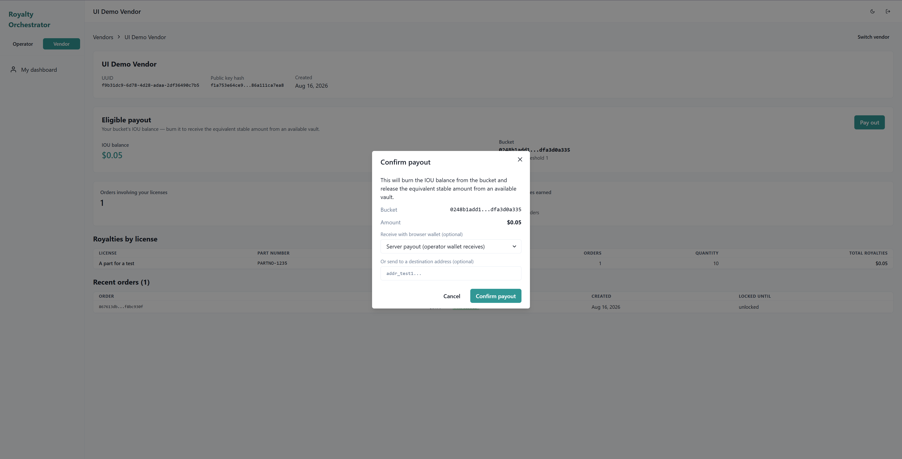

The payout action is shared by the operator and vendor views. Its confirmation modal states
plainly what is about to happen, *"this will burn the IOU balance from the bucket and release
the equivalent stable amount from an available vault"*, and shows the bucket and the amount
before anything is signed.

It then offers three destinations for the funds:

| Destination | Behaviour |
|---|---|
| **Server payout** (default) | The operator wallet receives the stablecoin. The server builds, signs and submits. |
| **Browser wallet** (CIP-30) | Funds go to the connected wallet's change address; the wallet submits the presigned transaction. |
| **Explicit address** | A bech32 address entered by hand, validated before the button enables. |

In the capture, the **Receive with browser wallet** select sits on its default, *Server payout
(operator wallet receives)*, and the destination-address field below it is empty, so
confirming would send the stablecoin to the operator wallet. Detected CIP-30 wallets appear as
further options in the same select.

Three destinations is the design decision. Where payout funds should ultimately land is not
settled: the likely end state is that these flows are integrated with, or embedded in, a
custodial provider's interface rather than presented as our own screens. Committing the
prototype to a single custody model would have meant rebuilding it once that decision is made.
Keeping all three paths open costs one select control and keeps every option live.

This is why §4 is labelled prototypes. The interfaces are functional and back the real
settlement pipeline, but the payout and vendor surfaces are staged for replacement or
absorption once custody is decided, so visual and interaction polish has been held back in
proportion. The operator and license-management views, which the custody question does not
affect, are the more settled of the two groups.

### 4.5 Chain management (feature-flagged)

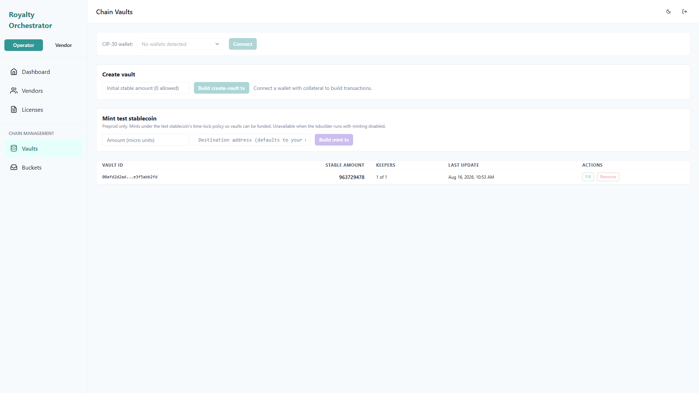

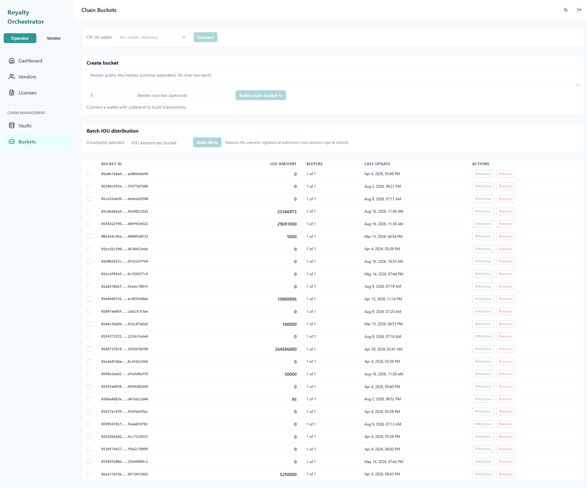

Vault and bucket administration sits behind a chain-management configuration flag and
is hidden entirely when off. These views expose vault identifiers, stable amounts, keeper key
hashes and last-update times, with fill and withdraw actions.

They exist for exercising the contracts directly while testing on preprod (filling a vault,
withdrawing from a bucket) rather than for routine administration, which is why the flag
defaults off. What they can do is bounded on chain rather than by the flag: vault actions
require a system keeper multisig, and a bucket withdrawal requires that bucket's own keepers,
each meeting its configured threshold ([Milestone 2
Part 1](../milestone-2/01-smart-contract-prototype-report.md) §4.2). Without those keys the
screens cannot move anything.

---

## 5 Storage / file-access UX

No human file-access interface is designed on the retrieval path, because that path does not
contain a person.

Per [Part 4](04-storage-connector-design.md) §6, retrieval of an IP-protected build file at
print time is machine-to-machine from end to end: the printer asks its IoT edge device, the
edge device asks a WAG-side service, and that service calls the storage connector, which
resolves the path, authenticates with credentials only it holds, and streams the file back
along the same chain. The operator presses print; nobody browses, selects or downloads a file.
The entitlement decision is made WAG-side before the request, and the access control that
matters at the storage boundary is between two systems rather than between a person and a
screen.

Ingest is the exception, and it is manual today. Uploading a build file and associating it
with a part number is currently done by hand on the WAG side. That is a human interaction with
storage, but it sits inside WAG's own tooling and outside both this platform and its UX scope.
The connector receives an ordinary object-storage upload and has no opinion about what
produced it. Whether ingest should be automated, and on which side, is a roadmap question
rather than a UX one; see [Part 4](04-storage-connector-design.md) §6.2.

If a human-facing surface is later needed, for example an operator view showing which part
references resolve to which stored objects, its shape depends on where the object reference
lives on the licence record, which is still to be settled with the orchestrator/licensing
design.

---

## 6 Usability feedback & rationale

### 6.1 Review cycles with Würth

No transcripts exist, and none are required: the Catalyst evidence clause asks for *"summaries
from internal reviews"*.

Review with Würth has not taken the form of discrete, scheduled design reviews. It has run as
a **standing weekly meeting between Iagon and Würth since 24 July 2025**, with broadly the same
people present each week: Dimitrios, Richard and Rohit on the Würth side, Mikhail from WAG,
and Navjit and Nils from Iagon. Design was reviewed inside that cadence rather than in named
sessions, so there is no single date or summary to attach to most of what follows; the phases
below are the honest unit. The one exception, with a single date, a distinct participant list
and a purpose of its own, is the joint session with Fireblocks on 22 April 2026.

| Period | Participants | What was reviewed | Feedback raised | What changed |
|---|---|---|---|---|
| **From 24 July 2025** (first month) | Dimitrios, Richard, Rohit (Würth); Mikhail (WAG); Navjit, Nils (Iagon) | Business goals and the systems already in place. Würth and WAG demonstrated ORSY Connect and the WAG-side tooling to Iagon, including their current interfaces. | The end-user experience comes first: whatever is added must not degrade the ordering experience that exists today. | Set the scope boundary recorded in §1.3: integrate with ORSY Connect rather than design a parallel ordering experience. |
| **From late August 2025** (second month) | as above | A prototype orchestrator frontend with no backend behind it, built around vault and bucket concepts in abstract form, before the smart-contract vocabulary now in use was settled. | Branding did not need settling yet, because on/off-ramping might not live in this UI at all and several of the elements shown might belong in ORSY Connect instead. | Visual and brand design deferred (§4.4). The question of how much platform state the ORSY admin UI should carry was left open, and still is (§6.2). |
| **From autumn 2025 to April 2026** | as above | Incremental iteration on the operator and vendor screens as the backend came up behind them. | Minor. The UX was substantially settled by this point. | Nothing structural. Effort moved to the backend; the screens in §4 are that base plus small changes. |
| **22 April 2026** | Dimitrios (Würth); Navjit, Nils (Iagon); Tim, Niklas (Fireblocks) | A purpose-built prototype of the orchestrator UI focused on on- and off-ramping, with the royalty mechanics deliberately in the background. | See below. | Confirmed the payout and vendor surfaces as staged for absorption into a custodial interface (§4.4), and recorded vault recirculation from operator revenue as a design option. |

The Fireblocks session on 22 April 2026 used a prototype built for that meeting, separate from
the interfaces in §4 and not part of the delivered platform. It carried three surfaces: a
system overview marking the four points where a custody and ramp provider would attach (wallet
management, fiat on-ramp for Würth, vendor off-ramp, operator off-ramp); a vendor dashboard;
and an operator dashboard with vault funding history alongside Würth's own revenue share.
Payout was shown as a three-step sequence (burn the IOU balance, release stablecoin from the
vault, off-ramp to fiat), of which only the last step is the provider's. One constraint had to
be stated explicitly throughout: the contracts enforce a single stablecoin policy ID across the
vault, every vendor bucket and the operator bucket, so any ramp integration has to target that
one Cardano native token.

Five things came out of the session:

- Custody is a business decision before it is a design one. The business users' response was
  to take it to their technical and finance teams and work out the implications of using a
  third-party custodian. That is the reason §4.4 keeps three payout destinations open instead of
  committing the prototype to one.
- Branding is not a constraint. It was clear that this UI can be styled however Würth wants
  it for supplier-facing use, which is why visual design remains deferrable (§1.3, §4.4).
- This UI's scope is the ramps: payout and off-ramping, for Würth and for suppliers, plus
  stablecoin on-ramping for Würth. Ordering and royalty presentation stay where they already
  are.
- The vault can be refilled from operator payouts. Würth's revenue share accumulates in the
  same stablecoin the vault pays out in, so operator revenue can be recirculated into the vault
  rather than off-ramped to fiat and later on-ramped again, reducing how much fresh fiat funding
  each cycle needs. The prototype presents it as an explicit action next to withdraw-to-fiat.
  It is an option on the table, not a committed design.
- Whether vendors should see order insights in the same UI was left open on purpose. It was
  discussed and explicitly judged not to need resolution until much later, since it depends on
  where the vendor-facing surface ends up living.

### 6.2 Rationale for user-flow decisions

The decisions below are recorded from the project record and the implemented behaviour. Those
that came out of a specific review session are cross-referenced to §6.1.

| Decision | Rationale |
|---|---|
| **The buyer's ordering experience stays entirely inside ORSY Connect.** | Royalty settlement is an arrangement between Würth, the supplier and the platform. Surfacing it to a buyer would add friction to a purchase without giving the buyer anything actionable. |
| **No parallel ordering UI was designed.** | The storefront exists and is in production. A designed alternative would not have been built. |
| **Orders enter machine-to-machine through the ORSY adapter.** | Keeps a single source of truth for orders (ORSY) and avoids a second place where an order can be created and the two systems disagree. |
| **Royalty is resolved by the platform after submission, not sent by ORSY.** | The license and its per-unit royalty are platform state. Having ORSY send a royalty figure would let a stale storefront value override the licensed one. |
| **Open: how much platform state the ORSY admin UI displays.** | Identifiers are surfaced there today (§3.4). Extending that to royalty breakdowns, settlement status or vendor balances is possible on the existing read endpoints; whether administrators would rather work in ORSY Connect or in the operator dashboard is Würth's call. |
| **Operators can switch into a vendor's view without separate credentials.** | Support and verification, without provisioning a second identity per supplier. |
| **Payout offers three destinations rather than one.** | Custody is not settled and is likely to be integrated with a custodial provider (§4.4). Keeping the paths open avoids rebuilding the flow once it is. |
| **Payout states the on-chain consequence before it is signed.** | Burning an IOU balance and releasing stablecoin is irreversible. The modal names the effect, the bucket and the amount before enabling the action. |
| **Chain-management views are feature-flagged off by default.** | They are for exercising the contracts while testing on preprod, not for routine administration. Authority is enforced on chain by keeper multisig rather than by the flag (§4.5). |
| **No file-access UI.** | Retrieval is machine-to-machine at print time (§5). |
| **Interaction and visual polish deliberately deferred on payout and vendor surfaces.** | These are the surfaces most likely to be absorbed into a custodial provider's interface. |

### 6.3 Third-party usability input

None commissioned. The Catalyst evidence clause lists third-party usability input as optional
("*and optionally input from a third-party usability specialist*"). Given a closed-source
pilot with a single enterprise partner and a fixed, known user population of operators and
suppliers, review with that partner is the more informative signal, and is what §6.1 records.

---

## 7 Walkthrough video

A recorded walkthrough accompanies this milestone. It is the counterpart to the screenshots
in §3 and §4, which capture the same interfaces as stills.

| | |
|---|---|
| **In this package** | [`05-demo-video.mp4`](05-demo-video.mp4) |
| **On YouTube** | [Iagon & Würth Catalyst Project: Milestone 3 Demo Video](https://youtu.be/1m3CuBtidlY) |

Both are the same recording.

---

## Appendix A: Screenshot capture checklist

All captures live in the report's `screenshots/` folder and the set is **complete**: 00 to 19
cover ORSY Connect (§3) and 20 to 28 cover the platform interfaces (§4).

| # | Filename | Section |
|---|---|---|
| 00 | `00-orsy-login.png` | §3.1 |
| 01 | `01-3d-royalty-vendor-list-view.png` | §3.1 |
| 02 | `02-3d-royalty-vendor-create-ui.png` | §3.1 |
| 03 | `03-3d-royalty-vendor-create-success.png` | §3.1 |
| 04 | `04-3d-royalty-link-vendor-list.png` | §3.1 |
| 05 | `05-3d-royalty-link-modal.png` | §3.1 |
| 06 | `06-3d-royalty-vendor-link-success.png` | §3.1 |
| 07 | `07-3d-articles-list-view.png` | §3.2 |
| 08 | `08-3d-article-create.png` | §3.2 |
| 09 | `09-3d-article-create-success.png` | §3.2 |
| 10 | `10-license-list-page.png` | §3.2 |
| 11 | `11-license-create-ui.png` | §3.2 |
| 12 | `12-license-create-success.png` | §3.2 |
| 13 | `13-purchase-order-list.png` | §3.3 |
| 14 | `14-purchase-order-mask.png` | §3.3 |
| 15 | `15-purchase-order-vendor-selected-parts-appear.png` | §3.3 |
| 16 | `16-purchase-order-part-selected.png` | §3.3 |
| 17 | `17-purchase-order-part-quantity-added.png` | §3.3 |
| 18 | `18-purchase-order-submitted.png` | §3.3 |
| 19 | `19-purchase-order-list-view-submitted.png` | §3.3 |
| 20 | `20-operator-dashboard.png` | §4.1 |
| 21 | `21-operator-vendors.png` | §4.2 |
| 22 | `22-operator-vendor-detail.png` | §4.2 |
| 23 | `23-operator-licenses.png` | §4.2 |
| 24 | `24-vendor-picker.png` | §4.3 |
| 25 | `25-vendor-dashboard.png` | §4.3 |
| 26 | `26-payout-modal.png` | §4.4 |
| 27 | `27-management-vaults.png` | §4.5 |
| 28 | `28-management-buckets.png` | §4.5 |

The platform captures were taken against the beta deployment on **the same vendor, part and
order** created in the §3 ORSY walkthrough, so a reviewer can follow one transaction across
both systems.
