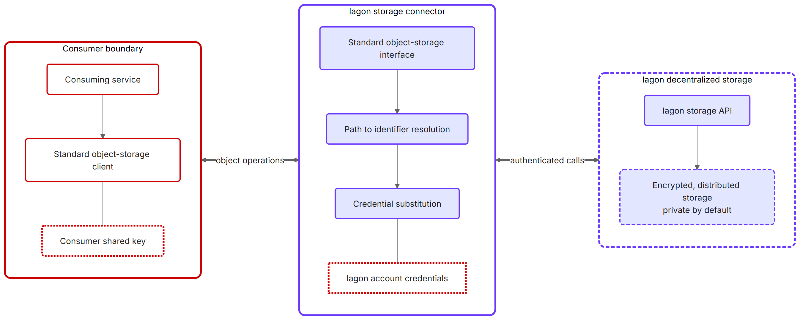
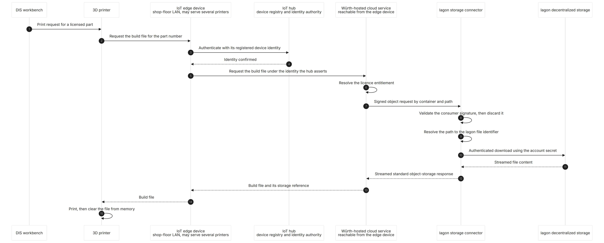

# Milestone 3 – Part 4: Iagon Storage Connector Design

## 1 Purpose and Scope

### 1.1 Purpose of this document

This document is one of the four output reports for Milestone 3 of the Iagon & Würth Catalyst Fund 13 project. It describes the **architecture and design of the Iagon storage connector** — the component that lets Würth's Digital Inventory Services (DIS) store and retrieve IP-protected 3D build files on the Iagon decentralized storage network. It addresses the Milestone 3 *Storage Connector Design* output, which calls for technical documentation of the connector's architecture and design plan, reviewed by both teams.

### 1.2 Scope boundaries

**In scope**: the connector's role and architecture; the conceptual model it presents to the storage consumer; how that model maps onto Iagon storage; the rationale for the gateway approach; the IP-protected file lifecycle; and the access-control and trust-boundary model.

**Out of scope**: the royalty/settlement path (covered in Milestone 2); the internals of the Iagon decentralized storage network itself; and the DIS internals owned by Würth/WAG.

> **A note on abstraction.** Consistent with the rest of this evidence package, the connector is described at the level of its **interface contract and concepts**, not by the name of the specific commercial storage API it is compatible with. The connector deliberately conforms to a **widely adopted, de-facto-standard enterprise object-storage interface** so that standard, off-the-shelf client tooling can talk to it unchanged. Internal Iagon and Würth teams know the concrete interface; naming it is unnecessary to validate the design and is omitted here in line with the closed-source pilot convention applied throughout the project.

## 2 The problem the connector solves

Würth's DIS needs a place to keep IP-protected 3D build files and retrieve them at the point of use (i.e. when a licensed part is printed). The project's requirement is that these files live on **Iagon decentralized storage** rather than a conventional centralized store, so that the data benefits from Iagon's distributed, encrypted storage model.

The trouble is that the two sides expect different things:

- **The enterprise consumer side (DIS and its tooling)** speaks a mature, ubiquitous **object-storage protocol** — hierarchical container/object paths, request signing with a shared secret key, and a well-known request/response shape that virtually every enterprise storage SDK, CLI, and infrastructure tool already supports.
- **The Iagon side** exposes a different model: files and directories are addressed by **opaque network identifiers** (not human-readable paths), authentication uses an account API key plus an account secret, and uploads/downloads follow Iagon's own request conventions.

Bridging the two inside DIS — or inside every tool Würth might use — would mean writing and maintaining Iagon-specific integration code everywhere the storage is touched. The connector eliminates that by absorbing the mismatch in **one place**.

## 3 Design: a compatibility gateway

The connector is built as a **compatibility gateway**: a small, stateless service that

1. **presents the standard enterprise object-storage interface** on its front side, so any standard client (SDK, CLI, infrastructure-as-code tool) connects to it exactly as it would to a conventional cloud object store — same connection string shape, same authentication scheme, same operations; and
2. **translates every operation into Iagon storage calls** on its back side, handling identifier mapping, authentication substitution, and response reserialization so the client never learns it is talking to a decentralized network.

To the consumer, the gateway *is* an ordinary object-storage endpoint. Underneath, it is a thin adapter onto Iagon. This is the "storage connector" the milestone calls for.

*Diagram **023** — the connector between the consumer boundary and Iagon storage. The retrieval sequence is diagram **024** in §6.*

## 4 Concept mapping

The heart of the design is a faithful mapping between the consumer-facing object-storage model and the Iagon storage model. The gateway maintains this mapping so that the two models stay consistent operation-by-operation.

| Consumer-facing concept (standard object storage) | Iagon-side concept | How the connector maps it |
|---|---|---|
| **Storage endpoint / account** | The Iagon account reached through the gateway | A single stable gateway address stands in for a storage account; one Iagon account backs it. |
| **Shared-key credentials** (consumer authenticates by signing each request with a shared secret) | Iagon **API key + account secret** | Two independent credential domains. The gateway validates the consumer's signature against a key it shares only with the consumer, then authenticates to Iagon with entirely separate credentials the consumer never sees. |
| **Container** (top-level namespace) | Iagon **top-level directory** | Container operations (create / delete / list / exists) map to directory operations at the root. |
| **Object path** (hierarchical, human-readable, e.g. `parts/8842/model.3mf`) | Iagon **file identifier** (opaque network ID) within a **directory tree** | A path-resolution layer keeps a **bidirectional path ↔ identifier map**, so the consumer works entirely in readable paths while Iagon works in opaque IDs. Intermediate directories are created on demand to realise a path. |
| **Object content** (bytes) | Iagon **file content** | Uploads are forwarded to Iagon's upload operation; downloads are **streamed** back so large files (3D models) never need to be buffered whole. |
| **Object / container listing** (with prefix + delimiter to present virtual folders) | Flat Iagon listing of files and directories | The gateway reconstructs the hierarchical, prefix-filtered view the consumer expects from Iagon's listing. |
| **Object content-type** | (inferred) | Derived from the object's name/extension so standard clients receive a sensible content type. |
| **Private vs. public objects** | Iagon **visibility** flag | Objects are stored **private by default**; retrieval of private content requires the account secret, which is held only by the gateway. |

Two mappings do the real work and deserve emphasis:

- **Path ↔ identifier resolution.** Enterprise tooling assumes stable, human-meaningful paths; Iagon assigns opaque identifiers. The gateway's resolver maintains the correspondence (with a short-lived cache to keep listings responsive) and transparently provisions the directory structure a path implies. This is what lets DIS address a file as `…/model.3mf` while Iagon stores it under a network ID.
- **Credential substitution.** The consumer's request signature is verified and then *discarded*; the gateway issues its own, separate, Iagon-authenticated request. The two sides never share secrets.

## 5 Why build it as a gateway

Several alternatives were possible — a bespoke DIS-to-Iagon client library, a custom REST contract, or embedding Iagon calls directly in DIS. The gateway was chosen for these reasons:

1. **Zero-integration adoption for the consumer.** DIS (and any Würth tooling) keeps the storage client, CLI, and infrastructure conventions it already uses. Decentralized storage appears as the kind of object store the enterprise already knows how to operate, monitor, and secure. No partner-side rewrite, no new client to certify.
2. **A stable, standard contract — and substitutability.** The consumer binds to a widely adopted interface, not to Iagon-specific APIs. The Iagon backing can evolve without breaking DIS, and the same DIS integration could, in principle, be pointed at any compatible endpoint. The coupling is to a public standard, not to an implementation.
3. **Credential and trust-boundary isolation.** Iagon network credentials live **only inside the gateway**. The consumer authenticates with a separate shared key scoped to the gateway. This yields a single, auditable chokepoint between Würth's enterprise environment and the decentralized network, with no secret shared across the boundary.
4. **Translation in one place.** The path-vs-identifier and authentication differences are reconciled once, inside the gateway, rather than being re-solved (and drifting out of sync) in every system that touches the storage.
5. **A minimal, well-understood, already-secured surface.** Conforming to a mature, extensively documented storage contract means no new protocol to invent, secure, document, and persuade the partner to adopt — a smaller audit surface and a faster path to trust.
6. **Operational simplicity.** The gateway is a small, **stateless**, containerized service that sits at the edge between the enterprise systems and Iagon. It holds no durable state of its own (its only state is a refreshable cache), so it scales horizontally and fails safely.

In short: the gateway lets Würth treat Iagon decentralized storage as a **drop-in object store**, while keeping the decentralized-storage specifics — and the credentials for them — entirely on Iagon's side of a clean boundary.

**The partner's existing architecture already works this way.** WAG's 3D-print environment runs an object-storage resource today, consumed over the standard interface and used as a shared repository between the 3D-print services and the shop floor. The connector therefore takes the position an object store already occupies, and its consumers keep the client library, connection configuration and access patterns they use now. Only the endpoint they point at changes, which is the zero-integration adoption of reason 1 in a system that is already deployed.

Its consumers are a small, known set: the blackboard service that serves 3D models to the shop floor, the inventory/storefront-side system that serves recipes, and the management and ingest processes (§6.1, §6.2). None of them is a shop-floor device, so the connector stays inside the partner's cloud environment and no consumer credential ever reaches an edge device.

## 6 IP-protected 3D-file lifecycle

### 6.1 Two classes of stored asset

The connector serves two kinds of content, with different consumers and different protection levels.

| | 3D model files | Recipes |
|---|---|---|
| What it is | The build file itself: the printable geometry, which is the IP being protected | Process instructions around the print: pretreatment, post-treatment, cleaning and similar |
| Consumed by | The printer and/or its edge device, at print time | The inventory/storefront-side system (DIS and its equivalents) |
| Protection | The strictest tier; release is mediated by a credentialed cloud service (§6.2) | Protected, but less vigorously; the commercial sensitivity is lower |
| Retrieval path | Diagram 024 below | The consuming system's own path, not the print-time flow |

In the target state both classes live on Iagon storage behind the connector, but different systems reach them. The connector does not need to know the difference, since they are ordinary objects under different containers and paths, but the surrounding access control does, and later documents should not give the two a single undifferentiated protection story.

How far that separation is carried is still open, and it is Würth's call. The lighter option keeps both classes in one storage account and separates them by container or path prefix, optionally with a distinct consumer credential per class. The stricter one gives each class its own account: by the mapping in §4, that means a second Iagon account behind a second gateway endpoint, so a credential issued for one class cannot address the other at all. Either way the connector works unchanged.

The lifecycle below describes the 3D model file path, which is the more demanding of the two.

### 6.2 The 3D model file lifecycle

*Diagram **024**: the retrieval path at print time, from the print request through to Iagon storage and back.*

1. Ingest is manual today. WAG staff upload the build file by hand and associate it with a part number. It reaches the connector as a standard object-storage upload; the gateway provisions the target directory and stores the content on Iagon as a private file. Automating it belongs to the partner-side rebuild described in §9 and is out of scope for this milestone.
2. At rest, the file lives on the Iagon decentralized network, which distributes and encrypts stored data. The connector keeps only the path ↔ identifier correspondence needed to find it again.
3. The stored object is identified by its container/path, and that is the reference upstream systems use.
4. A print request originates in the DIS workbench, not at the printer, and is assumed for now to reach the printer directly. The printer requests the build file through its edge device, the licence entitlement is resolved partner-side, and a Würth-hosted cloud service calls the connector. The gateway validates the request signature, resolves the path to the Iagon identifier, downloads with the account secret it alone holds, and streams the content back to the printer.
5. The printer clears the file from memory once the job completes, and the edge device never persists it.
6. Deleting an object or container maps to the corresponding Iagon delete, and the path mapping is invalidated.

The entitlement decision sits partner-side, before the object is requested: the connector authenticates its caller at account level and does not evaluate per-user licences. No shop-floor component holds a storage credential, since the edge device authenticates against a device identity held by the IoT hub, which is an identity credential rather than a storage one. How the print request routes through Würth's systems, and which component makes each call, is a partner-side detail that this design does not depend on.

## 7 Access control and trust boundaries

- **Two independent credential domains** (consumer shared key ↔ Iagon account credentials), joined only inside the gateway. Compromise of one does not expose the other.
- **Private-by-default storage.** IP-protected files are stored non-public; retrieval requires the account secret held exclusively by the gateway, so the decentralized network will not release private content to an unauthenticated caller.
- **Single mediated chokepoint.** All enterprise access to the decentralized store flows through the gateway, giving one place to authenticate callers, log access, and (in future) enforce finer-grained authorization.
- **Boundary alignment with the M1 model.** The connector sits on the trust boundary between Würth's enterprise environment (DIS) and the Iagon storage domain, consistent with the trust-boundary framing established in the Milestone 1 documents.
- **No persistence at the endpoint.** The build file is not retained on the shop floor: the printer clears it from memory after the job and the edge device never writes it down (§6). The file's durable home is Iagon storage, and every print is a fresh authenticated retrieval rather than a read from a local copy.

## 8 Relationship to implementation status

A working implementation of this connector already exists as an internal service; this document describes its **design and the concepts it maps**, as Milestone 3 requires (a design plan reviewed by both teams). Hardening, the DIS-side integration, and any authorization refinements follow in later milestones.

## 9 Partner context and the path to a native SDK

**Würth is reimplementing the surrounding capability in-house.** Printer connectivity and the IP-protection mechanisms for 3D build files are currently being rebuilt within Würth's own systems. The connector therefore has to integrate with a moving target: the systems that will produce and consume these files are themselves changing shape. An interface Würth's tooling already speaks stays valid across that reimplementation, whereas a bespoke contract negotiated against today's systems would need renegotiating as they change (§5).

**A native Iagon storage SDK is in development, and Würth is interested in it.** The SDK lets a consumer address the decentralized network directly, without a compatibility layer. It works today, but it is not stable: the SDK and the APIs beneath it are still being built out, and anything integrated against them now would need reworking as they change. Handing that to Würth would mean their engineers covering the same ground twice, and waiting for the SDK to settle would leave the storage half of the project idle in the meantime. We expect it to be ready for an outside consumer to adopt around **Q4 2026 / Q1 2027**. Until then the connector gives Würth a stable interface to build against.

**Both teams therefore agreed to proceed with the shared connector.** Two considerations decided it. First, it is where the joint planning with **WAG** had already arrived. Second, Würth's IT team can fold a standard object-storage endpoint into their existing test flows straight away, without waiting on new client libraries or certifying an unfamiliar protocol. Something their engineers can exercise now is worth more to the project's pace than a more direct integration arriving later.

**The connector and the SDK sit in sequence.** Today Würth's systems reach the connector through the standard object-storage client they already use. Adopting the native SDK later means replacing that client with Iagon's and addressing the network directly, at which point the connector drops out of the path rather than being reimplemented behind it. That swap is work on Würth's side, and they can take it on once the SDK has settled instead of holding up the pilot for it. The stored files are unaffected: both routes address the same Iagon storage.
